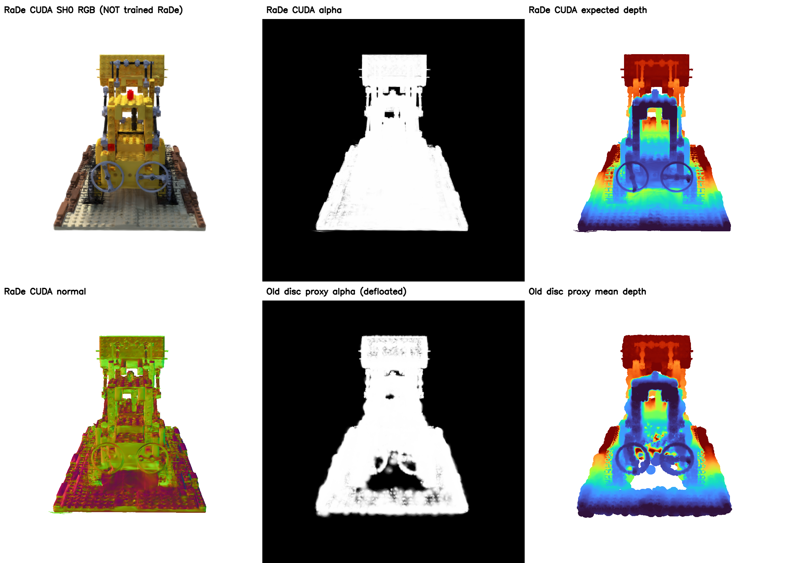

# F0：从可见高斯的成像状态开始（阶段报告）

**作者归属**：郝唯任 / 向井智彦的[特征线海报](https://mukai-lab.org/content/SA2026PosterHao.pdf)属于他们；它引用的 [RaDe-GS](https://arxiv.org/abs/2406.01467) 深度/法线方案属于张宝文等。这里是我们的**独立兼容性检查**，尚不是官方任一方法的完整复现。

## 最基本的思想

一个像素不是一张只有 RGB 的图片，而是一串前后遮挡的 Gaussian 样本：`(ID_i, alpha_i, depth_i, normal_i, color_i)`。第 i 个样本的实际可见权重是 `w_i = alpha_i ∏_{j<i}(1-alpha_j)`。沿同一射线，三维 Gaussian 的最大响应点有解析式 `t* = (vᵀ Σ⁻¹(μ-o))/(vᵀ Σ⁻¹ v)`，因而同一 Gaussian 在相邻像素的贡献**深度不是常数中心 z**。RaDe-GS 在局部仿射投影下把这种深度变化和法线高效栅格化。郝—向井方法再比较相邻像素的 **可见层深度/法线/alpha/颜色/高斯 ID 权重支持集**，分类型计算可靠度/可见性，并融合为视角相关的连续线密度和色调字段。它**不是**在最终 RGB 上跑 Canny，也不是固定三维曲线。

## 已实际完成的基础层

在隔离目录编译张宝文等公开仓库 `HKUST-SAIL/RaDe-GS@d72f207` 的 CUDA 栅格器，不覆盖现有 3DGS Python 环境。合成单 Gaussian 的投影/深度/法线测试先失败后通过（两项通过）。用原始冻结 Lego PLY、TRAIN `r_0` 运行：**没有使用 mesh、TEST、RaDe 训练，也没有添加该方法训练时的 `filter_3D` 属性**；直接提供 PLY 的位置、缩放、旋转、opacity 和 SH0 颜色。

上排：RaDe 官方 CUDA 栅格核在当前 PLY 上的 SH0 RGB、alpha、期望深度。下排：其法线、旧圆盘代理 alpha 和旧代理平均深度。图像是实际计算、不是概念图；法线看着有变化不证明物理地面真值。相机/主体位置一致，明显不是黑屏或错位。该输入用 `166,044` 个 Gaussian；旧代理去漂浮只保留 `99,721` 个。同场景全图 alpha 平均绝对差 `0.037912`，RaDe 前景支持像素 `149,180`，旧代理 `153,939`（阈值 0.05）。输出可在 `lego_r0/rade_raw_buffers.npz` 和 `STATE.json` 复查。

**严格边界：**官方 CUDA 几何**栅格核** ≠ 作者用 RaDe-GS 正则训练过的模型；纯 vanilla PLY 无 `filter_3D`，当前只预计算 SH0，未提供完整版高次 SH 颜色。顶层 top-4 贡献样本/IDs 尚未从同一原生栅格化过程导出，所以不能用这张基础图冒充郝—向井的特征线效果，也不能在 RaDe depth 上随手叠旧圆盘 top-k 当“忠实复现”。接下来的 F1 必须在一个渲染器里同时输出 top-4 与聚合状态，做质量覆盖/原 ID/重放一致性检查，然后才重新跑作者的 Eq.1–5 与视频。
