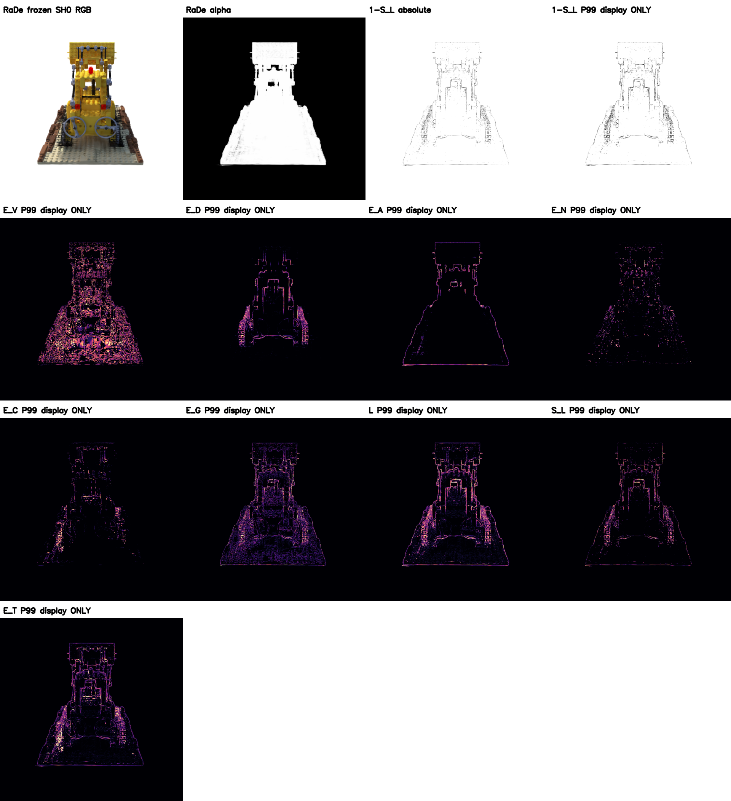

# F1：RaDe 原生同次栅格化状态 + 郝—向井方程（独立复现）

**归属**：Hao–Mukai SIGGRAPH Asia 2026 poster 的 Eq.1–5、固定参数与方法属于 Weiren Hao / Tomohiko Mukai；RaDe-GS CUDA 基础属于 Zhang 等。此处是**独立兼容复现**，非任一作者的官方实现或最终风格合成器。来源：[作者海报](https://mukai-lab.org/content/SA2026PosterHao.pdf)、HKUST-SAIL/RaDe-GS `d72f20792005ae1d6555a82aa2d15345f247604e`。

[短视频：8 帧逐帧原生重栅格化、8 fps](lego_r0/native_f1_short.mp4)。视频三栏分别为 SH0 RGB、原值 `1-S_L`、仅展示固定增益 `1-S_L/P99`；增益只从 TRAIN r_0 取值，**不影响方程字段**。相机从 TRAIN r_0 朝 TRAIN r_10 的插值轨道取 8 帧；中间是新相机而非 TEST 相机、非光流合成。面板其余字段各自 P99 可视化，不是论文的最终合成图。

## 真实状态与实现

`native_patches/rade_f1.patch` 是针对上述 RaDe-GS 原始源的最小改动，**没有提交第三方完整源码**；在本分支隔离副本中编译。与 RaDe 同一个 `renderCUDA` 像素遍历，在实际通过原始 `alpha>=1/255` 与透射率提前终止门限后，以 `aT=alpha*T` 插入权重前四；直接读取 `point_list` 原高斯 ID；保留该贡献者的 `t*rln` 深度与 RaDe splat 法线，且同次输出 RGB/alpha/期望深度/聚合法线、完整加权深度二阶矩与法线长度。未按深度重新排序，也未进行局部 ID 重映射。保留背景 ID `-1` 和权重 `0`。原生权重导出不归一化；只有代入作者 Eq.1–5 时，依旧接口契约将 top4 归一化，并携带 `topk_mass=sum(top4 aT)/alpha`；深度方差来自**全部**实际贡献，而非只有 top4。颜色从同次原生 RGB 减去白色背景后按 alpha 求可见平均；**仅 SH0**。

`lego_r0/native_states_r0.npz` 含 `topk_id`, `topk_w`, `topk_depth`, `topk_normal`, `moment2`, `normal_len`, `rgb`, `alpha`, `depth`, `normal`, `radii`；`typed_fields_r0.npz` 含 Eq.1–5 的连续字段，均来自 Lego TRAIN `r_0` 原始冻结 166044-Gaussian PLY。无 mesh、TEST、重训练、去漂浮过滤器或 RaDe 训练的 `filter_3D`。

## 验证与边界

GPU 新增双测试先失败（缺少 wrapper）后通过：原 ID、真实 aT、单/双层贡献排序、空像素、深度/法线与归一化约束。与 F0 未改动的官方 RaDe GPU 缓存对照，同一 `r_0` RGB、alpha、期望深度、法线的**逐元素最大绝对误差均为 0**。7 项针对性单测通过。原生 top4 权重绝不超过像素 alpha（数值最大超额 `1.565e-7`）。alpha>0.05 区域 149180 像素，top4 对总可见 alpha 覆盖均值 `0.60870`、P05 `0.33593`。`S_L` 非零 27231 像素、全图 P99 `0.28989`。视频经 OpenCV 完整解码：8/8 帧、全部 `1152×424`，面板 `1920×2104`。精确值见 `lego_r0/SUMMARY.json`。

**限制**：模型是冻结 vanilla 3DGS、不是 RaDe 正则训练结果；无高阶 SH 颜色、无作者专有合成器；视频仅 8 帧短片，不是完整轨道时序质量证明；top4 覆盖有限，未从旧 disc 代理拼接任何状态。输出是每帧 2D 类型字段，不是固定 3D 资产。

复现（需 CUDA/Torch 环境，先将 patch 应用到隔离的 RaDe rasterizer 副本并编译；不要改官方 checkout）：`PYTHONPATH=$PWD/native/rasterizer:$PWD python scripts/run_rade_native_f1.py`。CUDA 配置：`CUDA_HOME=/usr/local/cuda TORCH_CUDA_ARCH_LIST=8.6 MAX_JOBS=2`。
