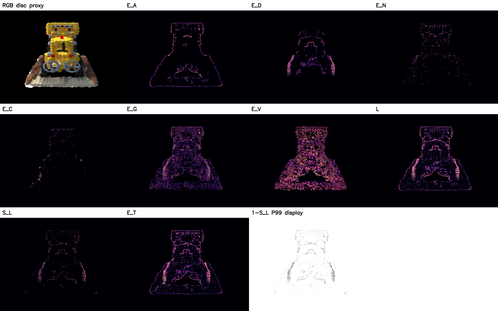
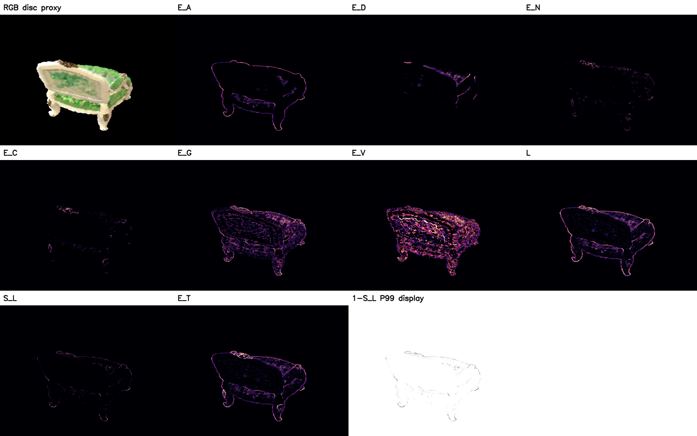

# 郝唯任—向井智彦方法：独立公式重建（非官方复现）

**归属**：`Feature Line Rendering from Rasterization States in 3D Gaussian Splatting`，Weiren Hao（郝唯任）与 Tomohiko Mukai（向井智彦），**SIGGRAPH Asia 2026 Posters**。作者[项目页面](https://mukai-lab.org/publications/sa2026poster-3dgs/)与[两页预印本](https://mukai-lab.org/content/SA2026PosterHao.pdf)；本文不转载原文、原海报或原图。该方法是他们的工作，下面全部图像只是**我们按照公开公式所作的独立重建**，绝非他们的官方输出，也不是我们原创算法。

## 到底重建了什么

- 照作者式 (1)–(5)：每像素前向累积 alpha、预期深度、法线、颜色、贡献权重；按**实际贡献**选 `K=4` 且保留原 PLY ID、权重、深度与法线；计算深度方差 `u`、一致性 `κ`、可靠性 `q_s/q`、前两权重竞争 `ℓ`、可见性 `E_V`、四邻域 `δ_D/δ_A/δ_N/δ_C/δ_G`；其后依据原文固定的所有 smoothstep 阈值/λ 输出 `E_D/E_A/E_N/E_C/E_G`、`L/S_L/E_T` **连续字段**。不在算法里对各字段做分位阈值截断。
- **没有忠实重现关键底座**：作者使用 RaDe-GS 的深度/法线；这里用现有冻结 vanilla GS 的圆盘近似栅格器和协方差候选轴。此轴不是经校准的表面法线；颜色为内部 SH0 近似，非原论文的完整渲染状态。论文未完全定义邻域差分的颜色空间/距离及最终绘笔/合成代码，本实现分别取相对深度差、`1−dot` 法线差、内部 RGB 欧氏距离及 `1−S_L` 黑白预览。**故不能称像素级复现或科学意义上验证/否定原作者方法。**
- 两个提前冻结的 TRAIN 相机：Lego `r_0`、Chair `r_0`；没有打开 TEST，没有用评估 mesh，没有按结果选帧。固定三维资产不是作者论文的目标或已实现输出：原文明确是**视角相关的二维 raster fields**。
- 曾有 `out/POSTER_REPRO_RESULTS.md` 的 2025/rank-max 实验：当时未见论文、使用自拟的 rank-max 融合。这是**我们自己的未证实代理**，不是郝—向井公式，也不能把其图/指标冠名为作者结果。年份 2025 是旧记录错误；官方页面是 2026。

## 实跑结果（仅这个重建）

- Lego：原始 3DGS `166,044` 个 Gaussian、去漂浮后 `99,721`；本次 proxy 栅格 `8,962,239` fragments；`S_L` 非零像素 `24,585`，全图 P99 `0.1053`。
- Chair：`6,261,221` fragments；`S_L` 非零像素 `9,428`，全图 P99 `0.003816`。原强度很弱；**不是作者真实 RaDe-GS 数值**。
- 内部目视：`E_A` 与 `L` 给出物体轮廓；Lego 的轮子/车身有部分结构，Chair 的靠背和椅脚尚可识别；`E_G/E_V` 对象内部有明显散点/纹理杂讯，原强度 `S_L` 淡且线条不完整。P99 高对比图只是**可视化归一化**，没有修改算法或数值。

*Lego：第一格是本地 disc RGB proxy，不是论文照片。每个彩色字段独立按正值 P99 做**显示**拉伸；右下 `1−S_L P99 display` 亦仅显示变换。*

*Chair：同一固定参数与显示方案，没有按场景调阈值。*

原连续字段存在 `lego/typed_fields.npz` 和 `chair/typed_fields.npz`；两幅未经 P99 拉伸的实际强度图分别为 [`lego/stroke_density_continuous_ours_display.png`](lego/stroke_density_continuous_ours_display.png)、[`chair/stroke_density_continuous_ours_display.png`](chair/stroke_density_continuous_ours_display.png)。P99 显示图分别为 [`Lego`](lego/stroke_density_p99_display_only.png)、[`Chair`](chair/stroke_density_p99_display_only.png)。细节和每通道分位数在各自 `STATS.json`。

## 验证与下一步边界

`python -m unittest tests.test_hao_mukai_source tests.test_raster_state -v`：8 项通过；两场景出图、字段均有限且存在有效非零响应；`git diff --check` 通过。真正接近论文 Figure 1 还需作者代码/权重或 RaDe-GS 兼容输入和栅格实现，再验证邻域算子与合成器细节。当前应标 **PARTIAL RECONSTRUCTION / UNDETERMINED FIDELITY**，不能写成“郝—向井方法 NO-GO”，也不能把它的创新记在我们的三维曲线方法名下。
