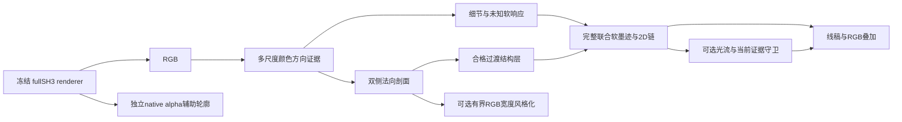

# 图像空间边界场基础实验：实际结果

结论：**PARTIAL**。新表示已实际落地为逐视图二维法向剖面、软线场与笔划链。完整 SH3 冻结 3DGS 只提供 RGB 和独立 alpha 辅助层。两场景完整物体线稿与真实连续相机视频已产出，尚未证明真实场景优于经典图像方法。结构层单独使用为 NO-GO；联合细节层保留了必要图案，但仍繁杂且包含明暗双线。

这是一项视图相关的屏幕空间线绘/局部风格化实验。没有修改底层 3D 几何，没有物理材质边界认证，没有建立无目标条件下的照片级修复。3D 方法的其他可能性未在此排除。

## 实产物与视角

主运行有 **82 个 800×800 原生 RGB 输入**：8 DEV、8 固定评价、66 arc；每场景固定 r_000/r_008/r_018/r_030 与完整 arc0_000…032。另有开发前预览和 stock Camera 重复校准，不把重复校准算作新的评价相机。4 条 H264/yuv420p/faststart 视频共 **132 解码帧**；每条去掉文字栏的 33 个原生 RGB 都实际不同。独立审核 47081 项通过，291 个保护文件字节不变，旧分支未动。

所有相机均为历史 GS/研究见过的探索性视角，不是新盲测。旧 w2c/FoV 原样沿用，K 恢复到原生 800 尺寸；与官方 Camera 的两场景 DEV 校准最大差都是 0。原 TRAIN 图仅为同相机对照，不是物理线真值，未读取原始 TEST 照片。

| 场景 | 四视角纯线图 | 同 RGB 叠加 | 33 帧线稿视频 | 33 帧叠加视频 | 每一帧实际图条 |
| --- | --- | --- | --- | --- | --- |
| lego | [完整对象六层](media/lego/fourview_line_only.png) | [叠加](media/lego/fourview_overlays.jpg) | [lines](media/lego/arc/lines_33.mp4) | [overlays](media/lego/arc/overlays_33.mp4) | [全部33帧](media/lego/arc/all33_actual_strip.jpg) |
| chair | [完整对象六层](media/chair/fourview_line_only.png) | [叠加](media/chair/fourview_overlays.jpg) | [lines](media/chair/arc/lines_33.mp4) | [overlays](media/chair/arc/overlays_33.mp4) | [全部33帧](media/chair/arc/all33_actual_strip.jpg) |

逐视角 `media/<scene>/fixed/<key>/full_object.jpg` 包含 reference/native/Canny/classic/结构/联合/叠加/alpha 辅助。该目录还有 standalone ink/overlay、320×320 原生 crop、2× 最近邻 zoom、confidence/unknown/width 与法向采样图。视频首/中/末帧保存为 `lines_000/016/032.png`、`overlays_000/016/032.png`；原生 RGB 及全帧联系表也在 arc 目录。MANIFEST 对媒体、float16 公开场、float32 完整 out 场/剖面/2D chains/flow 给出真实哈希。

## 基础方法与对照

多尺度 display-RGB 亮度/颜色对手通道的结构张量形成无向法/切线场；空间张量积分、沿切线方向支持与尺度方向一致性形成置信度。沿图像法向采样，使用双侧中位颜色、带符号 RGB 对比、平台方差、离散单调 logistic 宽度/中心拟合及颜色残差；局部不可信剖面留在 DETAIL/UNKNOWN。宽软响应、ridge、hysteresis 与切线邻域支持生成线场与二维链。没有 top10%/固定群数、3D lifting 或 Gaussian UID 门槛。

主 RGB-only classmap 的“合格颜色过渡”不区分物体外部/内部。独立 `alpha_aux_classes` 用原生覆盖把 alpha 外轮廓、覆盖内部的清晰颜色拟合、detail/unknown 和覆盖不确定分别标出；它不更改 RGB-only 墨迹，内部覆盖也不等于几何/材质语义。方向图在低 confidence 区域没有可信法向含义。所有方法使用同一 stock float32 RGB；PNG/视频共用 display clamp 与编码，未降低 SH 阶数。

对照是 RGB-only Canny 与经典多尺度亮度结构张量梯度；后者是既有组件的简单独立实现，没有冒充 FDoG 论文复现。相同 ink 函数呈现，DEV 只匹配可见墨迹面积与 skeleton 长度。两场景共享 Canny high=60/low=24/gain=.6，classic gain=1.2；匹配后仍有以下残差，并保留 default Canny45、classic raw 和 broad soft 未匹配图。

| 对照 | DEV 面积比 | DEV 长度比 |
| --- | ---: | ---: |
| classic | 1.077500 | 0.983447 |
| canny | 0.956135 | 1.083896 |

这些匹配目标只用于墨迹预算公平性，不认证真实边缘语义。固定真实 ROI 在生产前冻结，整物体图是主要评价，不以少数 patch 的改善替代完整表示。

还直接公开冻结的 RGB 颜色张量/方向支持组件、移除剖面增强的对照（gain=1）。DEV 面积比 0.997494、长度比 0.997287，预算本已很接近；8张固定图的平均像素增量仅 0.00007713。[Lego 剖面消融](media/lego/fourview_profile_ablation.png)、[Chair 剖面消融](media/chair/fourview_profile_ablation.png)。这是冻结 detail 层的后审计展示，未调新参数；它明确表明联合线稿的大部分外观来自既有颜色结构组件，剖面新增的视觉作用有限。

| 场景固定4图 | 剖面候选 | 合格剖面 | 剖面增加联合强度的像素 | 结构/联合墨迹面积 |
| --- | ---: | ---: | ---: | ---: |
| lego | 138437 | 19646 | 1289 | 0.1260 |
| chair | 103415 | 5649 | 1432 | 0.0465 |

主代理看完两场景四视角六层全图、原生 ROI、全部 66 帧图条及证据/控制图。Lego 凸点和 Chair 合法花纹在联合图中保留；结构图遗漏大量凸点、花纹、边饰和腿部。RGB 联合与经典张量外观接近，仍有明暗双边和花纹拥挤；alpha 辅助补充浅色外轮廓。剖面通道在联合图中的实际增量很小，不能把剖面元数据或稀疏“更干净”图当成已获线稿优势。独立人工视觉评审 pending。

## 独立界面与时间结果

7 个解析界面包含常量、等亮度颜色阶跃、低对比、合法条纹、角点、交汇与已知宽度。构造真值先于检测存在；P/R 是固定 2px 容差诊断，不是 gate。等亮度颜色阶跃在亮度对照中行为 RED，新场能检出并拟合；常量无显著墨迹；低对比无结构拟合而保留弱 detail；条纹不合格的单调剖面不会使联合图丢失合法图案。8 项基础 unittest GREEN。初始缺接口、错误的 5px 平均响应断言、真实整图 OpenCV SHRT_MAX 采样失败与修复日志保留；采样改为分块，没有候选数量截断。

| 场景全arc | motion MAE OFF | motion MAE ON | churn OFF | churn ON | 警报帧数 |
| --- | ---: | ---: | ---: | ---: | ---: |
| lego | 0.177782 | 0.165829 | 0.291093 | 0.278637 | 0 |
| chair | 0.210715 | 0.199114 | 0.320486 | 0.299651 | 31 |

误差与 churn 在 forward/backward 有效、当前或 warped ink>.075 的屏幕域计算；二值 churn 门槛为 .2。Farneback 只 warp 软响应，出生/消失与无当前证据处复位，当前证据限制增量；真实两场景 unsupported ghost=0。降低这些数值不能证明感知质量或真实重投影稳定。Chair 的警报仍多，完整稳定视频为 NO-GO；所有帧都展示，没有删掉坏帧。

冻结警报是 edge flow valid fraction<.5、unsupported ghost，或 spatial motion MAE>.2。Lego 警报帧 []；Chair 警报帧 [1, 2, 3, 4, 5, 6, 7, 8, 9, 10, 11, 12, 13, 14, 15, 16, 17, 18, 19, 20, 21, 22, 23, 24, 25, 26, 27, 28, 29, 30, 32]（0-based；第0帧复位）。没有警报也不表示没有视觉失效。旧 arc 是有限轨迹，累计旋转约 Lego 10.51°、Chair 7.85°，并非360°覆盖；重复图案上的 flow confidence 不认证静态3D对应。

独立移动矩形/遮挡/消失控制展示全部7帧。已知未遮挡两条边的 OFF/ON 定位 MAE 均 0.500px，ON-OFF 最大中心偏移 0.000px；3px真值带外 ghost质量最大 0.000。全消失帧复位。它支持守卫行为，不显示时间方法提高定位能力。[移动与遮挡全图](synthetic/moving_disocclusion_all_frames.png)、[已知边位置控制](synthetic/moving_edge_lag_band.png)。

## 可选RGB宽度控制及失败修正

原候选存在25个新增越界色值（6张固定图）和已知6px界面最小反向斜率 -0.00027275，判 NO-GO。第一次裁剪守卫仍不足以保证单调；初始独立审核失败保存在 `tests/INDEPENDENT_AUDIT_INITIAL.json`。随后只更改可选控制为有限带端点固定的新单调过渡，逆组合保留 RGB 残差、切线置信混合和最大每通道 .08 增量；非边缘、带外、已有裁剪和 alpha 外部处回退。DEV/解析验证后另行冻结，已经看过固定图，明确是 post hoc 工程修正。主空间法、参数、原候选和视频未改。

| 解析界面 | 原始离散10–90宽 | 收窄 x.65 | 放宽 x1.50 | 最小新增剖面斜率 |
| --- | ---: | ---: | ---: | ---: |
| width | 6.0000 | 3.9825 | 8.3187 | 0.000000 |
| color_step | 3.2805 | 1.9910 | 4.1993 | 0.000000 |

该有限带约束使实际放宽量小于名义倍率；不能把倍率标签当作真实宽度。最终8张固定图、16个控制臂带外/非边缘差=0、alpha逐值不变、新增裁剪=0、最大delta≤.08；合成无反向梯度/平台越界。真实图仅有少量可信局部变动，主观 halo/照片级修复没有独立目标证明，能力仍标 PARTIAL 局部风格化。

[Lego 最终四视角控制](media/lego/guarded_RGB_v2/fixed/fourview_RGB_control.jpg)、[Chair 最终四视角控制](media/chair/guarded_RGB_v2/fixed/fourview_RGB_control.jpg)、[已知宽度](synthetic/anchored_control/width.png)。没有把墨迹黑化叫做 RGB 修复。

## 阶段判断与复现

| 阶段 | 判断 | 限定 |
| --- | --- | --- |
| representation_and_native_execution | GO | engineering: actual per-view RGB fields, profiles and 2D chains; no 3D selection |
| structural_layer_as_complete_line_drawing | NO-GO | necessary studs, upholstery pattern, trim/legs often missing; do not replace union with this sparse layer |
| RGB_only_generous_union | PARTIAL | recognizable complete-object prototype; dense/shading double contours remain and real superiority to classic control is unproven |
| analytic_color_profile_interface | GO | constructed color step/constant/low contrast/stripes/corners/junctions; not material or geometry semantics |
| temporal_regularizer | PARTIAL | zero unsupported ghosts under current-evidence guard; motion-corrected error lower but line churn remains high |
| temporally_stable_finished_video | NO-GO | Chair exceeds frozen .2 spatial motion-error alarm on 31 transitions; perceptual stable-video superiority is not established |
| original_RGB_width_candidate | NO-GO | 25 new clipped channel values across six fixed images and a constructed reverse slope; all original evidence retained |
| anchored_guarded_RGB_stylization | PARTIAL | known transition monotonic/no overshoot plus fixed exact outside/nonedge/alpha/no-new-clipping guards pass; small local edits, real photorealistic repair not established |
| independent_human_semantic_visual_review | PENDING | primary agent inspected actual exported media; independent human review pending |

生产 runner 的实际恢复验证通过：13 个已封印生产单元全部校验后跳过，新增渲染=0（`tests/RESUME.json`）。

方向场引导线绘与 flow-based DoG 已由 [CLD 原论文](https://cg.postech.ac.kr/papers/kang_npar07_hi.pdf) 提出；光流引导时间 NPR 可参见 [2007 时间水彩工作](https://research.adobe.com/publication/video-watercolorization-using-bbidirectional-texture-advection/)。本轮为 tensor+双侧剖面+软墨迹+保守 temporal 的独立原型组合，没有宣称新颖性，也没有逐项复现其 ETF/FDoG 或双向纹理输运。

[复现](REPRODUCE.md)、[参数与相机冻结](PRODUCTION_FREEZE.json)、[机器结果](FINAL.json)、[来源分层](SOURCE_MAP.json)、[媒体哈希](MANIFEST.json)、[独立审计](tests/INDEPENDENT_AUDIT.json)。固定 GPU0/CPU2、4GiB root/1.5GiB Git reserve/8GiB cap 未放松，无安装、无旧模型编辑、无其他进程终止。后续仍需解决真实场景的线条取舍与完整性、亚像素连续性、Chair 高换变，以及独立人工判断；未把工程 PASS 换成科学 GO。
