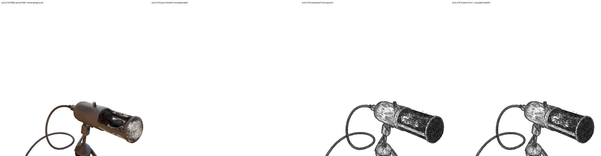
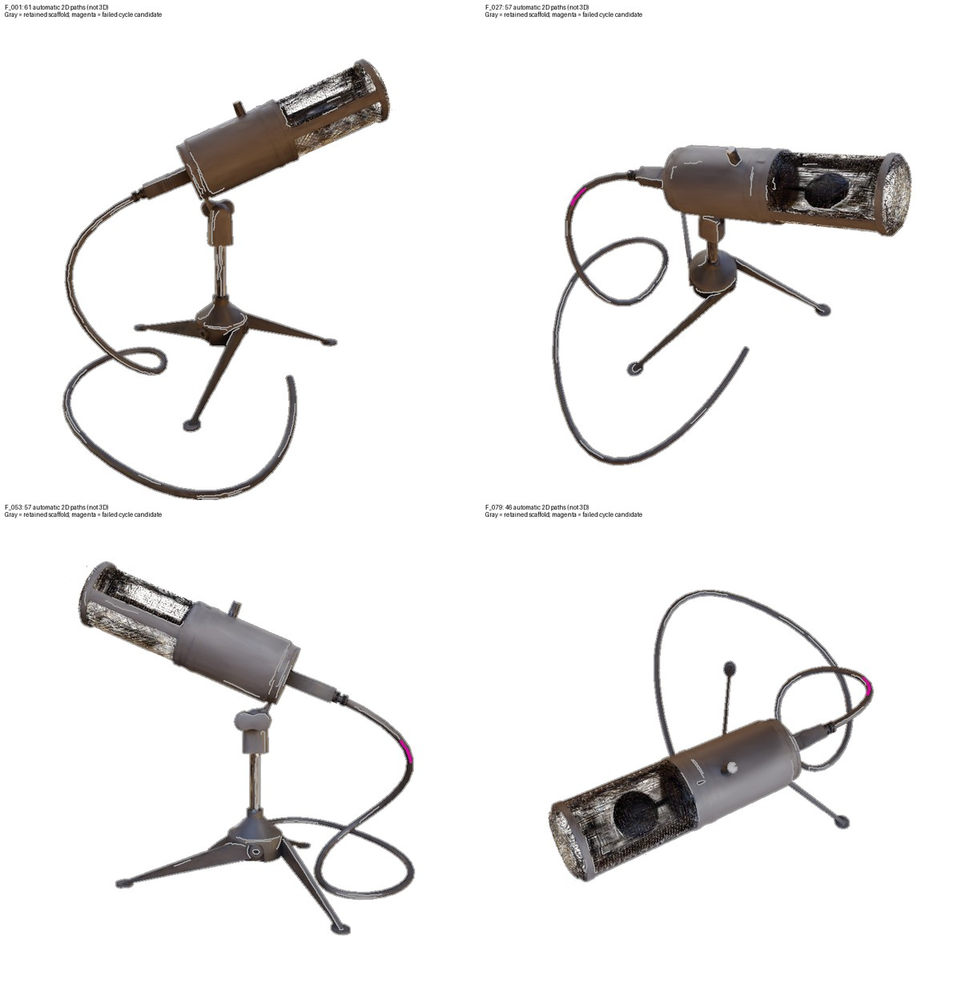

# Mic 固定三维线：单次冻结预算可行性实验

真实实验完成，接受 **0 条固定三维路径**。失败发生在跨视图点对应的循环一致性门：唯一进入三视图循环检查的候选只有 **10/32（31.25%）** 样本回到参考路径的误差不超过 3 px，低于冻结的 70%。因此真实数据没有进入射线三角化，也没有形成供深度验证的三维提案。这是本方法、本视图分割、本预算下的科学负结果；不是空间阻塞，不是 Mic 固定三维线普遍不可行的证明。

已交付全部 **49 个相机记录**的 RGB / pure fixed3D / residual2D full C / hybrid 原生图、原 A/C 基线、模型叠加及全部提案无遮挡诊断，并交付完整 33 帧视频。因为资产为空，49 张 pure3D 均为白底，hybrid 与完整 C 逐像素一致，全部三维提案诊断也为空。没有删掉二维线使结果显得更好，没有把二维结果改称固定三维线。

[完整 Telegram 视频，1600×416，33 帧](media/arc33_telegram1600.mp4) · [33 帧联系表](media/arc33_contact.jpg) · [全部 8 个 C 记录](media/C8_contact.jpg) · [首帧](media/arc0_000_comparison.jpg) / [中帧](media/arc0_016_comparison.jpg) / [末帧](media/arc0_032_comparison.jpg) · [可下载空资产 JSON](ASSET.json) / [NPZ](ASSET.npz)。每个面板保留完整 800×800 内容，顶部另加 32 px 标签；视频没有裁图、删帧、重选相机或用静帧动画替代。

实际链路由 [CONSTRUCTION.json](CONSTRUCTION.json)、[VALIDATION.json](VALIDATION.json) 和独立 [NUMERICAL_REVIEW.json](NUMERICAL_REVIEW.json) 重算：

| 阶段 | 实际结果 |
|---|---:|
| F001 / F027 / F053 / F079 保留路径 | 61 / 57 / 57 / 46，共 221 |
| 原骨架路径 / 小于 24 px 排除 | 34,448 / 34,256 |
| 每视图 96 条上限排除 | 0 |
| 六组视图对的路径组合 | 18,253 |
| 长度不相容 / 极线或覆盖门拒绝 | 5,570 / 12,608 |
| 相容配对 / 互为唯一配对 | 75 / 34 |
| 三元组枚举槽 / 点循环候选 | 27 / 1 |
| 该候选通过循环的不同参考样本 | 10 / 32 |
| 实际射线三角化调用 / 三维提案 | 0 / 0 |
| 真实三维路径的验证视图测试 / 最终接受 | 0 / 0 |

34,448 条原骨架路径扣除 34,256 条短路径，剩余 192 条长度合格原路径；按冻结的 320 px 上限确定性分段后得到 221 条保留路径。

内部旧字段名 `triangulation_attempts=1` 计数的是进入候选循环检查的次数，不能解释为执行了一次射线三角化。独立核验另给出 `triplet_cycle_attempts=1`、`actual_ray_triangulation_attempts=0`。四个验证视图均按阶段实际读取并构造完整未限量线证据，但输入提案数为零，不能称为真实几何验证成功。

唯一循环候选来自 `F_027_path037 / F_053_path037 / F_079_path031`，位于电缆弯曲轮廓附近。下图灰色是自动保留的二维路径，洋红色是该失败候选；这是**二维提取诊断，不是三维线**。不同视角的路径片段及点顺序未能产生足够一致的循环。大量短骨架碎片在既定 24 px 门处排除，96 条容量上限未触发。没有扩容、补桥、改变闭环接缝、放宽阈值或重新拟合来挽救结果。

空对照只运行一次，seed1730，把三个目标视图中 13 / 18 / 14 个完整路径身份作无固定点置换，保持原关联槽与点索引，禁止重新匹配找回真对应。全部强制错配在匹配门被拒绝，空对照三元组、三角化、提案及接受均为零。它证明这次错配未形成可信路径；没有实际压力测试真实三维候选的深度或验证拒绝能力，也不是一般假阳性率估计。完整备选、置换、循环误差和失败原因留在 HDD 的 `out/mic_persistent_line_feasibility_v1/MATCH_DIAGNOSTICS.json`。

实际图像保留原 C 的丰富内部线，也保留明显缺点：网罩与内部区域容易变成近黑密集纹理，机身和支架有碎裂、擦痕状响应；这些响应不等同于可编辑表面线。原生 RGB 也有 splat 重建不确定与细节噪声。arc 中段物体落到画面下方，支架和电缆发生已有出画；本轮保留原相机和完整画幅，没有重居中。纯三维为空，视觉丰富性完全来自原二维 C，不能宣称固定几何带来时间稳定性、优越性或新颖性。联系表和首中末帧是代理检查依据，用户及父级完整视觉评审仍为 **PENDING**。

输入限定为封印的 Mic vanilla30000 / seed1729，checkpoint SHA256 `13255fd1207c031c5542e25cbbdf9596dbe88a0212fd7e383a9010852d6501ca`，相机清单 SHA256 `afa6240bfdada724876ce5ae0a885f6875bb427463f9da85ce1013cd955b2c3c`。源目录仍为 `/mnt/hdd1/u00134/hybrid_raster_trained_models_v1/transport/{raw,frames,media}/mic`；[INPUTS.json](INPUTS.json) 保持真实外部引用。49 是 4 构建 + 4 验证 + 8 C + 33 arc 的记录数，arc 端点复用 C7/C33，不能称为 49 个独立新视角。全部静态视角属于 GS TRAIN 且历史已见，只称未参与本次 LINE 构建，不称新颖盲测或 GS holdout。RGB 为同相机 SH0 白底缓存，不是 GT；vanilla splats 与 mean/median/top-k depth 都不是已知真实表面。未读取 TEST 或 mesh，未重训、人工标注、使用旧橙色曲线或挪动世界控制点追逐二维线。原 A/B/C/author 为视角相关二维结果；原 AUTHOR 是独立重建而非第三方官方结果。

协议只冻结一次。预冻结仅做 JSON 来源、字段头及不解码字节哈希核验：[PREFLIGHT_CURRENT.json](PREFLIGHT_CURRENT.json) 独立核对 1,717 文件、1,533,017,861 字节、99 封印、245 NPZ 头及 49 相机。比例分母、零分母、绝对 top-k 权重与冲突规则在冻结前闭合，原数值阈值未改。[协议](PROTOCOL.md)、[配置](CONFIG.json)、[冻结文件哈希](FREEZE_FILES.json) 与 [推送凭据](PROTOCOL_PUSH.json) 记录以下顺序（UTC）：

| 时间 | 事件 |
|---|---|
| 2026-10-03 13:45:32.834534 | 协议提交 `e69a70f7a71412a3848fbf8fc52db5da29c2c78d` 普通推送并读回相同远端 SHA |
| 13:48:28.021390 | 真实 RED：12 个 fixture，生产模块尚不存在，退出码 1 |
| 14:00:20.088589 | 实现及修复后 25 项合成测试 GREEN，退出码 0 |
| 14:01:31 前后 | 首次读取四个构建视图像素，提取并匹配 |
| 14:02:02.136398 | 提案 JSON/NPZ 封印 |
| 14:03:10.663921 | 验证后空 accepted asset 封印 |
| 其后 | 才读取全部 C/arc 响应和 RGB，渲染全部记录 |
| 14:06:19.016884 | 独立字段、资产、逐帧及两段视频核验完成 |
| 14:09:03.425503 | 最终 25 项相关回归通过 |

合成测试覆盖已知三维线三相机恢复、完整提案正例、独立投影、重复线唯一性弃权、强制错配不重新匹配、低视差、特定视角移动轮廓拒绝、路径顺序/反向/断口、有限性/空输入/近点坍缩、绝对层冲突、遮挡/再现/uncertain、缺失分母、不合理缺失、破坏封印及阶段隔离。RED/GREEN 是实际执行日志；[SYNTHETIC_TESTS.json](SYNTHETIC_TESTS.json) 与 [FINAL_TESTS.json](FINAL_TESTS.json) 给出命令、退出码和哈希，原始及中间修复日志保留在 ignored out。保守把全部初始实现及合成修复时间计入第 1 轮工程预算：827.174 秒，未超过 3 轮/90 分钟；真实数据只运行一套参数，GPU 用时 0。之后仅补充图像计数文字及审计记账，不改变科学设置或接受结果。

[独立交付核验](INDEPENDENT_VERIFICATION.json) 通过 49 组、3,577 个字段数组的有限性/形状/类型/文件哈希检查，以及 RGB/A/C 输出与源值逐像素比较。两段 H264/yuv420p/6fps/faststart 视频均完整解码为 33 个不同帧，去除标签后以 RGB 核对真实帧顺序。49 个姿态复核同一几何哈希 `af5570f5a1810b7af78caf4bc70a660f0df51e42baf91d4de5b2328de0e83dfc`，JSON/NPZ 一致。实际资产为零，真实控制点独立重投影实例数也为零；非空投影与样式编辑能力只由合成 fixture 校验，不虚构真实资产编辑演示。

`strace` 覆盖实际记录的 construction / validation / render 及其后独立检查、回归、审阅图生成的进程树 open/openat/openat2/creat，见 [额外作用域审计](ADDITIONAL_SCOPE_AUDIT.json)：六个进程树、8,464 次 open 类调用、零违规。它不覆盖未记录历史或其他系统调用；NPZ 成员级隔离由已审查的选择性加载代码和时间事件补充，不能声称仅凭 strace 就证明没有读取同压缩包中的某成员。预冻结 checkpoint `.ply` 仅作封印字节哈希，未作 mesh 解析。

唯一写工作区为 `/mnt/hdd1/u00134/hybrid_raster_trained_models_v1/mic_fixed3d_standalone`。`.git` 及 objects 真实位于该 HDD，无 alternates/符号链接；每次实际提交/推送前后检查 1 GiB 储备并考虑载荷，不清理旧数据、不降低保护。历史初始 REPORT/FINAL/协议/输入/guard 原件保存在 [historical_blocker](historical_blocker/SNAPSHOT.json)，旧源工作树未修改。HTTPS 缺少写凭据时以已有 SSH key 对同一 GitHub 仓库作普通无 force 推送，origin URL 与全局配置保持不变。

服务器产物根为 `out/mic_persistent_line_feasibility_v1/`：`frames/<49 keys>/` 含所有原生图，`arc33_native3200.mp4` 为 3200×832 原生视频，`EVENTS.jsonl`、`scope/*.strace`、`logs/`、`tests/` 为原始证据。精确绝对路径、字节数及 SHA256 见 [FILE_INDEX.json](FILE_INDEX.json)，最终计数和声明状态见 [FINAL.json](FINAL.json)，代码审阅见 [FINAL_DIFF_REVIEW.json](FINAL_DIFF_REVIEW.json)。提交后远端 SHA 与干净工作树的最终读回凭据写入 `out/mic_persistent_line_feasibility_v1/DELIVERY_VERIFY.json`，避免提交内文件自引用自身提交哈希。
