# 冻结 3DGS 特征线与 Gaussian 边缘贡献归因综合报告

**2026-10-04｜从固定三维线、逐视角二维线，到冻结核的连续属性与固定 ID 筛选**

> **结论先行。** 最新结果支持的是：在冻结 3DGS 中，根据多视图二维边缘证据，为原始 Gaussian ID 估计连续贡献分数，并把固定分数或固定核群投影到其他相机。研究对象是**参与边缘成像的 Gaussian**，不是已经恢复的真实几何棱边。Mic 与 Materials 完成了来源报告所记载的 **98/98 个 native800 相机记录**，但评分仍受 TOP4 贡献者截断限制，**完整贡献归因为 UNDETERMINED**。[7]
>
> 固定三维线路线保留科学负结果：Mic 的 221 条二维路径，经匹配后只有一个循环候选，通过一致性的样本仅 10/32；实际三角化、三维提案和最终接受均为零。这限定了当时的方法、输入与预算，不能证明固定三维线不可恢复，也不能用来否定后续固定 Gaussian ID 群。[6]
>
> 八场景二维线图展示了更多结构响应，也保留面内杂纹、灰填充、断线与出画。核归因的集中度提升不能直接换算为几何精度、时间稳定性或人工视觉 GO。本报告没有新增科学运行；本次报告包已在本地独立完成图像来源哈希、链接、中文 PDF 和视频逐帧完整解码核验。这些工程检查不等于新增科学证据。[4][5][7]

## 目录

1. 证据等级与输入合同
2. 历史物空间路线及其失败边界
3. 第三方方法与独立公式重建
4. 八场景二维线方法的实际结果
5. Mic 固定三维路径的负结果
6. 冻结核贡献评分与完整模型投影原理
7. Mic 与 Materials 的实际投影和控制
8. 定量结果及其正确解释
9. TOP4 截断与完整性审计
10. 版本、交付边界与后续研究排序

## 1. 证据等级与输入合同

本报告包含 **27 张真实实验图、3 张原理示意、1 张缩略导航**，并链接两段原始对比视频。真实图保留原实验数据；示意图只解释计算关系；导航是既有图的派生拼接，不增加独立证据。图内过时标题、宣传文字及历史状态，以正文限定为准。

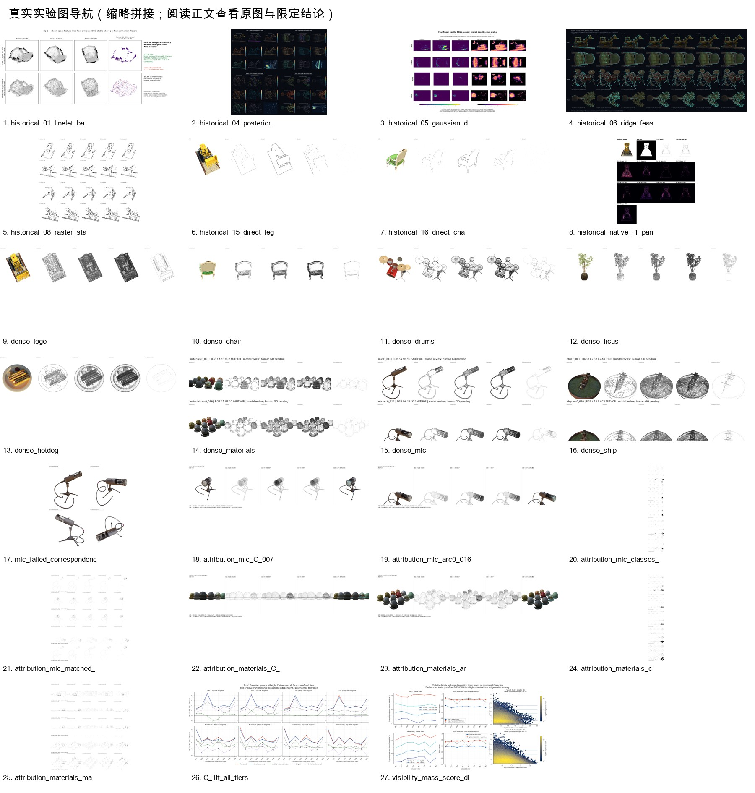

图1帮助定位各阶段资产，不能用于判断细线质量、遮挡、完整帧序列或方法优劣，也不能把拼接中的不同实验视为统一条件下的比较。

研究先后采用三种输出合同。**固定三维线**要求世界坐标中的控制点、身份与拓扑固定；**逐视角二维线**允许边缘随相机重新计算；**固定 Gaussian 属性或 ID 群**固定的是原模型核的分数或选择身份，其成像范围由当前视角下的贡献决定。第三种不等于第一种，也不要求把核支持区域拟合成细薄曲线。

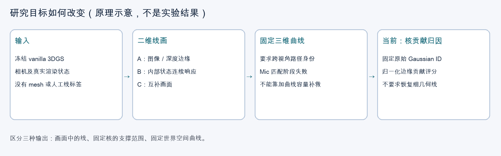

图2解释目标从“恢复可编辑三维线”转向“识别边缘成像贡献者”的过程。它不证明任一路线成功，也不意味着放弃未来恢复三维线；目标变化必须伴随评价问题变化。

最新核实验使用冻结 vanilla30k／seed1729、native800、SH0 clipped DC、白背景 RGB、黑背景属性及 `kernel_size=0`。45 个高阶 SH 系数没有参与该渲染，因此 Materials 的反光物体不能作为完整视角相关反射的验证。RGB 是模型渲染，不是 GT；渲染深度、核轴及缓存最近层也不是已知真实表面。[7]

核评分使用 F=[1,14,27,41,53,67,79,93]；C=[7,21,33,47,59,73,86,99] 不参与该评分，arc 使用预声明的 33 帧相机。**C 仍属于模型训练时见过的 100 个 TRAIN 相机，不能称为盲测、TEST 或 GS 泛化测试。**本文区分“C 相机”与二维方法臂“C”，避免把视角分组误读成算法名称。[5][7]

## 2. 历史物空间路线及其失败边界

早期目标是在冻结 vanilla 3DGS 上自动构造持久线资产，不让 mesh 进入算法。图像边缘能提供候选，却不能单独赋予跨视图身份、连续拓扑和正确遮挡。历史 linelet 曾显示部分稳定性收益，但存在碎裂、漏线和错线；干净实体上的逐帧图像边缘也可能稳定。

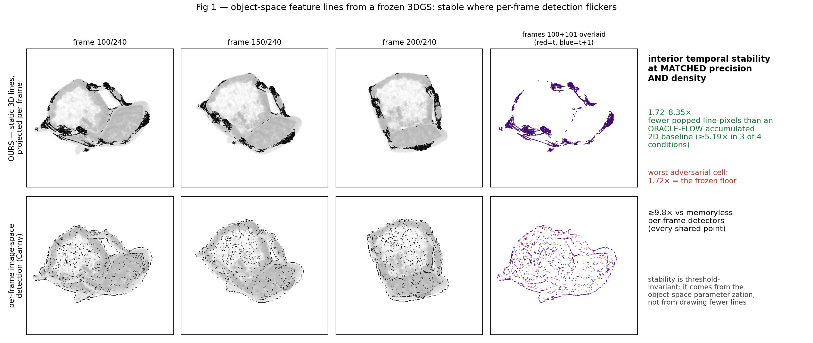

图3保留当时 linelet 与图像证据的对照，用于观察局部结构及稳定性差异。它不支持“所有场景都优于二维边缘”或“已获得完整固定资产”的结论；旧图文字不能扩张这一观察范围。

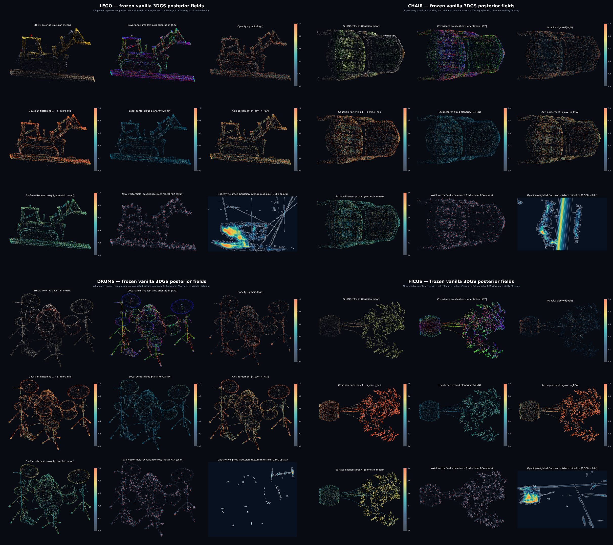

图4检查表示中的多层、碎片及候选方向。最小 covariance 轴只是未定向候选轴，不能据此认定它是真实曲面法线，更不能直接连接为可靠棱边。

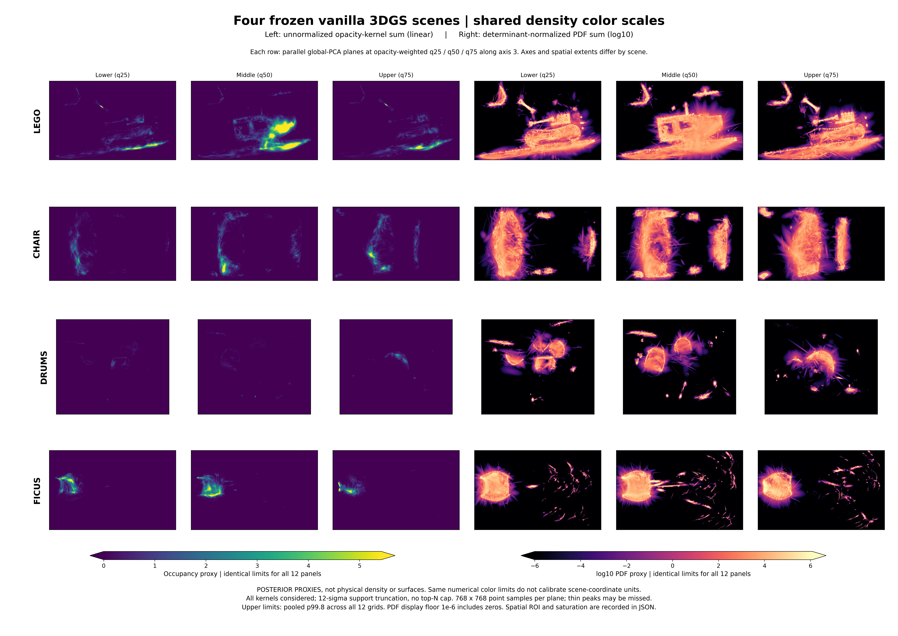

图5展示混合密度的空间分布。密度可以反映表示状态，却不自动具有曲面拓扑或 SDF 含义；高密度区域不等于表面，高密度变化也不等于应画的几何线。

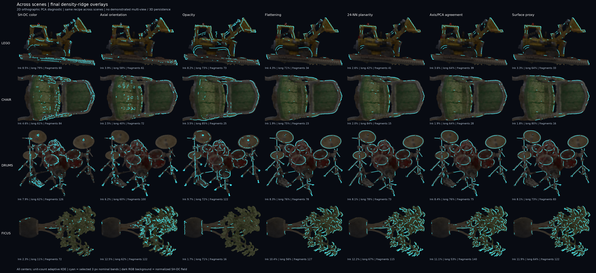

图6记录局部 ridge 与带状响应，历史结论仅为有限二维诊断可用。它没有交付稳定、持久、可编辑的三维线，宽响应也不能作为几何恢复成功的替代证据。

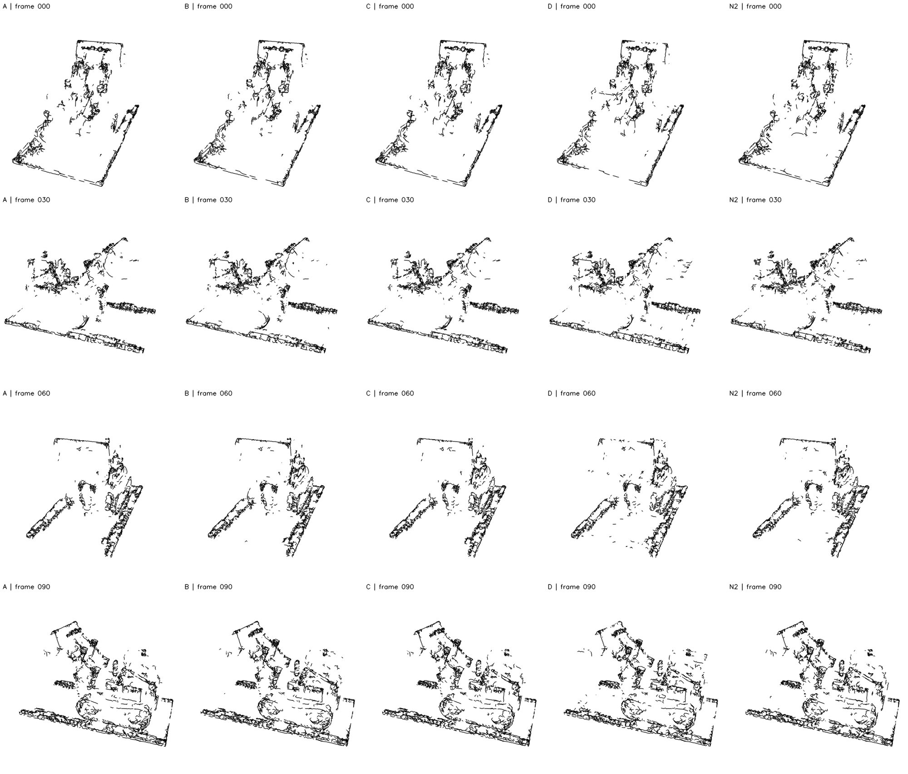

图7属于本项目早期状态读出与候选实验。旧圆盘代理不等价于郝—向井方法的原生输入和最终合成器，因此代理失败不能判第三方作者方法失败。

扩充候选、WV-PC 路径组织、固定端点补桥和 VRSS 子集选择，曾改善个别局部缺口，但没有解决完整结构与最差视角。固定 top-8 contributor 的覆盖不足属于工程 `INVALID`；自适应质量完整贡献者 G0 通过后，分层检测 G1 的四场景仍为 `0/4 NO-GO`。工程无效与科学负结果必须分开。

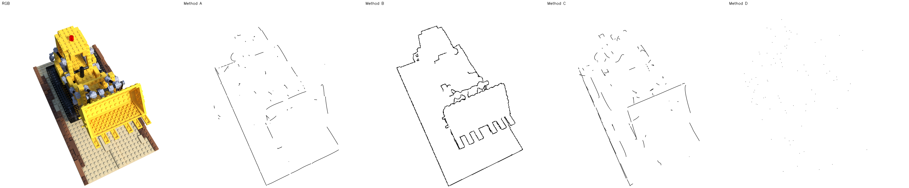

图8保留固定曲线与二维参考的历史多臂比较。列序为 RGB、D、depth2d、I、L；depth2d 的单帧表现不能证明固定三维资产成功，I 的局部改善也没有消除缺失和错线。

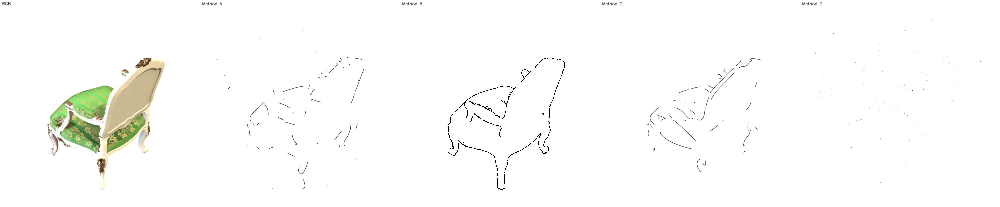

图9提供另一场景的同类失败证据，不能将局部看似合理的曲线推广为完整椅子结构。历史全局拟合 D／I／L 三臂在四场景均未达到冻结门槛。

旧版曾把失败过的 I 分支橙色曲线与二维边缘合成视频；那是当时的混合合同，**当前八场景二维图与核归因图没有使用这些旧橙色三维曲线**。另两条历史分叉也保留：Lego 时间运输首个候选在等墨量控制下 NO-GO；额外 Kinect RGB-D 路线虽形成固定 ID 并完成工程视频检查，仍因短碎结构与遮挡错误未获科学通过。后者改变了输入，不能计入 vanilla-GS-only 成功。

## 3. 第三方方法与独立公式重建

需要严格区分四类工作。原始 3DGS 提供 Gaussian 的可见性混合与成像基础。[2] **RaDe-GS** 是第三方深度／法线栅格化方法，本项目使用并校准其分支；其基础能力不是本项目原创。[7] **郝—向井海报方法**依据栅格内部的贡献者、深度、法线、颜色和透明度状态，以邻域差异及可靠性门控构造连续特征线字段，不是最终 RGB 的简单后处理，也未在所述结果中交付持久三维笔画。[3]


图10是本项目隔离编译 RaDe 原生 CUDA、同次前向导出 top-4 ID、`αT`、深度和法线，再独立计算海报 Eq.1–5 的字段图。输入为冻结 vanilla PLY、仅 SH0，缺少 RaDe 训练所得 `filter_3D` 和作者最终风格合成；P99 拉伸只是显示处理。因此它不支持“作者官方效果复现”，也不证明三维线恢复。[3]

本项目的**密集二维融合**与**冻结核贡献筛选**是另外两种实现。前者组合逐视角响应；后者把独立二维证据回传到原始核身份。海报公式重建是对照臂，不能把其他臂的收益归给作者公式。

**Gaussian Grouping（ECCV 2024）**使用 SAM+DEVA、16D 可学习身份、联合重建和空间 KL，解决分组问题。[1] 本次核归因是在冻结核上解析累计贡献，不训练身份特征，不是 Gaussian Grouping 的复现，也未提出新颖性主张。[7] 固定 ID、贡献类别和语义实例分割是不同概念。

## 4. 八场景二维线方法的实际结果

这一组图属于**逐视角二维线方法**，与后文 Mic／Materials 核属性投影分开。前四场景沿用 densev2 的冻结配置；后四场景正式报告定义 A 为灰度 RGB／depth／alpha dense edges，B 为 OUR 六通道，C 为自动互补，AUTHOR 为海报 Eq.1–5 独立重建、非官方结果。不同阶段的相同列名不能自动证明输入及全部参数完全等价。[4][5]

这些灰度表示连续边缘响应或墨量，**不是新增光照或真实阴影**。原增益面板保留实际深浅；后四场景的等墨量只适用于 A/B/C，AUTHOR 使用冻结增益。增加墨量不等于增加正确结构。

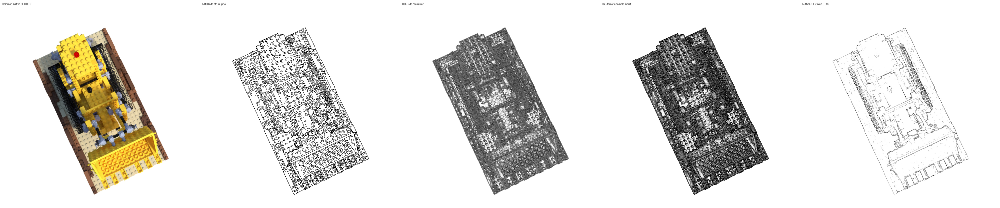

图11用于比较车体、铲斗与底板的二维结构表达，当前不含旧橙色曲线。线条丰富度不能证明新增固定几何，也不能据单帧认定时间稳定。[4]

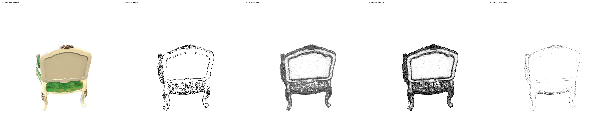

图12用于检查外轮廓与内部结构响应之间的取舍。更密的内部线不自动具有可编辑三维身份；它也不支持沿用旧固定曲线的成功结论。[4]

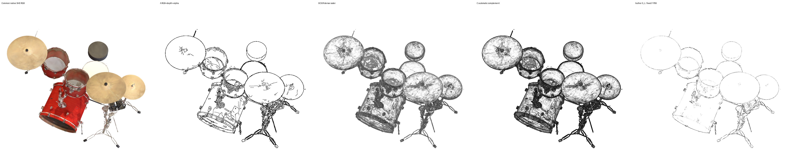

图13用于检查鼓面、支架及局部细节的响应。来源记录同时保留不规则杂线，不能把所有细纹解释为真实结构，也不能凭丰富度判定方法优越。[4]

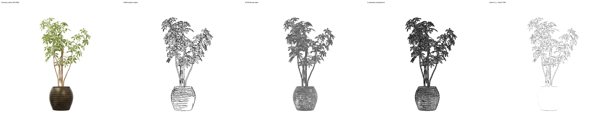

图14对应叶冠的复杂结构与拥挤响应。增加叶部线索可能提高可读信息，也可能增加混叠；它不证明叶片身份、遮挡或跨帧连续性已经解决。[4]

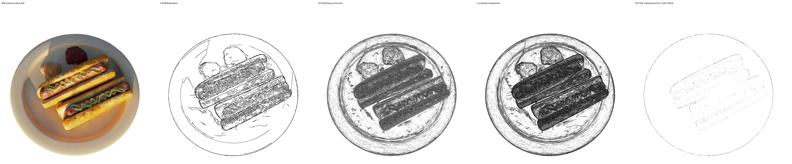

图15保留盘沿、食物边线及内部碎纹。它是二维方法结果，不是 Gaussian 筛选图；盘面杂纹不会因墨量匹配自然成为正确边缘。[5]

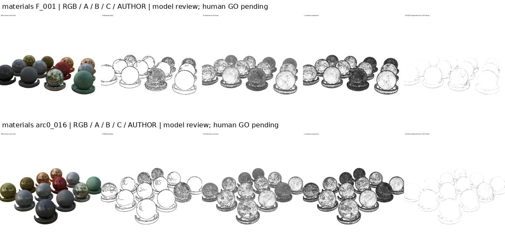

图16同时保留出画和球体面内杂纹。来源观察为：A 常显示外缘与底座环线，B/C 可在平滑球体内部形成颗粒或云状灰填充，AUTHOR 较细且断续。它不支持完整反射验证；共同 SH0 RGB 中已有的不规则深色区域，也不能全部归因于新增 NPR。[5]

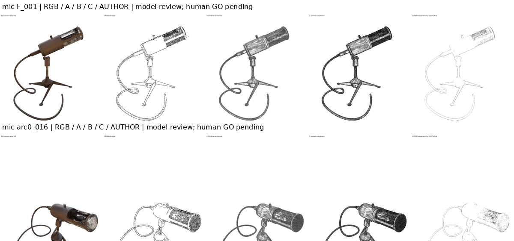

图17保留网罩密线、金属表面擦痕状响应及支架／电缆出画。等墨量可以改变深浅，不能消除这些空间杂纹；二维 C 的丰富性不等于恢复了可编辑表面线。[5]

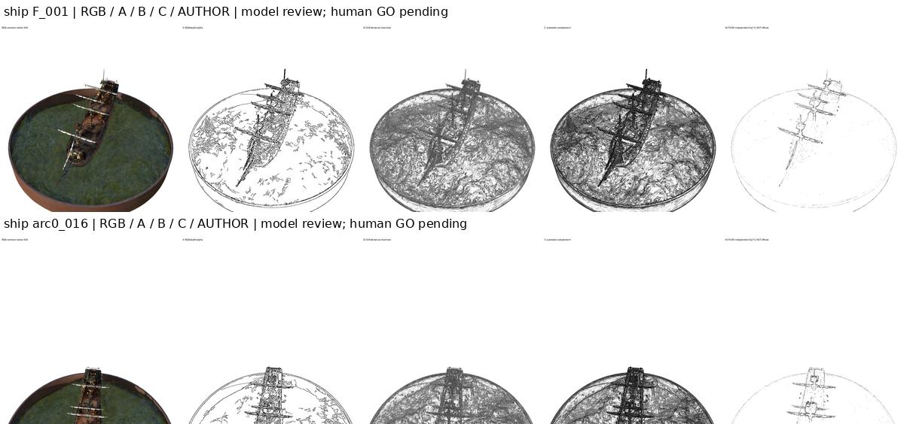

图18必须结合来源记录阅读：**arc016 的大部分船体和圆盘落在下边界之外，上部大面积空白，原生 RGB 已直接证实。**这是相机成像问题，不是 JPEG 排版裁切。B/C 的水面密纹和压暗也被保留；首末较完整不能证明整段视角覆盖合格。[5]

后四场景扩展先经历了输入库存阻塞：Hotdog、Materials、Mic、Ship 缺少可用的标准 vanilla 3DGS 检查点，Ship 的既有 2DGS 不能冒充替代输入。经用户允许，仅用各场景已有 TRAIN 数据，以 seed1729 进行 30,000 步标准光度重建，并保留 7,000／30,000 步检查点；之后模型冻结，没有线感知重训。最初只完成 Hotdog 的 49 帧，余下渲染被存储不足阻塞；授权 HDD 后续跑，而不是降低磁盘守卫或删除历史证据。因此“获得缺失模型的标准训练”和“后续冻结模型的线画／归因”属于不同阶段。[5]

后四场景来源报告记载现存 196/196 帧及 24/24 视频产物完成独立工程核验，但人类科学评审仍 pending。旧 Hotdog 首次 render 在 27 帧后以 143 中断，首次 checker 也以 143 中断，两份历史审计仍 INVALID；后续产物完整性不能补齐旧退出记录。[5]

## 5. Mic 固定三维路径的负结果

这次实验从四个构建视图的二维骨架路径出发，尝试建立跨视图路径身份和点对应，通过循环一致性后才允许射线三角化。另四个静态视图用于后续验证；49 个记录由 4 构建、4 验证、8 C 和 33 arc 组成，arc 端点复用 C7／C33，不能称为 49 个独立新视角。[6]

| 阶段 | 来源核实的实际结果 |
|---|---:|
| 四构建视图保留路径 | 61／57／57／46，共 221 |
| 相容配对／互为唯一配对 | 75／34 |
| 点循环候选 | 1 |
| 循环一致样本 | 10/32，31.25% |
| 实际射线三角化 | 0 |
| 三维提案／最终接受 | 0／0 |

原骨架路径 34,448 条，短于 24 px 的 34,256 条被排除；剩余 192 条按冻结 320 px 上限分段得到 221 条。每视图 96 条容量上限没有触发。唯一候选未达到冻结的 70% 循环门槛，因此失败发生在对应阶段，尚未测试真实提案的深度验证能力。[6]


图19的灰色是保留的二维路径，洋红色是电缆附近失败候选，**不是三维线**。内部旧字段 `triangulation_attempts=1` 实际计数进入循环检查，不能解释成三角化一次；独立记录明确实际射线三角化为零。[6]

接受资产为空，所以 pure3D 为白底，hybrid 与完整二维 C 逐像素一致。视觉丰富性全部来自二维层，不能归功于固定几何。错配空对照在匹配门被拒绝，只说明该次强制错配没有生成可信路径，不是一般假阳性率或真实三维验证能力估计。合成 fixture 的恢复成功也不能改写真实 Mic 的零接受结果。[6]

## 6. 冻结核贡献评分与完整模型投影原理

最新实验不再要求先拼出线，而是问：**哪些原始 Gaussian 在 F 视图中，为独立边缘证据所在像素贡献了成像质量？**颜色梯度、渲染深度梯度和 alpha 轮廓分别作为证据来源；主证据不由 ID 切换构造。[7]

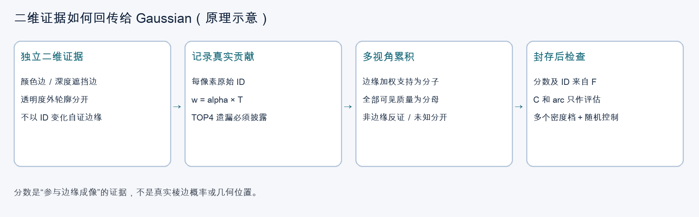

图20说明像素证据按实际贡献权重累计到核身份。它只解释计算路径，不能证明贡献者齐全；当前回传仍局限于 F 的 TOP4 缓存。

以 `v` 表示视图、`p` 表示像素、`i` 表示原始核 ID，`E_v(p)` 表示独立连续边缘证据，`T` 表示该核之前的透射率。基本贡献比与投影可写成：

```text
w_vi(p) = alpha_vi(p) * T_vi(p)
r_iv = sum_p[w_vi(p) * E_v(p)] / sum_p[w_vi(p)]

SCORE_i：
由 F 的证据支持、贡献分母及冻结视图平衡规则得到的连续核分数。

P_v(p) = sum_i[w_vi(p) * s_i]
Q_v(p) = sum_{i in S}[w_vi(p)]
```

`r_iv` 表示单视图基本证据比；主分数另以每视图缓存总质量平衡影响，不能把上式当作全部双侧规则。`s_i` 是用于主投影的可靠性处理后分数；`S` 是按预声明层级选择的固定 ID 集合。**SCORE 是核属性，P 是连续评分的像素投影，Q 是选中核群的贡献投影**，三者不能互换。[7]

分母累计整个缓存网格：核在非边缘区域有贡献而证据弱，会形成反证，降低估计。**未知则表示核没有进入这些 F 的 TOP4，缺少评分观测。**未知不能解释成非边缘、永久遮挡或从未可见。eligible 排除总可见质量小于 1 或可见视图少于 2 的低可靠性估计；主 P 对不可靠核置零属于弃权，不是负样本判决。[7]

双侧扩展使用独立软梯度方向、固定 2／4 像素偏移、贡献者集合重叠及相对深度差，将证据沉积到适当的前景／缓存最近层。这里的“最近”受缓存约束，ID 差异本身也不是几何真值。[7]

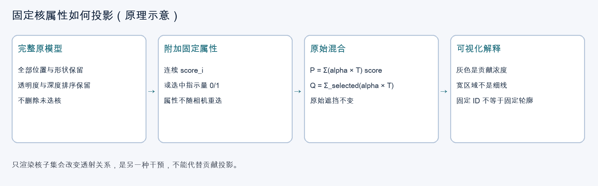

图21解释分数和 ID 固定、像素支持随视角变化的关系。它不证明细薄线条或时间稳定性；整颗 Gaussian 的投影自然可能较宽。

实际 P/Q 使用完整模型原生遍历，保留所有核的位置、形状、透明度和排序，只改变预计算属性颜色。未选中核没有被删除，仍参与遮挡，因此隐藏层不会因子集重合成而被释放。单独渲染导出的选中 PLY 会改变遮挡，不能代替该投影。[7]

## 7. Mic 与 Materials 的实际投影和控制

以下图与第4节分开：它们展示固定核评分及固定群投影。类别代表颜色、深度、轮廓证据来源，不是语义实例；1／3／10／30% 均为预声明 eligible 排名层级，不能根据好看的图重新挑比例。[7]

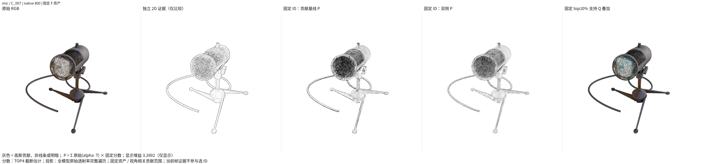

图22依次为 RGB、独立二维证据、贡献评分、双侧评分和固定 top10% 贡献叠加。C007 可检查未参与核评分的相机表现，但仍为 TRAIN；它不支持盲测、几何 precision 或人工视觉 GO。[7]

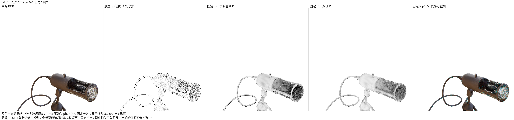

图23展示真实同相机的 arc016。固定 ID 不意味着固定二维轮廓，贡献范围会随视角变化；中段支架／电缆已有出画，因此不能认定整物体在全段均受评价。[7]

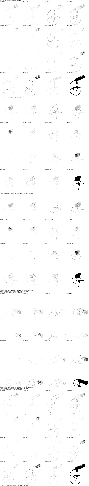

图24检查证据来源与选择规模如何影响支持区域。宽区域属于整核选择的结果，不宜直接按细线标准判失败；但类别响应也不能证明真实材质边界或三维棱边。[7]

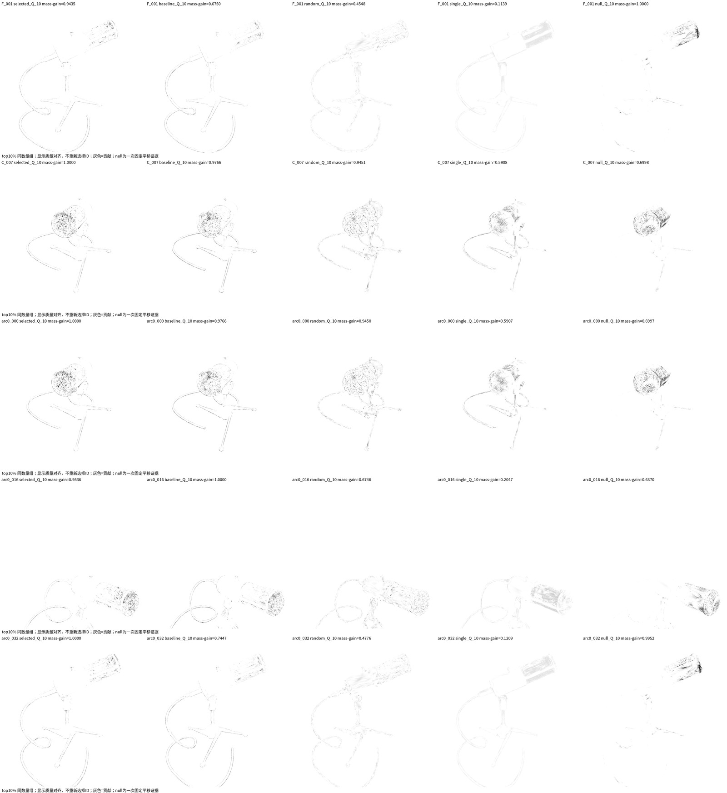

图25针对数量与投影质量差异提供控制。随机核按 F 的 TOP4 质量和可见视图数分层匹配数量，完整投影质量仍可能不同；质量缩放不等于同几何位置、同线宽或同可见空间覆盖。[7]

[下载 Mic 旧线算法与 Gaussian 贡献筛选对比视频](videos/mic_old_lines_vs_gaussian.mp4)

Mic 视频按来源清单保留同相机完整 **33 帧**及原显示增益，**不是等墨量对照**。“旧线”不能自动解释成旧橙色固定三维曲线；视频也不能单凭播放顺畅证明跨帧稳定或科学优越。

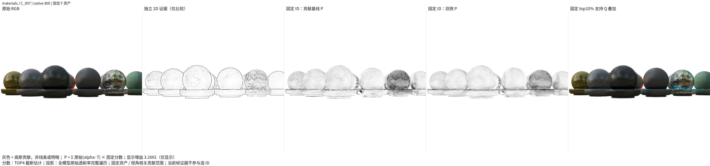

图26采用与 Mic 相同的五列解释和冻结配置，检查平滑及反光对象上的贡献分布。它不支持完整视角相关反射验证，也不能把属性灰度解释为物体受光。[7]

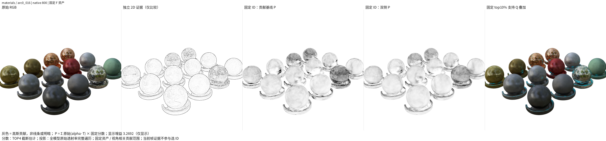

图27用于检查真实相机变化时的固定核群成像。贡献范围变化不等于重新选择 ID；一张代表图不能证明整段稳定、遮挡均正确或筛选完整。[7]

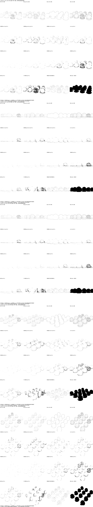

图28保留不同通道和四档规模的比较，避免只展示最有利层级。它不能把颜色证据贡献者认定为真实几何边缘，也不能据某档较集中宣称整体方法获胜。[7]

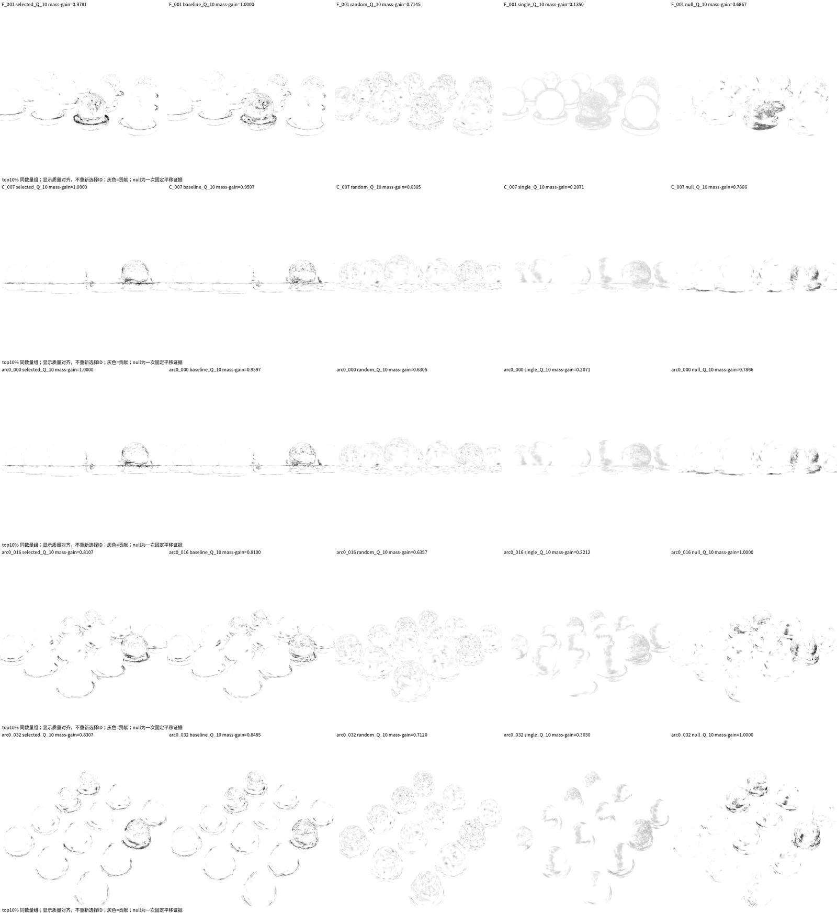

图29检验明暗或贡献总量是否足以解释部分差异。缩放不能消除空间位置差异，仍须结合原始质量和范围阅读；它不是完整几何条件匹配。[7]

[下载 Materials 旧线算法与 Gaussian 贡献筛选对比视频](videos/materials_old_lines_vs_gaussian.mp4)

Materials 视频同样为同相机完整 **33 帧**、原显示增益、非等墨量。两视频的本次报告包复制、来源哈希与本地链接检查已通过；各视频完整解码 33 帧，去除标题的 RGB 内容裁片也有 33 个不同帧。HTML 中设有离线播放器。工程解码与科学判断分开；这些检查不新增人类视觉 GO。

## 8. 定量结果及其正确解释

| 场景 | 原始核数 | eligible | F TOP4 未观测／未知 | top1%／3%／10%／30% 核数 |
|---|---:|---:|---:|---|
| Mic | 311,562 | 33,551 | 228,418（73.31%） | 336／1,007／3,356／10,066 |
| Materials | 282,537 | 72,124 | 134,802（47.71%） | 722／2,164／7,213／21,638 |

这些比例以 eligible 排序，不是原始全模型核数的相同比例。大量未知是贡献缓存的观测限制，不能算成成功剔除的非边缘核。[7]

lift 衡量属性质量对独立二维证据容差区的集中程度：

```text
lift_v =
（容差区内属性质量 / 该视图总属性质量）
/
（容差区内原始 alpha 质量 / 该视图总 alpha 质量）
```

C 使用固定 2 px 容差，先逐视图计算再平均，不能直接用两个平均集中度相除重算。lift 不是几何 precision、真实边缘检出率或人工质量分数。[7]

| C 平均 lift | 基线 P | 双侧 P | 基线 top10% Q | 双侧 top10% Q | 匹配随机 Q | 单 F1 Q | 平移 null Q |
|---|---:|---:|---:|---:|---:|---:|---:|
| Mic | 1.1374 | 1.1042 | 1.2141 | 1.2185 | 1.0204 | 1.1510 | 1.1353 |
| Materials | 1.1684 | 1.1319 | 1.3194 | 1.3348 | 1.0728 | 1.0616 | 1.1426 |

双侧 top10% Q 比匹配随机更集中，相对贡献基线的增量却较小；双侧连续 P 在两场景都低于基线。结果支持“某些固定核群具有证据集中度”，**不支持双侧扩展整体优越**。Mic 的单 F1 和平移 null 也有集中度，需保留这些控制，不能只与随机相比。[7]

| 场景 | 容差区占 alpha 质量 | 双侧 top10% Q 集中度 | Q 平均质量／随机平均质量 | 最差 C 的 top10% lift |
|---|---:|---:|---:|---|
| Mic | 81.49% | 98.75% | 2056.7／3391.3 | C007：1.1316 |
| Materials | 71.38% | 94.07% | 5837.4／7428.7 | C086：1.1839 |

证据容差区覆盖的 alpha 质量本就较大，高集中度必须结合这一背景。主组与随机组完整投影质量不相等，不能只看叠加深浅判断筛选质量。[7]

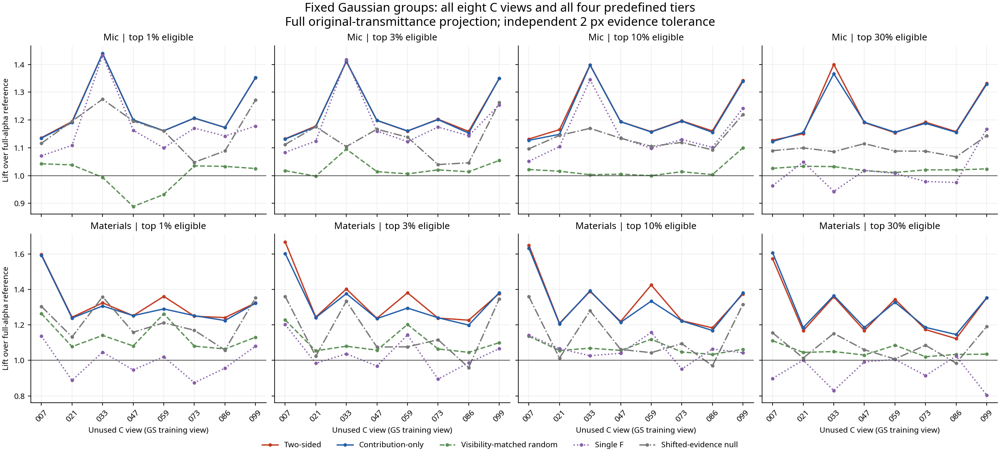

图30将所有 C 和预声明层级放在一起，支持检查代表图之外的差异。Mic 四档双侧 Q 平均 lift 为 1.2328／1.2236／1.2185／1.2130；Materials 为 1.3245／1.3475／1.3348／1.2830。它不证明几何正确率，也不提供时间稳定性结论。[7]

单 F1 对照不以未知核补足：Mic top30% 主组／单 F1 为 10066／8074，Materials 为 21638／14531；top10% 分别保持 3356／3356 和 7213／7213。跨层级比较需要保留这种实际数量差异。[7]

## 9. TOP4 截断与完整性审计

**投影完整与评分完整是两个独立问题。**主图原生遍历包含完整模型在阈值和提前终止规则下的有效贡献，不能反推 F 的 TOP4 已覆盖所有可评分贡献者。[7]

| 场景 | F 缓存／原始 alpha 质量 | C 缓存／原始 alpha 质量 | C top10% 组投影质量被 TOP4 捕获 |
|---|---:|---:|---:|
| Mic | 57.71% | 57.51% | 81.69% |
| Materials | 58.31% | 57.98% | 76.47% |

缓存遗漏不仅影响未知核，也可能改变已观测核的分母、证据比例及资格集合。固定 ID 的身份可追溯，不能据此认定其评分无偏或集合完整。[7]

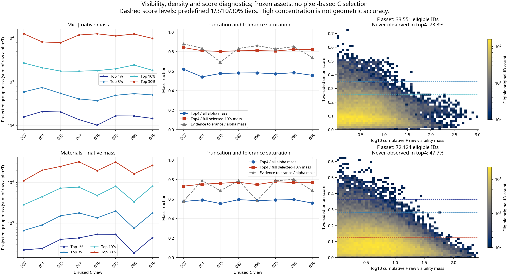

图31用于联系投影质量、缓存覆盖和分数，避免仅凭集中度评价。它不证明遗漏贡献者无关，也不能把低分、低质量与未观测合并成一种“非边缘”判断。[7]

Mic 原生 top32 插桩仅检查 **F1/F41**。两视图的 RGB、alpha、深度及前四 ID／权重与原缓存一致；按主前景阈值，top4 覆盖为 56.75%／57.64%，top32 为 97.04%／95.98%。两 F 的 eligible 从 6,962 增至 15,844；共同 eligible 上双侧 union Spearman=.9533，但各自 top10% Jaccard=.3881。[7]

这说明条件排序可以相似，而资格和选择集合仍对截断敏感。它**不是全数据 top32 重算**，没有改写主资产，也没有解决完整归因。Mic 两 F 的局部检查不能替代全部 F、Materials 或其他场景的完整性评估。[7]

完整模型属性投影的全1属性与 alpha 最大误差小于 `9e-7`，属性变化不改变 alpha／深度，98 个记录执行相同校准。这验证属性投影接口，不验证 SCORE 的完整性、真实几何或审美质量。所谓完整只限原生阈值及提前终止下的有效贡献，并非无限支撑积分。[7]

## 10. 版本、交付边界与后续研究排序

本次正文编写的默认配置与 runtime header 已核验为 **`gpt-6.1-sol/xhigh`，very high effort**；历史实验执行为 **Astra/ultra**，不能归为此次 Sol 执行。首次远端 HDD 报告写入失败后，流程降级为只读 ephemeral Sol 输出正文，由本地父助手编排生成与验证。用户 Mac 的 136 GiB 空间用于最终 MD／HTML／PDF／ZIP；本次没有科学重跑、资产删改或历史结论改写，也没有发布到 repo。

历史出处保留以下四个准确提交：

- [`f2a618450e0d0d142a059794149021fe3c2644ab`](https://github.com/mengguo311/FeatureLineRendering/commit/f2a618450e0d0d142a059794149021fe3c2644ab)
- [`59b6b3e49e14f758032a5e0079fe9405511bc148`](https://github.com/mengguo311/FeatureLineRendering/commit/59b6b3e49e14f758032a5e0079fe9405511bc148)
- [`d5c6d4d114b6b80ec5edb9c1717111e89a191eda`](https://github.com/mengguo311/FeatureLineRendering/commit/d5c6d4d114b6b80ec5edb9c1717111e89a191eda)
- [`20f85a15c3d3c382b94b83e8b6aa501c72009e70`](https://github.com/mengguo311/FeatureLineRendering/commit/20f85a15c3d3c382b94b83e8b6aa501c72009e70)

核归因来源明确将 `d5c6d4d114b6b80ec5edb9c1717111e89a191eda` 列为工作基点。[7] 这些历史提交不能作为本次推送或当前远端读回凭据。报告中的媒体使用相对路径；manifest 应保存准确绝对来源、SHA-256、字节数以及实验图、示意图、导航和视频的类型。

来源报告中的单元、回归、合成恢复、属性校准和媒体解码，分别验证代码与工程合同，均不等于科学或人工视觉 GO。[5][6][7] 历史核归因测试曾使用默认临时路径，后续已修复并重测，但不能追溯证明全会话所有匿名临时写入；访问审计也仅覆盖所记录进程树。旧 Hotdog 143 缺口同样保留，不由新报告包装消除。

下一步研究按以下顺序建议，**本报告不授权执行**：

1. **优先解决贡献者截断。**在冻结协议下扩大或自适应累计贡献，检查未知、资格、SCORE 与选中集合如何变化，先于进一步渲染调优。
2. **分离贡献集中度与真实边缘质量。**保留独立二维证据、平移 null、单 F1、随机及质量控制，另建立明确的视觉或几何评价。
3. **补足公平输入比较。**分别控制 SH0／完整 SH、RaDe 训练属性及作者合成差异，避免把颜色或输入变化当作方法收益。
4. **评价完整运动与出画。**使用预声明相机和完整帧序列，单独报告时间变化、遮挡与视野覆盖；Ship 中段问题不能被首末帧掩盖。
5. **重新研究固定三维线恢复。**从可核验的跨视图身份与点循环开始，区分真实提案验证和合成 fixture；固定核群可提供研究线索，但不能直接冒称三维线资产。


## 交付与核验范围

本报告由 dss9 的 GPT-6.1 sol／xhigh 只读会话编写正文，在 Mac 上编排媒体与 PDF。它没有重跑科学实验。完整离线包请解压后打开 `index.html`，图片可点击原尺寸，视频在 HTML 内播放。PDF 中视频只提供离线包路径，不是嵌入式播放器。当前报告未推送 GitHub；所列 GitHub 入口是历史实验提交。报告文件完整性检查与人的视觉判断不同：没有新增独立人类视觉 GO。HTML 的本地路径全部检查通过；浏览器实播检查被默认浏览器配置及独立 Chrome 超时阻塞，未宣称播放器实播成功，两视频另已由 ffmpeg 完整解码。


## Sources

[1] https://www.ecva.net/papers/eccv_2024/papers_ECCV/papers/04195.pdf
[2] https://repo-sam.inria.fr/fungraph/3d-gaussian-splatting
[3] https://mukai-lab.org/content/SA2026PosterHao.pdf
[4] https://github.com/mengguo311/FeatureLineRendering/blob/f2a618450e0d0d142a059794149021fe3c2644ab/artifacts/hybrid_raster_evidence_v2/REPORT.md
[5] https://github.com/mengguo311/FeatureLineRendering/blob/59b6b3e49e14f758032a5e0079fe9405511bc148/artifacts/hybrid_raster_trained_models_v1/REPORT.md
[6] https://github.com/mengguo311/FeatureLineRendering/blob/d5c6d4d114b6b80ec5edb9c1717111e89a191eda/artifacts/mic_persistent_line_feasibility_v1/REPORT.md
[7] https://github.com/mengguo311/FeatureLineRendering/blob/20f85a15c3d3c382b94b83e8b6aa501c72009e70/artifacts/gaussian_edge_attribution_v1/REPORT_ZH.md
