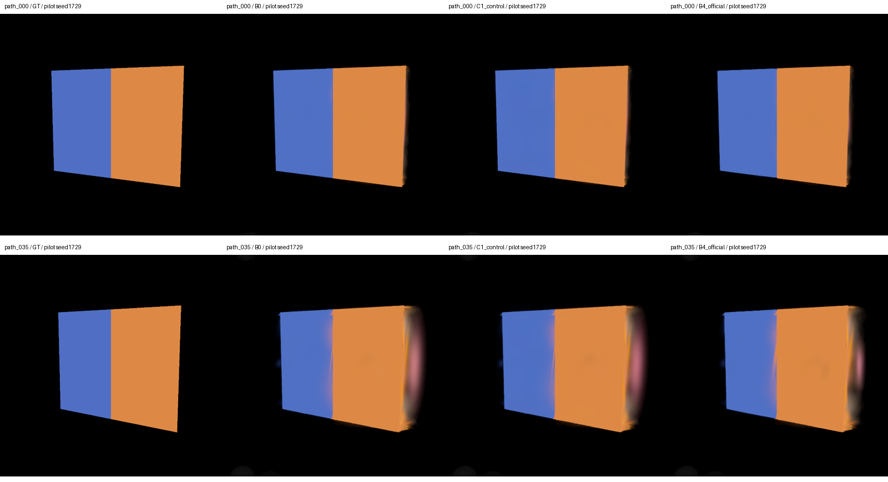
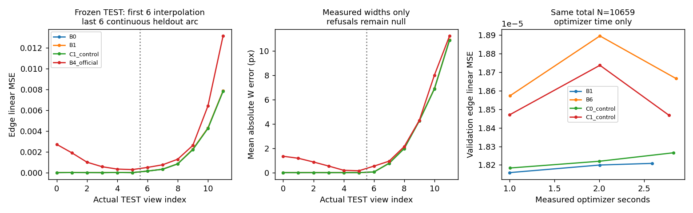
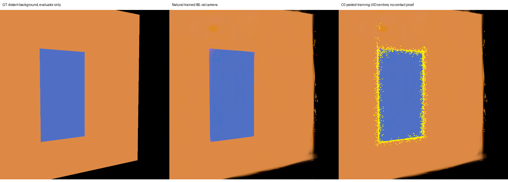

# 实际执行报告：object-neighborhood-edge-control-v1

结论：本次完成真实原生 GS 训练、同一 CUDA 遍历的贡献诊断、官方 COB-GS pilot、局部控制和冻结 TEST/路径评价。**没有得到达到预注册门槛的新控制方法正结果**。两次受控消融未优于普通微调，已停止增加复杂模块。交付是可重现的研究基础与失败证据，不是完整 P0–P7 科学验收。

模型/effort 继承启动器的 gpt-6.1-sol / xhigh；未改全局配置。不可变 base `8deeb1d6f12ef813c4ff20cbd4992410311d92ba`；方法与评价冻结代码 `305952e353a767afa72cef1a448031873c122476`。最终发布 SHA 以 Git HEAD 与 SSH 远端读回为准。

## 合同、阶段与数据隔离

已完整阅读 [执行 brief](instructions/agent_execution_brief.md) 的 30 行和 [原始研究大纲](instructions/3dgs_edge_control_research_outline.md) 的全部 544 行；原文保持 byte-identical。SHA256 分别为 `f391c2b727167db1c12453fe1c7a5ededf30ae15591899b8f40ed6610bd96a8e`、`ece2503b743b789cd7fe04daad742849eab84458759ef16e0fc3b0c0e7234000`。分节继承见 [task_inheritance](source_bindings/task_inheritance.json)。

| 阶段 | 实际状态 |
|---|---|
| P0 | EXECUTED_NATIVE_AND_SOURCES |
| P1 | ENGINEERING_EXECUTED_16_TESTS |
| P2 | PARTIAL_HIGH_CLOSED_LOOP_LOW_VALIDATION_NOOP_FAR_C1_REFUSAL |
| P3 | PARTIAL_ENGINEERING_NOT_READY |
| P4 | null：未运行，前置条件未满足 |
| P5 | null：未运行，前置条件未满足 |
| P6 | null：未运行，前置条件未满足 |
| P7 | CURATED_PILOT_DELIVERY_COMPLETE |

只运行 seed=1729；三个预先生成条件各为 512×512、24 train / 6 val / 12 TEST。高对比的 12 TEST 已在冻结后只读评分；低对比与远背景只评 6 val，TEST 未打开。连续保留区段 [22°,32°] 有六个 TEST；完整路径是 36 个不同相机，非 120 帧正式电影。10 条件、三个种子、正式 60/20/20、完整 B0–B8 都未完成。

训练器/控制器只读 RGB、训练 instance mask、coverage；初始 4096 点来自固定随机体积，未用 oracle 表面初始化。GT 深度/法线/表面点/mesh 只用于另标注的评价。联合 RGB checkpoint 的标签来自训练 mask 支持概率，低于 0.85 保留 unknown；不是直接 GT Gaussian 标签或 Gaussian Grouping 学得实例。任务 A 恢复目标与任务 B 三维色场目标分别保存，B 仅生成，P4 未运行。旧模型、数据、标签、TEST、代码、seals/out 未作为新训练输入或改动。

## 原生实现与可靠性

主线只用一个固定的未修改官方 3DGS renderer。原项目已装扩展含额外输出，不能据此声称可用官方 RGB/backward；本 stage 单独编译原版。强制包含 cstdint/cfloat 是编译兼容参数，未改 upstream 或全局安装。COB 独立 renderer 只供 B4；真实 RGB 校准最大差 0。

实际 stock audit：RGB 最大绝对差 0，alpha·T 合成及颜色 Jacobian 误差 5.96e−9，位置有限差分相对误差 1.335e−4，被完全遮挡的尾部贡献 0。颜色 feature pass / Jacobian 使用原 CUDA footprint、排序、alpha 截断与提前终止；无 top-k、无 N×H×W 张量，不重复乘 opacity。depth 是 Gaussian 中心代理，不声称真实表面精度。

16 个测试已通过：front/back、cut 后透射重算、hidden/unknown、UID reorder/拆分继承、线性 RGB W10–90/低对比 null/Lab 条件、旋转椭球和 tangent/near/separated/far、原生遮挡/反向、数据隔离及官方 Boundary IoU。实际 RED/GREEN 与工程失败均保留；Boundary IoU 曾把错误形态学算子得出的 0.2084 修正为官方方形腐蚀的 0.34125，修正在 TEST 前完成。缺失模块的 RED 只是实现缺失，不伪装成自然模型性能失败。

UID 在联合训练结束时首次分配，之后不以行号取身份；B4 子 Gaussian 继承 parent_uid、固定标签/概率、anchor。观测、诊断假设、显式 A 目标分开存。空间关系是 Gaussian neighborhood proxy，不等于物理 contact；尚未做全面 GT 表面 pair precision/recall。低对比 W 返回 null，拒绝率计入表；ΔE76 为 D65/2°，LPIPS 用展示 sRGB，FLIP 用线性 sRGB/67ppd。

## 自然训练与候选成本

| 场景 | 训练 N | 判定 | C0 / C1 / B6 编辑候选 | C1 秒 |
|---|---:|---|---:|---:|
| panels_high | 10659 | hard_edge_color_only | 801 / 1379 / 1379 | 404.497 |
| panels_low | 18455 | no_op_low_contrast | 225 / 535 / 535 | 278.212 |
| far_background | 16746 | C1_ENGINEERING_REFUSAL_NO_CONTROL_EXECUTED | 2986 / None / None | null：证书失败 |

训练实际调用固定官方 training()：SH0、7000 迭代、500–4000 增密，具体全部参数/seed/时间/显存/模型 SHA 在 train manifests。有界平面 pilot 不声称 30k 标准模型。高对比 N=10659，训练约 72.10 秒；随机体积/RGB 平面约束在新视角上的不足仍存在。不得把人为扰动诊断图称为自然训练错误收益。

高对比 C0 半径 0.09 耗时 2.59 秒，覆盖训练 band 贡献 44.21%；C1 椭球 k=3、ε=0.02，耗时 404.50 秒、121031 个距离判定有证书、0 未认证，覆盖 98.03%。C1 以两个单线程 CPU worker 做全椭球 AABB/距离证书，无中心最近邻预筛遗漏；高召回同时带来明显成本。主观视觉中可见大椭球中心离边较远，不能把选中中心叠图当作 contact 真值。

低对比与远背景的 val 结果如下；两者 TEST 均关闭。远背景 GT 平面间隔 3 个世界单位仅是评价事实，不输入主线选择器。若训练 Gaussian proxy 仍连接远背景，这就是负例拒绝失败，不能偷偷借 GT 清除候选。

| 负例 | 方法 | no-op | val W误差 | val edge MSE | val全前景孔洞 |
|---|---|---|---:|---:|---:|
| panels_low | B0 | True | null | 1.300494e-05 | 0 |
| panels_low | B1 | False | null | 1.29865e-05 | 0 |
| panels_low | C0_control | True | null | 1.300494e-05 | 0 |
| panels_low | C1_control | True | null | 1.300494e-05 | 0 |
| far_background | B0 | True | 0.011913 | 0.0002914796 | 0.006143662 |
| far_background | B1 | null：未运行 | null | null | null |
| far_background | C0_control | null：未运行 | null | null | null |
| far_background | C1_control | null：未运行 | null | null | null |

远背景 C1 在距离区间 [0.0199949668, 0.0200196488] 跨越已冻结 ε=0.02 时拒绝，未放宽阈值或修补 TEST 后源码。最后成功进度为 7/66 chunks，30554 个已报告认证邻域；这些不是完整 pair 数或成功结果。原模型与训练 mask 支持身份已保存，另跑只读 B0 val 和相同冻结 C0 数学诊断。C0 对远背景 仍有候选，因此物理远背景拒绝也未通过。没有运行 far 的 B1/B3/B6/C0/C1 控制；P2 只能 PARTIAL。

## 基线与冻结 TEST 实际结果

B1 在 C1 同一 1379 行上普通 L1+SSIM 颜色微调；B6 只用二维训练 band，匹配 1379 行；C1 用固定参考 band 像素损失，均冻结几何/opacity/标签/非指定 UID。B3 在同集合统一尺度×0.85，再普通颜色恢复。C0 只编辑 801 行，虽然总 N 相同，其编辑容量不能说完全匹配。336 步与实测 1/2 秒曲线均执行，曲线是固定 N 的预算点，不是多个 N 的 count sweep。候选预处理及初始化不计入 optimizer 秒，必须另外看 C1 的 404.50 秒。

| 方法 | val edge MSE | TEST edge MSE | TEST W 误差 px | TEST PSNR dB | TEST band 孔洞比例 |
|---|---:|---:|---:|---:|---:|
| B0 | 1.848709e-05 | 0.001321898 | 2.0781 | 39.121 | 0 |
| B1 | 1.820833e-05 | 0.001326908 | 2.0803 | 39.139 | 0 |
| B3_uniform | 2.90328e-05 | 0.0009779179 | 1.7383 | 39.234 | 0 |
| B6 | 1.866616e-05 | 0.001312506 | 2.0726 | 39.007 | 0 |
| B4_mask_only | 1.848709e-05 | 0.001321898 | 2.0781 | 39.121 | 0 |
| B4_official | 0.001217627 | 0.002639146 | 2.6225 | 36.513 | 0.0342967 |
| C0_control | 1.826565e-05 | 0.001322144 | 2.0772 | 39.122 | 0 |
| C1_control | 1.84681e-05 | 0.001311013 | 2.0699 | 39.149 | 0 |

原始自然 B0 验证集 W 误差仅约 0.004 px，TEST 均值却约 2.078 px；末段路径可以直接看到蓝橙混色和外轮廓漂浮晕圈。几何不足是与图像一致的诊断假设，RGB 并不唯一证明物理原因。C1 相对 B1 的 TEST edge MSE 改善约 1.20%，低于预冻结的 10%；验证消融已触发停止，不能在看到 TEST 后改选 B3 或改变目标。B3 TEST MSE 较低但覆盖孔洞增加且验证退化，不据此选择为赢家。

成功门槛在 TEST 前冻结：边误差相对改善≥10%、PSNR 下降≤0.2dB、可靠前景孔洞增量≤0.001、时序残差增量≤5%；验证 B0 边宽误差过小，宽度采用绝对 0.05px 容差。两次 C0/C1 消融在 336 步及同时间点未稳定超过 B1，复杂度停止。独立人工视觉 GO 仍 null；数学指标不能证明绘画偏好。

B4 执行官方 foreground/rest mask 梯度符号计数与歧义选择，分别运行 mask-only 和 include_mask+finetune_mask；不是 RGB error proxy，也不是只有自写 split 组件。336 步内实际拆分 598/401/404 个父 UID，N 10659→11257→11658→12062，官方最终 prune 到 9798。恢复是官方全局几何/opacity/颜色更新，不是我们的受限颜色操作。训练 mask 为非学习 analytic instance1，未装 SAM。故为官方算法 oracle-mask pilot，非完整论文/NVOS/SAM/30k 复现、非等资源强基线。验证 mask-head foreground IoU≈0.99686，同时 band alpha<0.95 孔洞约 7.08%，RGB 边误差显著变差；语义好不表示 RGB 边好。common fixed-label mask IoU 与 mask-head IoU 分列，不混淆。

B2、B5、B8 未运行；B7 仅 C0/C1；B4 尚不具备等容量/多条件正式比较资格。P3 明确 PARTIAL / ENGINEERING_NOT_READY，不宣称方法优越。P4 soft/m(x)、P5 learned identity、P6 kernel/crop 均 null；停止规则优先，不为了形式完成阶段增加模块。

## 视觉、度量和失败证据

[C1 全路径视频](videos/panels_high_C1_control_pilot_36frames.mp4) 与 [原始 B0](videos/panels_high_B0_pilot_36frames.mp4)、[B1](videos/panels_high_B1_pilot_36frames.mp4)、[C0](videos/panels_high_C0_control_pilot_36frames.mp4)、[B4](videos/panels_high_B4_official_pilot_36frames.mp4) 都来自实际原生渲染。每个 36 帧/36 不同相机/36 不同解码帧，1536×550、H264/yuv420p/faststart，全部解码完成；180 是五种方法的输出帧总数，唯一相机仍为 36。每帧/视频/原始收益的 SHA 与原始模型对应关系在 manifests 与 SOURCE_MAP。

PSNR/SSIM、全图/边裁剪 LPIPS、FLIP、mask/Boundary IoU、异物贡献、outside RGB 变化、可靠前景与 band 孔洞、W/ΔE 和 native 渲染 10 warmup/30 重复时间均为实际计算值。每视角原始数字见 summary_actual.csv 及 tables，不只平均值。GT 表面重投影残差只用于评价；B0/B1/C1 36 帧均值约 4.192/4.186/4.128×10⁻⁶，B4≈2.930×10⁻⁶，但更小残差不能抵消其明显静态错误。

[单原因注入图](figures/diagnostic_single_cause_fixtures.png) 是副本上的尺度/标签/透明度/孔洞 fixture，原 checkpoint SHA 未变，单独记录，不合并进自然训练性能。孔洞评价曾漏看 band；TEST 前保存旧表并补 all-foreground/band v2 指标，未改模型或 RGB 数字。

## 文献、源码组件与复现边界

精确 commit、原 README 配置、实际读取 training/splitting/backward 文件及 license SHA 见 [upstream](source_bindings/upstream.json)。组件对应：

| 来源 | 本次使用 | 边界 |
|---|---|---|
| [官方 3DGS](https://github.com/graphdeco-inria/gaussian-splatting/tree/472689c0dc70417448fb451bf529ae532d32c095) | 原训练、RGB/backward、densify | 7000 pilot，非30k |
| [Gaussian Grouping](https://github.com/lkeab/gaussian-grouping/tree/0ab60afed3385b717c985af1d30a20f7b0884c89) | 已读 CE identity/3D regularization 与 config | 未训练 learned identities；mask贡献不是其复现 |
| [COB-GS](https://github.com/ZestfulJX/COB-GS/tree/559a9fc11888b06d59969eea9534b1a6f845a585) | 官方 mask ambiguity/split/recovery B4 | mask-only 与 full 配置分开；oracle masks |
| [Boundary IoU](https://github.com/bowenc0221/boundary-iou-api/tree/37d25586a677b043ed585f10e5c42d4e80176ea9) | 官方 square-erosion 定义 | Δmask不是线性RGB边宽 |
| [LPIPS](https://github.com/richzhang/PerceptualSimilarity) / [FLIP](https://github.com/NVlabs/flip) | 已运行声明色域/权重/ppd 的评价 | 非人工审美结论 |

未提前克隆或声称复现 LocalGaussStyle/StopThePop/Mip/AbsGS/DisC-GS/DRK；对应后续阶段未满足前置条件。split、crop、sharpness 本身不作新颖性贡献。本次贡献限于精确可核查的诊断/实验基础与暴露的失败。

## 原大纲七个问题的实际回答

| 问题 | 本次证据与边界 |
|---|---|
| 三维筛选比二维是否增益、何时漏边？ | C1 对 B6 的 MSE 改善在验证约1.1%、TEST约0.11%，未达门槛；C0仅覆盖44.21% band贡献，会漏大尺度/远中心有效投影。不是GT pair recall。 |
| 尺度感知是否值得成本？ | C1 404.50秒对 C0 2.59秒，召回提升但控制收益未达门槛；本 pilot 不支持成本合理。 |
| 优于COB/等预算增密/普通微调？ | 没超过合格 B1 门槛；B4资源不匹配，B2等预算增密未跑，不能宣称整体优越。 |
| 软边/消失边是否靠错误透明或几何破坏？ | 低对比自动 no-op 不改opacity/几何；P4软边未跑。B3/B4覆盖失败有单列指标，不把孔洞称为控制成功。 |
| 断续场是否稳定、闪烁原因？ | m(x)未执行，无法回答。仅有重投影残差；没有排序/重建/控制的独立原因消融。 |
| 必须拒绝多少、真实原因多不确定？ | 高对比1147/10659个Gaussian标签unknown；TEST有效W剖面约94.61%。低对比W全部null。真实数据未跑，不能给原因准确率。 |
| 是否依赖oracle标签/几何/更多Gaussian？ | 依赖非学习合成训练mask；不直接给GT Gaussian标签。几何oracle仅评价；C0/C1/B1/B6同总N，B4改变N，未做learned/oracle对照。 |

单元封印记录开始前 source/config/data 与结束输出 SHA、命令/时间/资源；真正失败保留在新 out，不上传原始 agent 日志。高对比选择曾在运算期间补充元数据，实际 launch source 是 9bec045，未把结束代码身份伪称成完整执行身份；透明校正见 [selection_execution_correction](source_bindings/selection_execution_correction.json)。

[REPRODUCE](REPRODUCE.md) 提供从新 stage 构建和只读恢复命令；[FINAL.json](FINAL.json) 是实际机器状态，[SOURCE_MAP](SOURCE_MAP.json) 是 source/code/model/data/media SHA。所有 raw checkpoint、NPZ、GT mesh、缓存/构建留在 gitignored 新 out，未发布大文件。旧历史 tips/文档 hash/目标 branch SSH readback 另核查；发布只含新子树。

后续独立人员可先审图、复核原生校准与 TEST 封印，再决定是否另立新合同研究几何约束；本次冻结场景不允许再调参。低/远负例 TEST 未打开，正式 campaign、全面 GT spatial benchmark、等容量 B4 和人工 GO 都是明确未完成项。
