# Lego、Chair、tree / Ficus：冻结 Gaussian contributor 实际重复实验

实际完成 **147/147 姿态**：每场景8F+8C+完整33arc，五arms、三预算、仅F选定coverage-match均已原生投影。工程结论 **GO**；数学完整归因 **UNDETERMINED**；独立人类科学视觉验收 **PENDING**。本报告不以工程通过宣称科学成功。

运行实际CLI为 gpt-6.1-sol / xhigh，基点 `d5265b4b71f635bac6563ad12466e4abcd2e1ffb`。tree=此前Ficus，所有原scene ID、文件和模型身份仍为 `ficus`。旧Mic/Materials报告及模型归属不改写。S0提交/读回见 logs/S0_REMOTE_READBACK.json，S0 SHA256 `f36c5c7fda1bab50cf26c212c04829412a74a6be9ecbfe60b4b1ed7948d930ca`；全部F封条 `f011ecfaf2e17da4baec514c3924475a1132c2912368af42e62d755756563ecd`。

原双精度CPU审计在Chair的B分数误差6.795×10⁻⁶超过固定5×10⁻⁶界限，**原审计未全过**，原代码/断言及失败记录保留。C前增加的独立stored-float32算术验证重现继承矩阵的实际运算，仍用原界限，最大分数误差3.15×10⁻¹⁴；科学输入、F选择和native容差未改。工程GO以实际存储算术、全147校准和媒体验证为范围；详见[AUDIT_ARITHMETIC_NOTE.md](AUDIT_ARITHMETIC_NOTE.md)，不能表述为原float64检查全通过。

## 科学配方与输入边界

representative_core.py 与 legacy_core.py 和上一轮逐字节相同，完整源码SHA256/差异见 ALGORITHM_BINDINGS.json 和 ALGORITHM_DIFF.patch。三个vanilla30k/seed1729模型，原PLY行号固定；RGB SH0与alpha、depth、median-depth/TOP4来自已封存native800同遍历缓存，没有读取raw TRAIN图像、mesh、TEST或2DGS normals。C相机已GS TRAIN见过，旧媒体已知；只作为归因构造留出，不称盲测或GS unseen。

sigma=.8/1.6/3.2、原Mic八F持久化P99数值直接继承，未在新场景重估。各自梯度方向NMS，阈值.1，≥2尺度/2px持久MAJOR；0.8 fine非持久响应完整DETAIL。母组件≥3px、32px空间tile、chunk等权、每F/class1/24与空类零权不变。masked log median-depth双层平滑保留，深度证据不是物理crease真值。offedge=全部alpha≥.08 foreground距MAJOR或DETAIL union>2px。需求=.5 fullalpha，原alphaT/fullalpha，无截断表重新归一化。完整原模型T固定ID投影，未删其他核或per-view mask；gain1，未匹配墨量。

A使用历史TOP4 baseline_union同算法**新计算**，并非复制新场景历史科学结果。旧sigma1 Mic-only P99原数值及cfg冻结；每view numerator/denominator均除全网格raw TOP4质量再聚合，比率/tie/eligible原样。每F完整统计、unknown/unreliable与独立float64掩码CPU求和在out/baseline_A，A_BASELINE.json列出处与误差。A只需中心证据，不生成无关side增强arm。预算调用原rank_tiers=ceil(A eligible×1/3/10%)，counts在BUDGET_SEAL先封存；五arms均用相同原ID数量。

B是原expanded独立比率；C/D/E分别joint λ=0/.1/.3。净边际≤1e-15早停不填充，并保留实际同count A/B控制。coverage-match只由F的A中档U和最早前缀决定，C没有重新匹配。全24F容量调度/校准先完成，再封所有场景F选择后才读新C/arc。

## 实际阶段、预算与资格

| 场景 | 原PLY核数 | 新算A eligible / unknown | 预算1/3/10% | expanded eligible / unknown | F/C/arc |
|---|---:|---|---|---|---|
| Lego | 310475 | 89389 / 140431 | [894, 2682, 8939] | 124843 / 20823 | 8/8/33 |
| Chair | 256690 | 52216 / 155885 | [523, 1567, 5222] | 66415 / 99402 | 8/8/33 |
| tree / Ficus (ficus) | 284835 | 38745 / 185898 | [388, 1163, 3875] | 72757 / 26924 | 8/8/33 |

## 归一化与实际证据

| scale | color | geometry | outline |
|---|---:|---:|---:|
| 0.8 | 0.2719520098 | 0.01648455966 | 0.4399406874 |
| 1.6 | 0.1692729338 | 0.0110901499 | 0.2417559476 |
| 3.2 | 0.1316320051 | 0.0114093688 | 0.1231126998 |

| 场景 | 类 | fine | MAJOR | DETAIL | chunks |
|---|---|---:|---:|---:|---:|
| lego | color | 256537 | 327872 | 31882 | 8643 |
| lego | geometry | 208736 | 231973 | 55550 | 7303 |
| lego | outline | 34555 | 40774 | 2905 | 1769 |
| chair | color | 222129 | 284070 | 29727 | 4666 |
| chair | geometry | 186181 | 183624 | 63292 | 5340 |
| chair | outline | 32282 | 37876 | 4065 | 1158 |
| ficus | color | 52555 | 57531 | 14344 | 2881 |
| ficus | geometry | 52215 | 60944 | 13377 | 3163 |
| ficus | outline | 100524 | 140704 | 3625 | 2262 |

lego 的C MAJOR/DETAIL 2px带占foreground alpha质量均值 88.64%，这不是3D边缘准确率，也不与旧广union口径81.49%直接比较。

chair 的C MAJOR/DETAIL 2px带占foreground alpha质量均值 79.99%，这不是3D边缘准确率，也不与旧广union口径81.49%直接比较。

ficus 的C MAJOR/DETAIL 2px带占foreground alpha质量均值 91.67%，这不是3D边缘准确率，也不与旧广union口径81.49%直接比较。

## 真实容量校准与遗漏界限

| K | 校准F | 过门F | 最低weighted MAJOR mass | 最低MAJOR ray p10 |
|---|---:|---:|---:|---:|
| 32 | 24/24 | 16/24 | 0.873638 | 0.784819 |
| 64 | 24/24 | 24/24 | 0.968388 | 0.936639 |

门槛逐F为weighted MAJOR≥.95且p10≥.90；foreground/MAJOR/DETAIL/offedge及逐类mean/p10/p05/min/残差完整留COMPLETENESS.json。K64经hash-qualified helper只读复用旧capacity-only build，不复制大build，不重新编译。K128只在K64失败才运行。操作通过仍是截断归因，unknown绝不判negative。原RGB/alpha/depth/median-depth与TOP4 ID/w/depth冻结容差逐元素校准；全一属性最大alpha误差 1.25169754e-06，全部field bank alpha/depth/median-depth保持精确相同。独立CPU从保存CSR重算B分子/分母和cost，另与实际native原ID投影核验遗漏残差界限；这不是独立重写CUDA。

## 全部C、全部预算和λ（8视图均值）

| scene | budget/实际count | arm | MAJOR覆盖 | DETAIL覆盖 | offedge alpha比例 | offedge占selected质量 |
|---|---|---|---:|---:|---:|---:|
| lego | 894/894 | A | 0.0177 | 0.0068 | 0.0005 | 0.0197 |
| lego | 894/894 | B | 0.0232 | 0.0079 | 0.0017 | 0.0511 |
| lego | 894/894 | C | 0.1891 | 0.1494 | 0.0420 | 0.0714 |
| lego | 894/894 | D | 0.1907 | 0.1507 | 0.0403 | 0.0676 |
| lego | 894/894 | E | 0.1886 | 0.1499 | 0.0381 | 0.0650 |
| lego | 2682/2682 | A | 0.0436 | 0.0208 | 0.0025 | 0.0268 |
| lego | 2682/2682 | B | 0.0621 | 0.0328 | 0.0058 | 0.0537 |
| lego | 2682/2682 | C | 0.2653 | 0.2118 | 0.0777 | 0.0858 |
| lego | 2682/2682 | D | 0.2647 | 0.2111 | 0.0684 | 0.0766 |
| lego | 2682/2682 | E | 0.2633 | 0.2110 | 0.0619 | 0.0703 |
| lego | 8939/8939 | A | 0.1369 | 0.0931 | 0.0095 | 0.0255 |
| lego | 8939/8939 | B | 0.2043 | 0.1426 | 0.0286 | 0.0596 |
| lego | 8939/8939 | C | 0.4138 | 0.3551 | 0.1728 | 0.1024 |
| lego | 8939/8939 | D | 0.4120 | 0.3543 | 0.1453 | 0.0888 |
| lego | 8939/8939 | E | 0.4068 | 0.3483 | 0.1193 | 0.0765 |
| chair | 523/523 | A | 0.0250 | 0.0032 | 0.0000 | 0.0033 |
| chair | 523/523 | B | 0.0318 | 0.0125 | 0.0003 | 0.0113 |
| chair | 523/523 | C | 0.1682 | 0.1685 | 0.1042 | 0.2159 |
| chair | 523/523 | D | 0.1571 | 0.1628 | 0.0516 | 0.1110 |
| chair | 523/523 | E | 0.1500 | 0.1543 | 0.0314 | 0.0424 |
| chair | 1567/1567 | A | 0.0531 | 0.0168 | 0.0003 | 0.0075 |
| chair | 1567/1567 | B | 0.0803 | 0.0391 | 0.0014 | 0.0194 |
| chair | 1567/1567 | C | 0.3294 | 0.3189 | 0.2404 | 0.2390 |
| chair | 1567/1567 | D | 0.3175 | 0.3091 | 0.1624 | 0.1935 |
| chair | 1567/1567 | E | 0.2931 | 0.2925 | 0.0739 | 0.0982 |
| chair | 5222/5222 | A | 0.1373 | 0.0779 | 0.0020 | 0.0142 |
| chair | 5222/5222 | B | 0.2112 | 0.1382 | 0.0068 | 0.0256 |
| chair | 5222/5222 | C | 0.6113 | 0.5864 | 0.4427 | 0.2341 |
| chair | 5222/5222 | D | 0.5974 | 0.5731 | 0.3235 | 0.2006 |
| chair | 5222/5222 | E | 0.5561 | 0.5365 | 0.1721 | 0.1362 |
| ficus | 388/388 | A | 0.0103 | 0.0025 | 0.0001 | 0.0023 |
| ficus | 388/388 | B | 0.0088 | 0.0042 | 0.0004 | 0.0099 |
| ficus | 388/388 | C | 0.0722 | 0.0910 | 0.0365 | 0.0738 |
| ficus | 388/388 | D | 0.0717 | 0.0860 | 0.0284 | 0.0576 |
| ficus | 388/388 | E | 0.0705 | 0.0802 | 0.0196 | 0.0410 |
| ficus | 1163/1163 | A | 0.0332 | 0.0094 | 0.0002 | 0.0019 |
| ficus | 1163/1163 | B | 0.0279 | 0.0197 | 0.0016 | 0.0121 |
| ficus | 1163/1163 | C | 0.1713 | 0.1809 | 0.0821 | 0.0724 |
| ficus | 1163/1163 | D | 0.1676 | 0.1703 | 0.0672 | 0.0612 |
| ficus | 1163/1163 | E | 0.1632 | 0.1590 | 0.0499 | 0.0468 |
| ficus | 3875/3875 | A | 0.1280 | 0.0463 | 0.0024 | 0.0054 |
| ficus | 3875/3875 | B | 0.1017 | 0.0657 | 0.0094 | 0.0191 |
| ficus | 3875/3875 | C | 0.4011 | 0.3766 | 0.1950 | 0.0746 |
| ficus | 3875/3875 | D | 0.3974 | 0.3619 | 0.1571 | 0.0612 |
| ficus | 3875/3875 | E | 0.3872 | 0.3376 | 0.1166 | 0.0467 |

覆盖指渲染证据处所需alpha支持的饱和效用。offedge alpha比例=Σoffedge Q/Σoffedge alpha；selected漏出比例=Σoffedge Q/Σ全图Q，分母不同。全部逐视图/class/chunk、原mass、ink area/宽度诊断留METRICS，不当mesh精度。

## F覆盖匹配的C迁移（没有C调参）

| scene | arm | F选ID数 | F目标U | C MAJOR覆盖 | C offedge alpha比例 |
|---|---|---:|---:|---:|---:|
| lego | A | 2682 | 0.078657 | 0.0436 | 0.0025 |
| lego | B | 920 | 0.078657 | 0.0242 | 0.0018 |
| lego | C | 138 | 0.078657 | 0.0989 | 0.0173 |
| lego | D | 138 | 0.078657 | 0.0986 | 0.0168 |
| lego | E | 139 | 0.078657 | 0.1003 | 0.0165 |
| chair | A | 1567 | 0.046718 | 0.0531 | 0.0003 |
| chair | B | 383 | 0.046718 | 0.0230 | 0.0001 |
| chair | C | 36 | 0.046718 | 0.0229 | 0.0120 |
| chair | D | 37 | 0.046718 | 0.0214 | 0.0106 |
| chair | E | 38 | 0.046718 | 0.0221 | 0.0085 |
| ficus | A | 1163 | 0.037004 | 0.0332 | 0.0002 |
| ficus | B | 470 | 0.037004 | 0.0107 | 0.0005 |
| ficus | C | 87 | 0.037004 | 0.0232 | 0.0141 |
| ficus | D | 88 | 0.037004 | 0.0228 | 0.0108 |
| ficus | E | 91 | 0.037004 | 0.0218 | 0.0071 |

## 本轮与此前两场景的实际权衡

Lego 中档同count：A覆盖/漏出=0.0436/0.002470；λ0=0.2653/0.077710；λ.3=0.2633/0.061916。λ.3对λ0覆盖改变-0.74%，漏出改变-20.32%。全部λ和档位均展示，少ID本身不是成功。

Chair 中档同count：A覆盖/漏出=0.0531/0.000328；λ0=0.3294/0.240402；λ.3=0.2931/0.073894。λ.3对λ0覆盖改变-11.01%，漏出改变-69.26%。全部λ和档位均展示，少ID本身不是成功。

tree / Ficus (ficus) 中档同count：A覆盖/漏出=0.0332/0.000242；λ0=0.1713/0.082089；λ.3=0.1632/0.049913。λ.3对λ0覆盖改变-4.74%，漏出改变-39.20%。全部λ和档位均展示，少ID本身不是成功。

此前 mic 中档：A覆盖/漏出=0.0897/0.000463，joint λ.3=0.3256/0.081978；旧报告科学目标不支持的结论保持。

此前 materials 中档：A覆盖/漏出=0.0475/0.001408，joint λ.3=0.1341/0.044879；旧报告科学目标不支持的结论保持。

三个新场景使用各自checkpoint与A资格派生count，并非相同checkpoint或相同场景复杂度。固定Mic P99是严格继承的控制，不声称对各场景理想归一化。整核足迹可能覆盖宽面片，F匹配不保证C保持覆盖；科学结论需同时考察覆盖和漏出，不能因覆盖增加或核数减少单独报GO。连续比较完整保留RESULT_INTERPRETATION.json；独立人类判断PENDING。

在全部27个joint同数量C比较点，offedge alpha贡献均高于A。λ惩罚降低了joint自身漏出，但本轮没有证据支持“同时保留主要支持并比独立A减少非边缘泄漏”的总体目标；这是冻结操作点上的覆盖/漏出权衡，**不支持科学目标成功**。

仅F选定λ.3匹配点在C的覆盖/漏出相对A为：lego 2.300倍/6.685倍（139 IDs）；chair 0.416倍/25.823倍（38 IDs）；ficus 0.656倍/29.246倍（91 IDs）。Lego在C覆盖更高，Chair/Ficus在C覆盖下降，三者漏出均更高；F匹配没有自动形成C同覆盖比较。人类视觉结论仍PENDING，不因这些结果重调预算、normalization、阈值或λ。

实际坏点及模型辅助查看记录见[VISUAL_REVIEW_ZH.md](VISUAL_REVIEW_ZH.md)。该记录不是独立人类验收。

## 每场景六图与完整视频

### Lego

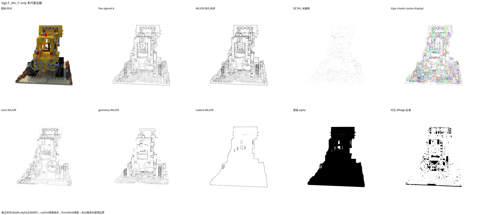

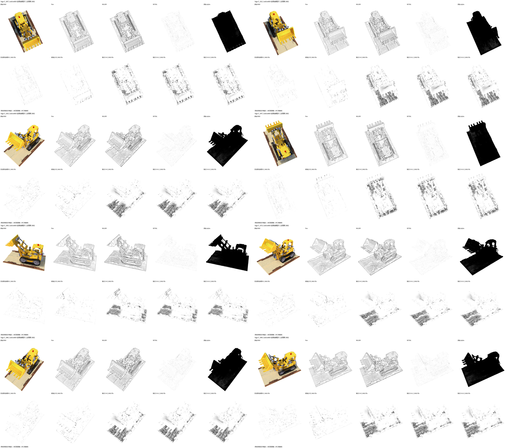

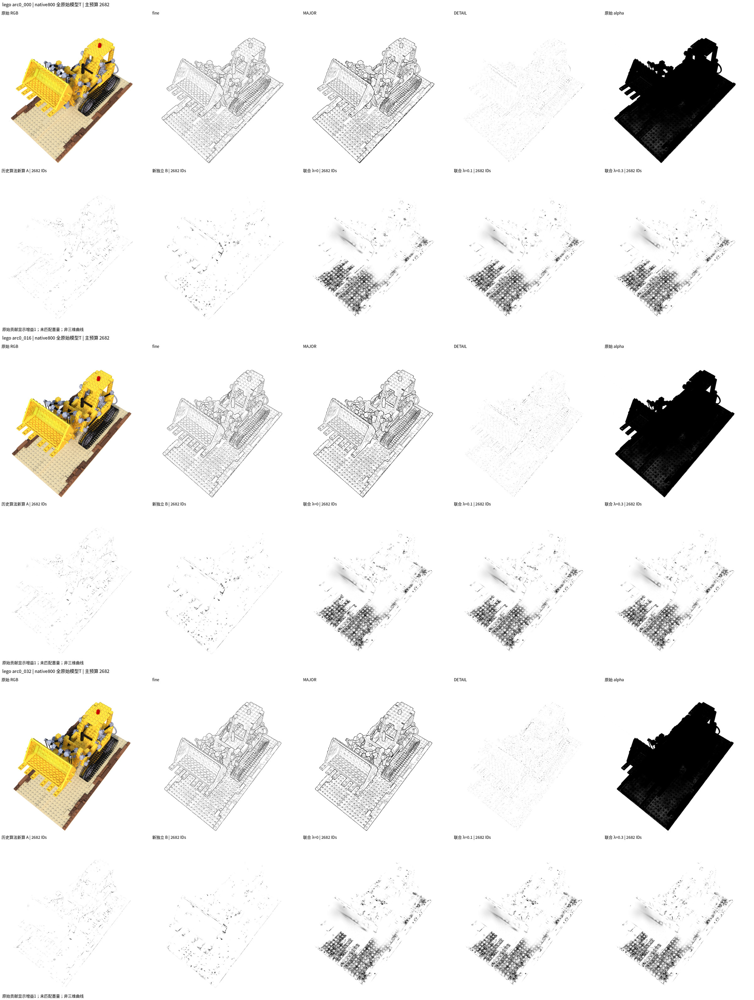

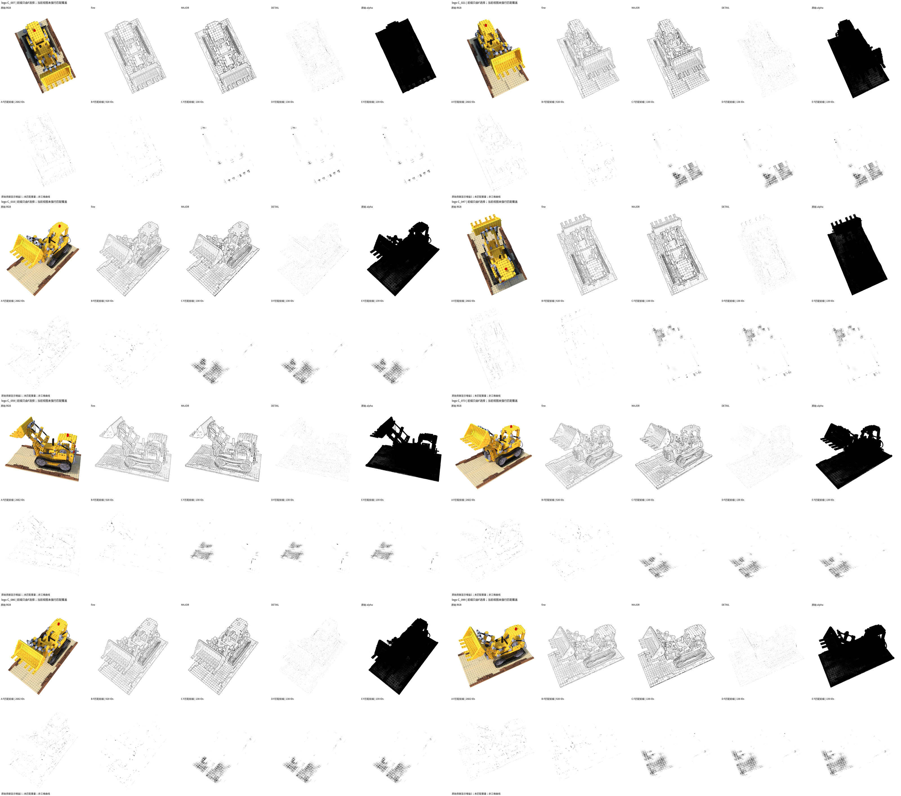

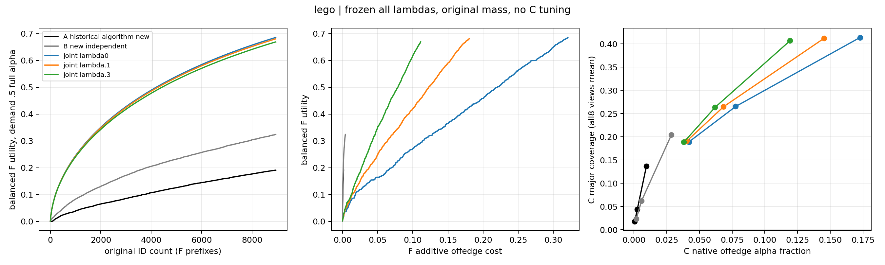

[Telegram1600完整33帧](media/lego/arc33_telegram1600.mp4) · [固定原ID JSON](assets/lego/selected_ids.json)。native视频路径 `/home/u00134/3dgs_line/representative_edge_gaussians_three_v1/out/representative_edge_gaussians_three_v1/lego/media/arc33_native.mp4`，SHA256 `0facfca0317ba434bdd25021a75d95eaaa0b4f0686b9814c9efefbd16eb8632e`。
### Chair

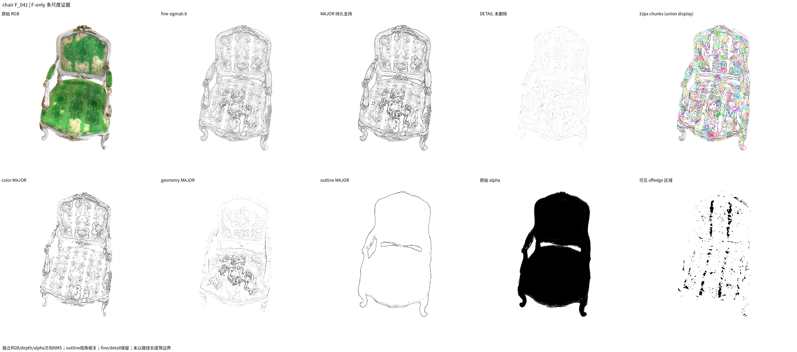

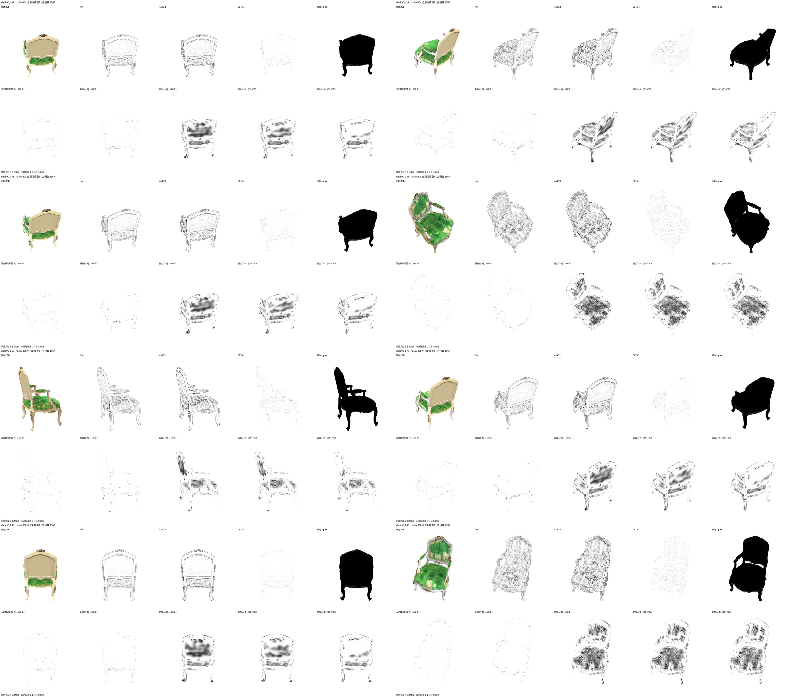

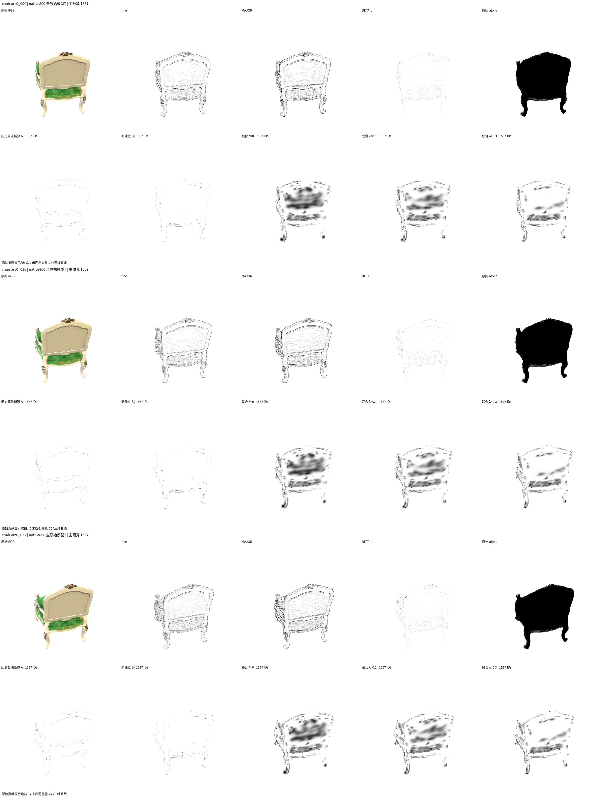

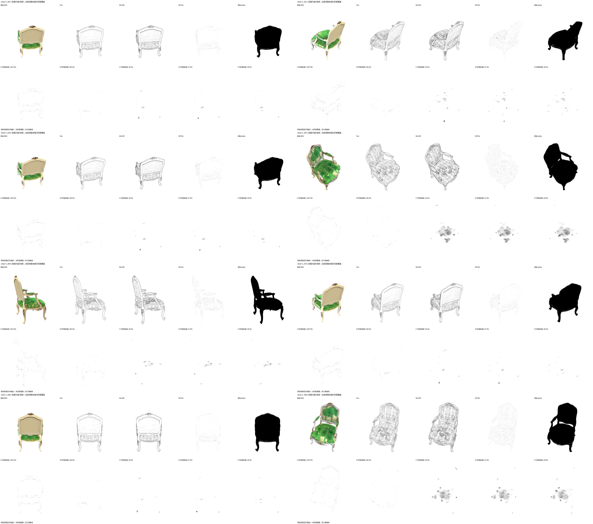

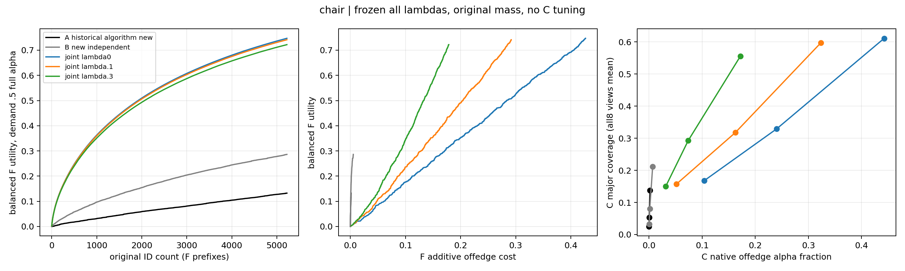

[Telegram1600完整33帧](media/chair/arc33_telegram1600.mp4) · [固定原ID JSON](assets/chair/selected_ids.json)。native视频路径 `/home/u00134/3dgs_line/representative_edge_gaussians_three_v1/out/representative_edge_gaussians_three_v1/chair/media/arc33_native.mp4`，SHA256 `4d265b00b8c3773f6c0ffa1a0bba322a8a6c44abce08ef0ac53e96462e603842`。
### tree / Ficus (ficus)

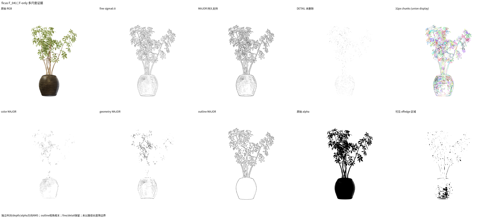

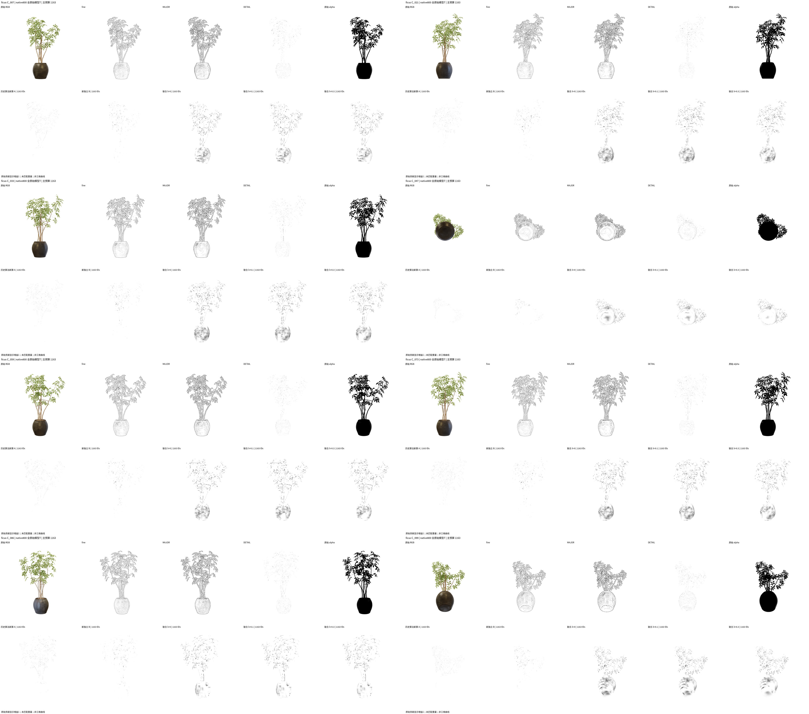

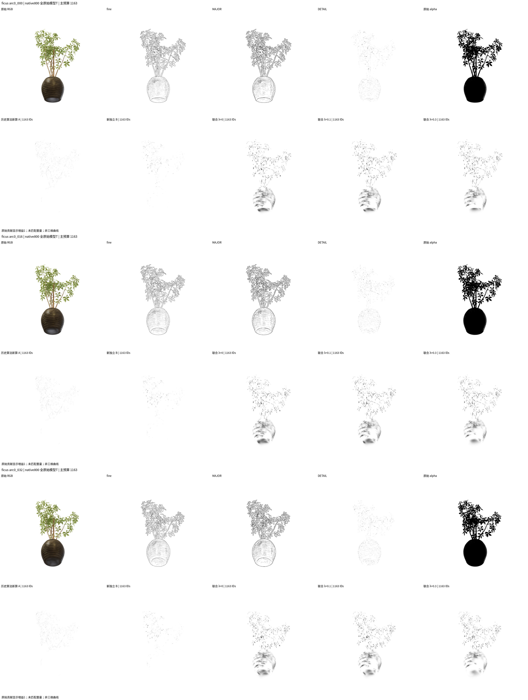

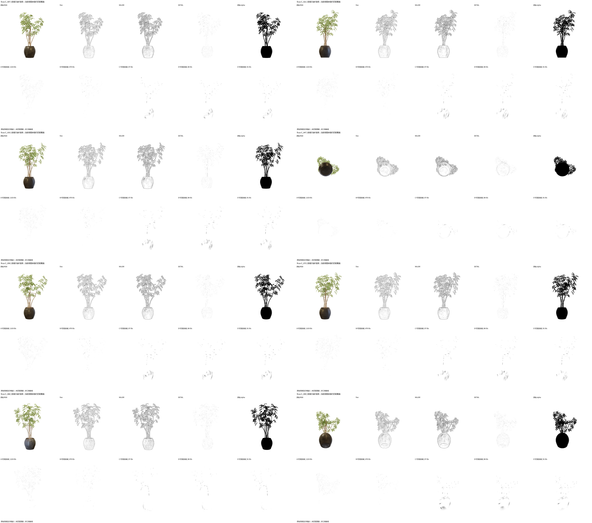

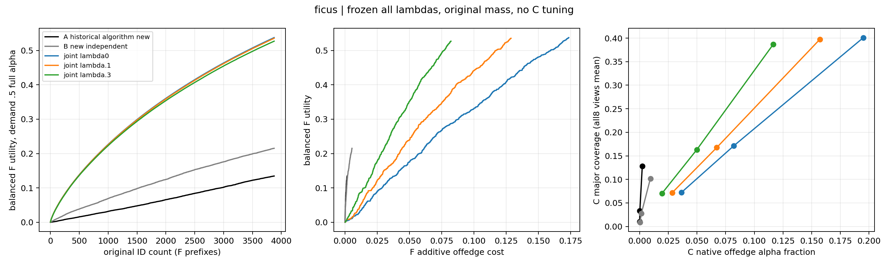

[Telegram1600完整33帧](media/ficus/arc33_telegram1600.mp4) · [固定原ID JSON](assets/ficus/selected_ids.json)。native视频路径 `/home/u00134/3dgs_line/representative_edge_gaussians_three_v1/out/representative_edge_gaussians_three_v1/ficus/media/arc33_native.mp4`，SHA256 `0163b1049e9e4f32152e30f31d5df642bc74c71473f285bb3836a8c10c5e6602`。

所有视频native 4000×1768与Telegram1600×708均H264/yuv420p/+faststart、gain1、完整33帧未cut，不匹配墨量。两尺寸均已由现有OpenCV检查和独立ffmpeg rawvideo管线逐帧decode；六段每段去标题RGB crop distinct=33（[独立解码记录](INDEPENDENT_VIDEO_DECODE.json)），camera hashes与original RGB content hashes见FINAL/SOURCE_MAP。父级审阅者/第三方仍需自行下载打开，并未宣称已由人类独立验证。

## 验证、资源、来源与复现

实际18项CPU测试通过（原13项+4绑定回归+1历史A算术），RED是旧场景/输出绑定的真实失败日志，没有捏造失败。每pose封条与全局F/count seals完整。wall 35.0分钟，native实际729次CUDA调用，CUDA同步合计5.49秒仅为调用计时，不是总wall。新science空间2.878GiB，CPU2、GPU0，无全局依赖安装或旧资产删除。

原内核归第三方RaDe分支；历史项目的独立贡献插桩与本轮scene绑定/新A计算分别归属，不归功于海报作者，也不声称原创RaDe、算法新颖性或论文复现。SH0渲染未使用模型保留的高阶SH，不声称完整反射验证。outline视角相关；geometry为depth/遮挡证据，不是表面真值。

[协议](PROTOCOL.md) · [机器FINAL](FINAL.json) · [输入hash](INPUT_HASH_MANIFEST.json) · [源码/媒体SHA256](SOURCE_MAP.json) · [复现](REPRODUCE.md)。大CSR/矩阵/逐pose投影留新out，只发布本stage与适量媒体。所有未跑字段应null；本轮实际完成数在stage seals与FINAL核验。
