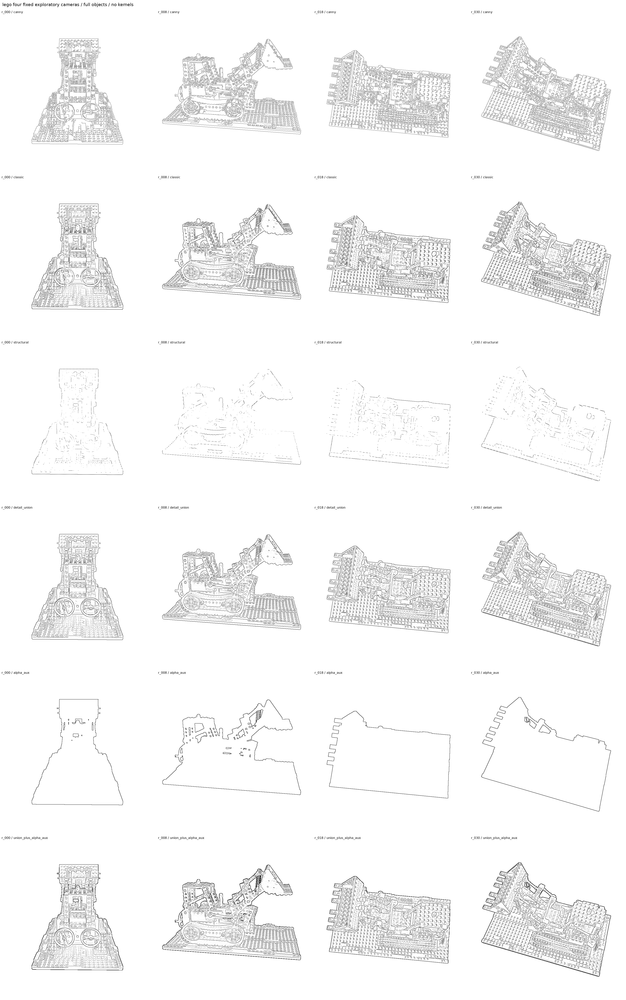
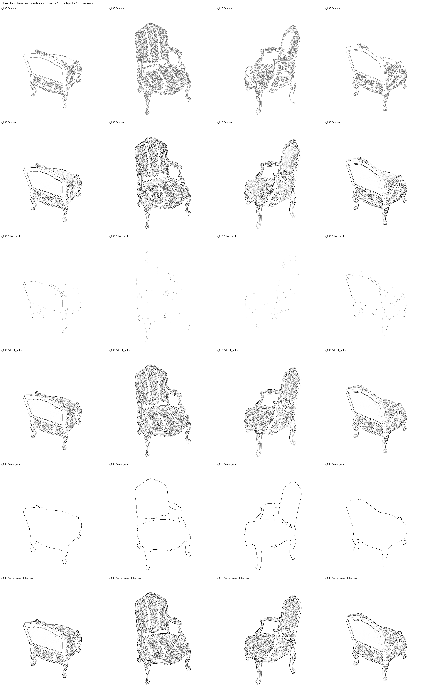
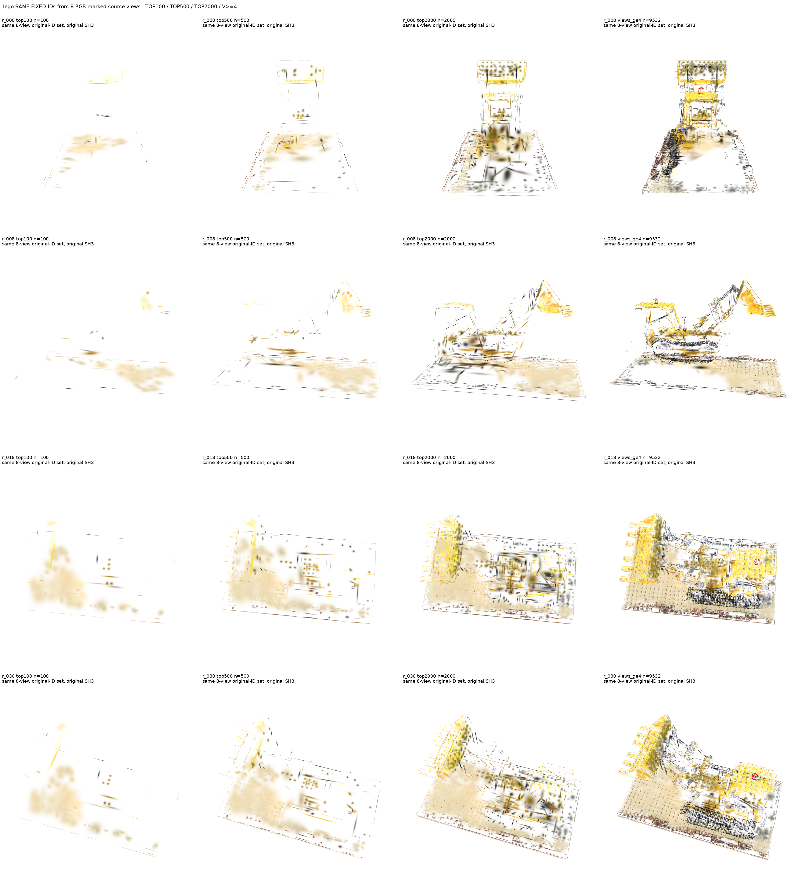
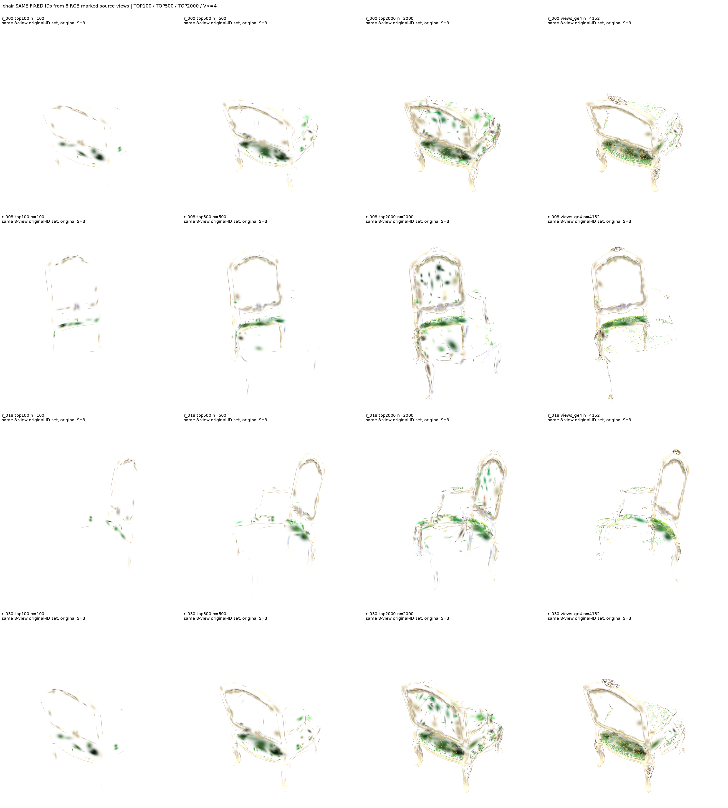
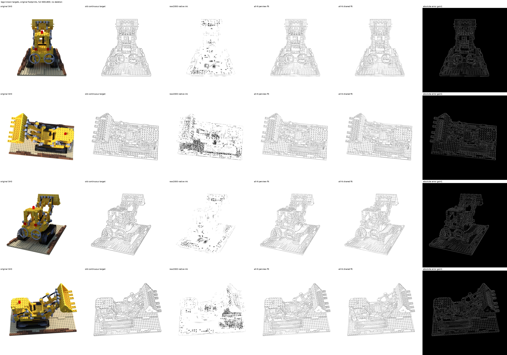
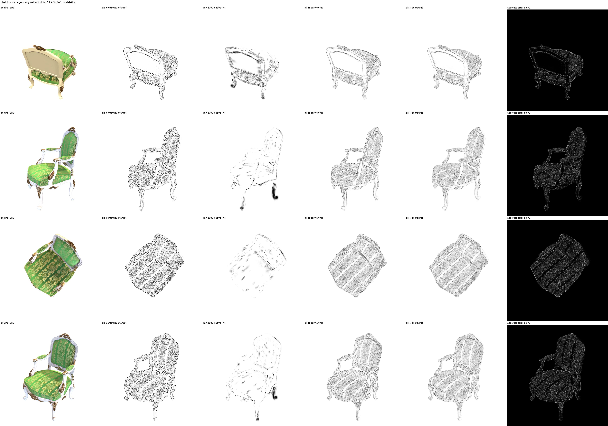

# 导师会议说明：从“找边缘核”到“用原 Gaussian 画线”

> **阅读用途**：这不是新实验计划，也不是论文完成稿，而是截至本次整理的原理讲解、证据回顾与会议讨论材料。
> **当前状态**：新研究已暂停。本次只整理已运行实验；没有训练模型、增加投票视角或继续优化。
> **最重要的一句话**：我们已经证明，原始 Gaussian 在保留遮挡的情况下，通过连续墨迹强度可以形成可辨线结构；但“自动选哪些核、每个视角激活多少”仍未解决，干净完整的窄线、泛化与时间稳定也尚未成立。

## 0．建议怎样向导师讲：先讲问题，再讲证据

可以这样开场：

> “我们原来想找出形成边缘的 Gaussian，再让这些核直接成为线条。后来发现，‘在边缘像素里有贡献’不等于‘专门负责边缘变化’，更不等于‘把它涂黑就能形成细线’。因此我们把问题拆成检测、归因、选择、渲染能力四层。最新结果显示：少量核投票的结果很差，但全体原核共同调节墨迹强度能形成线。这说明不能仅凭稀疏子集图否定原始表示；目前最需要讨论的是联合分配和视角相关的强度预测，而不是继续固定单赢家投票。”

**建议会议顺序**：
1. 用第 1–3 节解释 Gaussian 合成和海报方法。
2. 用第 4 节说清我们与海报重叠在哪里、区别在哪里。
3. 看第 7–9 节的真实图，不从工程测试数字开场。
4. 用第 10–12 节讨论当前证据能支持什么，以及研究问题如何收敛。

---

## 1．先理解 3DGS：一个像素不是由一个核独立决定的

### 1.1 直观比喻：很多有透明度的彩色小印章

把 Gaussian 想成一个三维小印章。相机把它投影到画面上后，形成一个有渐变透明度的椭圆足迹。多个足迹叠在一起，得到最终图像。

**核中心不是边界点，椭圆足迹也不是三维表面。** 一个中心离线很远的核，足迹仍可能参与这条线；一个中心恰好落在线附近的核，也可能被遮挡而没有实际作用。

遮挡使“透明度很大”与“贡献很大”不同：前面的核已经覆盖画面时，后面的核再不透明，也可能几乎不影响像素。

### 1.2 真正的贡献是 alpha 乘以到达它之前的透射率

对于像素 p，前后顺序由栅格器确定：

\[
T_i(p)=\prod_{j<i}(1-\alpha_j(p)),\qquad w_i(p)=T_i(p)\alpha_i(p).
\]

- \(\alpha_i(p)\)：该核在这个像素的局部覆盖，不是只有一个全局 opacity 常数。
- \(T_i(p)\)：前面的核还允许多少光通过。
- \(w_i(p)\)：该核真正参与最终合成的权重。

颜色合成还包括背景：

\[
I(p)=\sum_i w_i(p)c_i(v)+T_{\rm bg}(p)c_{\rm bg}.
\]

\(c_i(v)\) 随视角 v 变化；我们的真实 Lego/Chair 基线保留完整 SH3，不把它偷偷换成共享 SH0 颜色。

**这带来两个后果**：
- 不能按全局 opacity 判断核的像素责任。
- 删除其他核会重算 T，子集图会显露原本被遮挡的部分。它不等于选中核在完整模型中的原始贡献。

### 1.3 为什么不能给每个核永久贴“边缘核”标签

同一个核在相机 A 可能处在轮廓上，在相机 B 可能支撑物体内部。我们先保存 \(S_i(v)\)，即“核＋视角”的分数。

跨视角固定核集合可以作为一个实验输出，但它额外引入了限制：**不同视角必须使用同一组载体**。如果再共享墨迹强度，则限制更强。这两种限制不能混在一起讨论。

---

## 2．之前的 Hao–Mukai 海报到底做了什么？

原文标题为 **Feature Line Rendering from Rasterization States in 3D Gaussian Splatting**，作者是 Weiren Hao 与 Tomohiko Mukai。作者预印本标为 SIGGRAPH Asia 2026 Posters；旧交流中出现的“2025”应纠正。所读取 PDF 的 DOI/ISBN 仍含占位符，本文按作者预印本引用，不据此补造正式出版信息。[1]

### 2.1 核心问题：“哪些渲染状态变化值得画成线？”

他们不是先把最终 RGB 图交给 Canny，也不是重建 mesh。方法在渲染过程中保留每个像素的内部状态，包括贡献权重、深度、覆盖率、法线、外观，以及 Top-K 原始核身份和贡献分布，再比较邻近像素。[1]

可以用这条链路解释：

```text
3DGS + RaDe-GS 栅格状态
          ↓
深度 / 覆盖 / 法线 / 外观 / Top-K 支撑分布
          ↓
相邻像素的不连续 + 可靠性 + 层竞争
          ↓
轮廓响应 / 笔触密度 / 色调变化场
          ↓
视角相关的二维线场与合成
```

**“在图像网格上检测”不等于“只使用 RGB”。** 海报的关键恰恰是：在屏幕空间保留最终颜色图里被合成掉的分层信息。[1]

### 2.2 Gaussian 支撑分布的变化

原文对 Top-K 贡献按其保留质量归一化，并比较相邻像素中相同原始 ID 的支撑重叠：

\[
\delta_G(p)=\max_{r\in\mathcal N_4(p)}\left(1-\sum_g\min(\bar w_g^p,\bar w_g^r)\right).
\]

直观上：两个像素由相近的一组核支撑，差异小；支撑者明显换了，差异大。[1]

但他们**并不把核身份一变就当成线**。支撑变化响应还受到层竞争以及深度、覆盖率或可见性变化的门控，以抑制平滑表面上的排名变化。[1]

这一点很重要：我们在平坦表面看到大 D，并不能直接说“海报假设被否定了”，因为他们没有采用“支撑变化单独充分”的规则。

### 2.3 海报输出并不是持久三维曲线

原文明确说输出是 **view-dependent raster field**，不是 persistent 3D stroke representation；保留 ID、深度和可见性为未来多视图扩展提供基础，但不能把这种基础说成已经完成了持久线资产或时间稳定算法。[1]

原文列出 Top-K=4 截断、重建法线噪声、固定单像素邻域不具尺度不变性等限制；持久表面参数化三维笔触、线选择及联合线/色调优化属于未来工作。[1]

**归属边界**：海报的公式和状态线检测属于作者；RaDe-GS 是另一项既有工作；我们早期结果属于独立兼容重建与插桩，不是作者官方实现效果。我们的坏图不能科学地否定他们的完整方法。

---

## 3．四个问题必须分开：检测、归因、选择、能力

### 3.1 检测：哪里想画线？

它决定像素集合或连续目标图 \(L_v\)。线可能来自轮廓、遮挡、颜色过渡、纹理、阴影或艺术意图。没有物理标签时，不能把所有 RGB 线都叫几何棱边。

### 3.2 归因：哪些核参与这些像素或变化？

“边缘附近贡献质量大”回答的是位置支持；“边界两侧贡献变化大”回答的是变化分解。两者都还不是唯一因果责任。

### 3.3 选择：在预算与副作用下选哪些核？

把几万个像素的信息汇总成 500 或 2000 个核，会丢共同贡献。大而强的核可能覆盖很多目标像素，也可能把整片表面染黑。

### 3.4 能力：即使选择理想，允许的原核能不能画出目标？

原 SH3 子集图只是原色可视化，不是真正黑色线绘。需要让全部原核保留遮挡，用独立风格颜色实际渲染，再检验足迹能否共同组成目标。

> **关键逻辑**：选择失败不证明表示不可行；表示有容量不证明自动选择已解决；工程接口正确不证明研究方法有优势。

---

## 4．我们与海报：哪些重叠，哪些不同？

| 维度 | 海报原文 | 我们当前实验 | 判断 |
|---|---|---|---|
| 主要任务 | 从内部栅格状态生成分类型线场 | 将已有线像素映射到核，并检验原核的线绘容量 | 研究问题有区别，不能只靠改名主张创新 |
| alpha·T / 原始 ID / Top-K | 核心内部状态 | GAER 原生缓冲区使用同类状态 | 明显重叠，属于基础组件 |
| 支撑分布差 | 归一化邻域重叠＋门控 | 沿目标法向的未归一化逐核 D | 不同算子，但原理高度接近 |
| 线的位置来源 | 深度/覆盖/法线/外观状态变化 | RGB spatial union 指定线像素；早期 GAER 仅 alpha 轮廓 | 本轮不是海报检测器的完整复现 |
| 深度和法线 | 基于 RaDe-GS 内部状态 | 当前 vanilla GAER 接口没有公开可靠深度/法线 | 缺失不能用核轴或中心深度冒充 |
| 核级跨视角计票 | 原文保留 ID 为扩展基础 | 每像素强制投票，统计像素票和视角票 | 我们实际做了该实验，但效果尚不佳 |
| 最终黑墨 | 输出视角相关线场 | 不新增 primitive，用原核连续强度原生合成 | 可研究的输出合同区别；新颖性尚未论证 |
| 目前最好结果 | 本文不代作者评价官方质量 | 已知目标全 N 强度拟合能形成可辨线结构 | 只是容量证据，不是自动方法结果 |
| 时间稳定 | 不能从保留 ID 推断已保证稳定 | 最新容量/投票未验证稳定性 | 双方都不能被我们夸大 |

海报列中的事实来自原文第 2–3 节。[1] 我们列中的事实来自第 13 节固定提交的实际报告。

### 4.1 为什么归一化 L1 与海报 overlap 很接近

对严格单位质量分布 \(a,b\)，有：

\[
1-\sum_i\min(a_i,b_i)=\tfrac12\sum_i|a_i-b_i|.
\]

因此，**把海报 overlap 改写成归一化 L1，并不能构成独立创新**。但我们当前 D 使用未归一化 alpha·T，还保留总质量变化和截断界，不可把其数值与海报归一化响应直接等同。

### 4.2 当前最可辩护的区别

不是“我们也在图像空间找线”，也不是“我们用了更多 K”。更具体的问题是：

> **给定想画的二维线，是否能找到并联合激活原有 Gaussian，让它们在原遮挡下直接承担墨迹，而不添加线元？**

最新实验为这个问题提供了容量证据。但导师会议中应称为 **待形成自动算法的研究方向**，而不是已完成贡献。原文未来工作也包含线选择和联合优化，仍需要更广的先行方法比较。[1]

---

## 5．方法演变：为什么一路改到这里？

### 5.1 历史：固定三维曲线与代表性核群

早期固定曲线对应、密度/方向场、联合贡献群等路线各有独立合同。Mic 路径实验没有形成实际接受的三维曲线；五场景代表性选择提高目标贡献覆盖，也提高非边缘泄漏。不能把这些负结果说成“所有物空间方法不可能”。见[历史进展](PROGRESS_ZH.md)的保留章节。

### 5.2 双面板局部控制：操作失败不等于找不到核

合成双面板 v1 没有达到预注册修复门槛，C1 对普通微调的 TEST band MSE 改善约 1.20%，低于冻结的 10%。v2 诊断中，几何 oracle 初始化/约束改善外推，但核数不同，不能包装成公平优势；自然局部编辑未过开发门槛，新 TEST 关闭。

重要教训：**参与边缘、支持边界变化、可被某种操作修复，是三个不同对象。** RGB 外推错误也不能唯一证明物理原因。来源：[v1](../artifacts/object_neighborhood_edge_control_v1/REPORT_ZH.md)、[v2](../artifacts/object_neighborhood_edge_control_v2/REPORT_ZH.md)。

### 5.3 Lego/Chair 真实模型编辑

固定原 30k 模型、完整 SH3，relative-cov 相对原模型 band MSE 改善 Lego 6.21%、Chair 17.45%；简单 band2d 改善 10.99%、41.22%。相对同权限普通微调的额外改善只有 0.14%、1.27%，没有可靠 selector 优势。

随后的证据修订表明：把可信少量边段真正接入评分，能大幅提高这些固定目标窄带的贡献召回；但合成定位、独立作用优势和视觉门槛仍未全部通过，优化停止。不能将固定目标的高贡献召回说成全物体边缘被找全。来源：[真实编辑](../artifacts/edge_control_lego_chair_v1/REPORT_ZH.md)、[责任修订](../artifacts/edge_responsibility_lego_chair_v2/REPORT_ZH.md)。

### 5.4 图像空间基础算法：先把“想画什么”放在图上

RGB spatial union 使用多尺度颜色/亮度结构张量、方向连贯支持、法向双侧颜色剖面，以及结构＋细节软响应。严格结构层漏掉凸点、花纹和边饰；联合细节层更完整，但有双线和密纹。消融显示大部分外观来自既有颜色方向组件，新剖面增量有限。

方向场引导的连贯线绘已有经典先行工作；我们的原型不是 ETF/FDoG 完整复现，也没有新颖性声明。[2]





**读图**：六行依次为 Canny、经典方向场、剖面结构层、联合层、alpha 辅助轮廓、联合＋轮廓。每列同一个相机。不是原核黑墨结果。

时间光流辅助只得到部分换变改善，Chair 完整稳定视频仍未成立。最新原核容量结果不能继承这个时间结论。来源：[完整报告](../artifacts/image_space_edge_foundation_v1/REPORT_ZH.md)。

---

## 6．GAER：逆光栅化不是把图像唯一还原成几何

### 6.1 实际实现了什么

在原生 CUDA 前后合成中导出每像素 Top-K 原始 ID 与 \(w_i=\alpha_iT_i\)，K 默认 8、支持 1–32。RGB、已测梯度与一次 Adam 更新不变。这个工程基础有用，但 Top-K 不是完整贡献：四个原生视角 K8 只保留总 alpha 质量约 76%–81%。

“逆光栅化”在这里是**读取正向合成的归因记录**，不是从 RGB 唯一反演三维边缘。

### 6.2 法向两侧差分

沿二维线法向取两侧：

\[
p_- =p-\delta n,\quad p_+=p+\delta n,\quad D_i=|w_i(p_-)-w_i(p_+)|.
\]

双线性采样必须先按原始 ID 合并四个邻居，再算差；不能直接插值第 1/2/...槽，因为同一槽在邻居可能是不同核。

**截断未出现的 ID 不是“真的零贡献”**。先前回退主要来自贡献不充分、方向不确定等；K32 也不能自动当完整。

### 6.3 第一轮 GAER 为什么只找外轮廓

当前 vanilla 接口没有公开可靠深度/法线，因此只用 alpha 外轮廓作候选。选中核的贡献较集中，但自动可靠性在全部八图拒绝；展示的是预注册 0.5% 预算诊断。

非轮廓几乎没有贡献，并不证明内部核不存在，因为**内部线一开始就没进入候选域**。来源：[buffer](../artifacts/gaer_attribution_buffer_v01/REPORT_ZH.md)、[按视角选核](../artifacts/gaer_view_selection_v01/REPORT_ZH.md)。

---

## 7．RGB 标注强制投票：解决了覆盖契约，却没解决联合表达

### 7.1 规则

旧 spatial union 显示 darkness>0.2 的所有整数像素成为标注。每个中心确有原核贡献的像素必须推选一个核：优先中心可见候选中最大的 D；不可靠时回退最大中心 alpha·T。真实无贡献的像素保留为无法分配，不删除标注来美化成功率。

八个源视角累计：

\[
F_i=\sum_v\#\{p\in E_v:\operatorname{winner}(p)=i\},\qquad
V_i=\sum_v\mathbf1[\text{视角 }v\text{ 有像素选中 }i].
\]

F 是像素票数，V 是不同视角出现数。核赢一百像素，不等于被一百个视角支持。

### 7.2 实际结果

| 场景 | 标注像素 | 成功接收一票 | 无贡献像素 | 得票核 | 回退比例 |
|---|---:|---:|---:|---:|---:|
| Lego | 320,483 | 320,434 | 49 | 61,114 | 65.53% |
| Chair | 178,125 | 178,052 | 73 | 47,303 | 80.95% |

内部标注像素也接收了票，不再仅 silhouette。但因多数票回退，上一轮并不是纯 D 检验。





**读图**：每行一相机；四列为 Top100 / Top500 / Top2000 / V≥4 全集合。保留原 SH3 颜色，删除其他核，T 改变。因此这些不是实际黑色线绘，也不能当 full-T 支持量。

### 7.3 失败到底可能在哪里

- 一个像素可能由多核共同形成，单赢家丢失强弱关系。
- 像素票数混杂核足迹面积、可见次数、纹理密度。
- 八源固定集合不等于当前相机合适集合。
- 同一核支持线，也可能支持线外大片区域。
- 少量核足迹不能覆盖完整线稿，而这不等于全体核没有容量。

来源：[计票实验、下载与留出对照](../artifacts/gaer_rgb_union_voting_v01/REPORT_ZH.md)。

---

## 8．最新诊断一：贡献充分后，D 究竟说明什么？

### 8.1 完整记录确实改变赢家

只在冻结小 ROI 查询原生完整接受序列，不导出全场景 N×H×W。对同样的像素、法向与 δ，比较 K8/16/32 与 full。

| 场景 | 标注样本 K8→full 赢家变化 | 所有冻结样本 K32→full 变化 |
|---|---:|---:|
| Lego | 45/72 | 20/325 |
| Chair | 75/83 | 54/400 |

**结论**：截断是 D 分配的重要误差来源。但这还不证明补全记录后能得到更好线稿。

### 8.2 同色接替反例：贡献换人，画面不一定有边

想象左像素主要由核 A 支撑，右像素主要由核 B 支撑。两核同色且总覆盖相同：支撑者换了，D 很大，颜色却可以完全相同。

换成不同色时，同一组权重才产生可见颜色差。也就是说，**权重变化必须结合颜色、符号及背景分析**：

\[
\Delta I=\sum_i c_i(v)\Delta w_i+c_{\rm bg}\Delta T_{\rm bg}.
\]

绝对值求和会丢掉抵消：\(\sum_i|\Delta w_i|\) 大，不保证 \(\|\Delta I\|\) 大。Lego 冻结平坦负例中平均 \(\sum D\approx.821\)，RGB 双侧差范数约 .008，颜色项大量抵消。

**修正 H1**：D 是沿法向的贡献变化，不能直接解释为可见几何边缘的充分条件或唯一因果责任。海报也给支撑变化加了其他状态门控，不是这个过强假设。[1]

### 8.3 小扰动与真正作用

在完整模型中对小核群做 DC、log-scale 正负扰动，再用半幅复核；同时记录完整法向剖面、目标外变化、覆盖损伤和匹配随机组。

结果没有证明 D 普遍优于中心贡献。多核 D 在部分 ROI 更局部，但群的质量与面积不同。原边已经正确时，“没有误差改善”不能解释成“没有边缘作用”；本轮测的是作用方向和局部性，不是自然修复率。

---

## 9．最新诊断二：预算上界与真实线容量

### 9.1 固定 full-T 下，怎样得到同预算的精确最优选择？

令每个核在线域的总贡献为：

\[
b_i=\sum_v\sum_{p\in E_v}w_i^v(p).
\]

在原几何、opacity、T 都固定且没有泄漏约束时，取最大的 B 个 \(b_i\)，就是**最大化线域贡献总质量**的最优 B 核集合。全 N 系数通过原生 feature/梯度接口取得，没有 Top-K 截断，也没有构造 N×H×W。

但它只最优于这个线性质量目标：**不保证细线、不保证每个像素被覆盖、不约束非线区域**。改形状、opacity 或删核后，旧上界不再适用。

### 9.2 source-oracle 与 diagnostic-oracle 不能混称

- **source-oracle**：只用八源答案选择，在两保留视角评价，检查源聚合目标有多大改进空间。
- **diagnostic-oracle**：直接用保留图的答案选择，只作域内容量上界；其优势包含视角适配，不能全归因于排名。
- **perview oracle**：每图单独选择，进一步解除固定集合限制。

旧 raw 在八源域达到预算贡献上界约 80%–83%，center 更接近。保留域 B2000 的结果是：

| 场景 | 旧 raw 线域质量召回 | source8 oracle | diagnostic2 pooled oracle |
|---|---:|---:|---:|
| Lego | 5.12% | 5.28% | 16.27% |
| Chair | 3.06% | 4.30% | 16.97% |

Lego 的源 oracle 改善小；Chair 有较明显聚合改进空间，但也远未画出整套线。不能用目标答案 oracle 的高值宣称自动算法优势。

### 9.3 不再看原色子集猜能力：实际用原核画黑墨

全部原核保留，给每个核一个墨迹强度 \(s_i(v)\in[0,1]\)：

\[
c_i^{\rm style}=1-s_i,\qquad c_{\rm bg}=1.
\]

因为总贡献加背景透射为 1，实际输出是：

\[
I_{\rm line}(p)=1-\sum_iw_i(p)s_i,\qquad A(p)=1-I_{\rm line}(p).
\]

**直观上**：每个原核是一枚可调深浅的黑色印章。我们不是扔掉没选中的核，而是让其颜色与白背景一致；其遮挡仍然存在。

与原色子集图不同，这才是实际黑色线绘能力检验。公式用原生渲染验证，没有用外部线元绕过约束。

### 9.4 拟合的是已知目标容量，不是自动预测

目标 \(L\) 沿用旧 RGB spatial union 连续 darkness。冻结主目标是 E=L>.2 内拟合连续 L，E 外惩罚墨迹，λ=1；弱线区域被归为外域。外域原 L² 为常数，因此**不是对全连续 L 的无差别拟合**。

\[
\min_{0\le s\le1}\ \|A-L\|_E^2+\lambda\|A\|_{\rm outside}^2.
\]

全连续 L 的 MSE 另外报告。原始足迹全 N 解没有固定 500/2000 核限制，不能包装成同预算算法优越。

每场景使用相同四图池 r_000/r_018/r_001/r_014：比较逐图强度与跨图共享强度。所有目标均已知；这四图不用于宣称预测泛化。





**读图**：从左到右为原 RGB / 目标线稿 / 旧 Top2000 二值强度 / 全 N perview / 全 N shared / perview 误差。所有黑墨保留全部核和原 T，不删核。图形可辨不等于所有线完整。

| 场景 | perview 平均全连续 L MSE | shared 同池 MSE | 判断 |
|---|---:|---:|---|
| Lego | .0085735 | .0110052 | 逐图适配较好，共享更受限 |
| Chair | .0058152 | .0079010 | 逐图适配较好，细节仍不完整 |

### 9.5 怎样避免把优化失败当成表示不可能？

固定权重下是盒约束凸二次问题，用矩阵自由 FISTA、两个初值及对偶下界检查。全 N 没有被暗中缩成某个候选集。

八个逐图解中四个未达到冻结的 0.5% 相对 gap 门槛；其余四个逐图解与两个 shared 解达到带有限精度余量的认证。完整日志和未达门槛状态保留。

因此可以说“已得到可行线结构、部分目标已有近最优数值证据”，**不能说所有视图已精确最优，更不能说所有 3DGS 都存在某个不可达极限**。

### 9.6 形状调整的限定结果

每场景只改两个片段的 32 个原 ID：中心不动，沿目标切线保留方差，法向缩窄 2/4 倍。临时参数只作用风格渲染，实际重新计算 footprint、tiles、T，未重用旧权重。

局部改善很小；这些核的拟合总强度也小。核参与边界，不代表中心在线上；拉细后仍可能在面内。

**结论**：小规模测试未证明改形状必要或充分。不应凭它直接扩大形状优化，也不应据它否定所有形状方案。

最新原始证据：[容量报告](../artifacts/gaer_attribution_capacity_v02/REPORT_ZH.md)、[复现](../artifacts/gaer_attribution_capacity_v02/REPRODUCE.md)、[冻结协议](../artifacts/gaer_attribution_capacity_v02/PROTOCOL.json)。

---

## 10．目前可以说什么，不能说什么？

### 可以说

1. 原生贡献记录可以不改变 RGB 路径地取得；完整局部记录明显改变 D 排名。
2. RGB 标注的内部线像素可以映射到原始核，单赢家计票可运行。
3. 固定少量二值核难以支持完整线稿，不等于全体原核没有线绘容量。
4. 不增核、不加线元、保留原遮挡，连续强度能够形成可辨认线结构。
5. 已知目标中，逐视角强度比共享强度更有适配能力。
6. 联合贡献分配与强度聚合是目前证据更支持的下一问题。

### 不能说

- “D 就是几何边缘”或“大 D 是唯一因果责任”。
- “海报方法被我们的平坦反例否定了”。
- “每个像素投了票，因此方法科学成功”。
- “目标答案拟合得好，所以新视角自动算法已经成功”。
- “固定核 ID 就保证无闪烁”。
- “删核孔洞意味着我们提取出线条”。
- “八源 oracle 没提升，所以原始核不可用”。
- “某次优化未达认证，所以原始足迹不可达”。
- “对 32 核拉细效果小，因此形状完全无用”。
- “当前实验已经证明优于海报、Canny 或其他原核 NPR”。

---

## 11．适合带到会议的核心问题

### 问题 A：我们到底追求哪个输出？

**选项 1：好看的逐视角 NPR 图像。** 可以允许视角相关强度，但要证明自动预测与时间稳定。

**选项 2：固定可编辑的三维线资产。** 需要真正的载体与几何/可见性合同；当前原核强度拟合不等于这种资产。

**选项 3：解释哪些原核支撑指定线。** 是诊断与编辑工具，可以容纳纹理/色调线，但不要冒称物理棱边恢复。

建议导师先决定主任务，否则评估门槛容易在几种目标间摇摆。

### 问题 B：是否放弃“每像素一个永久赢家”的方法主干？

单赢家强制映射作为审计工具保留；作为最终线表达，它丢失共同贡献和强度。最新容量证据支持尝试核群联合激活，而不是继续把票数最多解释成最好的线载体。

### 问题 C：如何把已知目标容量变成自动算法？

尚待研究的候选是：在新视角从 RGB/栅格状态直接预测核群连续强度，并控制线外墨迹；跨视角使用可见性与身份约束，但不强迫所有核共享同一激活。

这只是未来讨论方向。本次没有训练预测器，没有新泛化实验，没有自动方法正结果。

### 问题 D：与海报相比，应当怎样冻结一个真实增量？

需要导师认可的可证伪区别，例如“原核作为最终墨迹载体的联合激活，比直接像素线场在某个明确合同下提供可编辑性或稳定性”。必须与原核直接着色、经典图像线绘及海报状态检测等先例比较。不能把 Top-K、归因、视角相关或联合优化这些一般词汇本身当成贡献。

### 问题 E：何时值得改形状？

先区分残差来自目标选择、候选遗漏、强度预测，还是已认证的足迹容量限制。若真正开 shape，需要把中心偏移、覆盖/孔洞与重新计算 T 一起作为约束，不只看局部 MSE。

---

## 12．导师可能会问的八个问题：可直接使用的回答

**Q1：是不是在重复海报？**

A：Top-K alpha·T 与支撑分布差原理明显重叠，不能作为新贡献。不同点是我们把指定线像素归因到原核，再用全部原核连续强度实际承担墨迹；目前是容量诊断，还没有自动新方法。[1]

**Q2：为什么不直接用 Canny？**

A：如果只需要单帧线稿，经典方法就是重要强基线。我们希望研究核身份与原遮挡能否提供可编辑或跨视角的额外能力；这些优势目前没有证明，不能先以概念压过图像基线。

**Q3：找到边缘核后，为什么涂黑仍像斑块？**

A：一个核的足迹可能远宽于线，而且还支持线外表面。核参与某条边不意味着它独自就是一段线。原色删核图还改变 T，与保留全模型遮挡的黑墨完全不同。

**Q4：多视角投票为什么没解决？**

A：票数混杂足迹大小、可见次数、纹理密度；多数像素回退到中心贡献。固定集合也限制当前视角适配，且单赢家丢共同强度。

**Q5：最新拟合是否证明原核可以画任何线？**

A：不能。只证明在两模型、固定目标和操作约束下形成可辨线结构，部分视图有近最优证据；窄峰、深色平台仍不足，四逐图解未达认证。

**Q6：是不是用目标答案“作弊”？**

A：这是明确标注的 oracle 容量诊断，不参加自动方法排名。它用于区分“算法没找到解”和“操作权限下未显示能力”。不以目标答案拟合冒充泛化。

**Q7：是否已有时间稳定优势？**

A：本轮没有。身份可保留不等于可见墨迹稳定；旧时间结果也有场景和方法限制，不能继承给最新容量实验。

**Q8：明天之后最优先做什么？**

A：在导师确定输出合同后，优先研究联合贡献与连续强度预测；暂不扩大票数、训练底座或长形状优化。新研究目前暂停，等会议决定。

---

## 13．实验清单与固定来源

本汇总复制了以下 **9 个阶段的实验代码、协议、报告和 Git 跟踪产物**，逐 Git blob 核验原字节；不是把不同方法源代码强行合并成一套程序。

| 阶段 | 固定源提交 | 一句话结论 | 原报告 |
|---|---|---|---|
| 双面板 v1 | `10e4aab` | 修复未达冻结门槛，部分负例工程拒绝 | [报告](../artifacts/object_neighborhood_edge_control_v1/REPORT_ZH.md) |
| 双面板 v2 | `abe7341` | 权限/底座诊断有证据，自然控制与新TEST未成立 | [报告](../artifacts/object_neighborhood_edge_control_v2/REPORT_ZH.md) |
| Lego/Chair 局部编辑 | `cd4dc55` | 有编辑作用，未优于简单选核 | [报告](../artifacts/edge_control_lego_chair_v1/REPORT_ZH.md) |
| 责任修订 | `f76fd00` | 可信证据更定位，科学门槛未过，优化NOT_RUN | [报告](../artifacts/edge_responsibility_lego_chair_v2/REPORT_ZH.md) |
| RGB图像基础 | `b2d5627` | 完整线场可输出，剖面优势及稳定成品未成立 | [报告](../artifacts/image_space_edge_foundation_v1/REPORT_ZH.md) |
| 原生归因buffer | `ee28fdc` | 接口正确性成立，不验证几何H1 | [报告](../artifacts/gaer_attribution_buffer_v01/REPORT_ZH.md) |
| 按视角GAER选核 | `e682614` | 轮廓局部参与存在，自动可靠性全部拒绝 | [报告](../artifacts/gaer_view_selection_v01/REPORT_ZH.md) |
| RGB线像素投票 | `bea1bfc` | 强制映射成立，单赢家/固定集合线效果有限 | [报告](../artifacts/gaer_rgb_union_voting_v01/REPORT_ZH.md) |
| 归因与线容量 v02 | `10bf025` | 连续原核可画可辨线，自动预测/完整质量未解决 | [报告](../artifacts/gaer_attribution_capacity_v02/REPORT_ZH.md) |

完整 SHA、逐文件散列见 [不可变来源清单](../artifacts/research_progress_summary_v1/IMPORTED_20261006_SNAPSHOTS.json)。各原实验 REPRODUCE 仍可能依赖服务器只读模型、编译库和缓存；快照进入 Git 不等于这些外部依赖都随仓库上传。

历史报告保留不修改。原始阶段的人类验收PENDING、数值失败、未运行和不一致记录都不被本讲解覆盖。当前材料是会议讨论，不是正式论文结果。

## Sources

[1] https://mukai-lab.org/content/SA2026PosterHao.pdf — Hao–Mukai: Feature Line Rendering from Rasterization States in 3D Gaussian Splatting, author preprint, SA2026
[2] https://cg.postech.ac.kr/papers/kang_npar07_hi.pdf — Coherent Line Drawing, author PDF

作者主页：https://mukai-lab.org/publications/sa2026poster-3dgs/ 。外部论文与本组实验严格分开；实验数值来自第13节的固定提交及原报告，不使用网页搜索结果替代实验数据。
