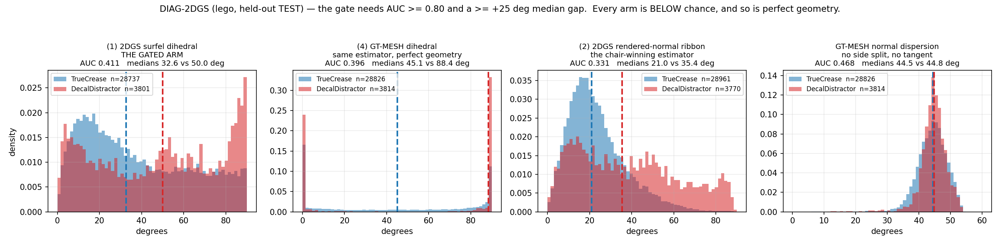

# DIAG-2DGS — 2DGS dihedral separability on lego (held-out TEST)

Executes `tier1/diag2dgs_spec.md`. Cheap diagnostic, no pipeline, no new method path. The GT
mesh is read for LABELS ONLY, as the spec permits; every reported number is on the held-out
TEST split; no published or committed temporal result was touched.

---

## Verdict

> **NO-GO — and not for the reason the spec's NO-GO branch anticipated.**
> The gate is not blunted by 2DGS blur. **Perfect geometry fails it too**, because the
> premise is false: on lego there is essentially no flat surface for a flatness gate to find.

| frozen gate | bar | measured (lego, held-out TEST) | |
|---|---|---|---|
| `AUC(dtheta; TrueCrease vs DecalDistractor)` | ≥ **0.80** | **0.4110** | **FAIL** |
| `median(dtheta_crease) − median(dtheta_decal)` | ≥ **+25°** | **32.63 − 49.97 = −17.33°** | **FAIL** |

Both legs fail, and the second fails *with the sign reversed*: the dihedral is **higher** at
the distractors than at the true creases. Every arm, every sampling radius and every
definition of "TEED-high-confidence" agrees, including the arm run on the **ground-truth
mesh**:

| arm | what it measures | AUC | median crease / decal | gate |
|---|---|---|---|---|
| **(1) `surfel3d`** — the gated arm | 3-D dihedral between the mean 2DGS **surfel** normals either side of the linelet | **0.4110** | 32.63 / 49.97 | **FAIL** |
| (2) `ribbon2dgs` | image-space ribbon dihedral on the 2DGS **rendered normal** map — *the estimator that scored 0.967 on chair* | **0.3307** | 20.98 / 35.37 | FAIL |
| (3) `ribbon3dgs_vanilla` | the same ribbon on **vanilla 3DGS** normals | 0.3875 | 23.58 / 29.52 | FAIL |
| **(4) `mesh3d`** — GT ceiling | the SAME 3-D estimator on the **GT mesh's** faces | **0.3964** | 45.05 / 88.43 | **FAIL** |
| `spreadmesh` | GT-mesh normal **dispersion** in the ball — no side split, no tangent, no estimator to blame | **0.4675** | **44.52 / 44.84** | FAIL |

The last row is the finding. Given **perfect geometry** and a statistic with no free
construction in it at all, the two classes differ by **0.32 degrees**.

---

## 1. Why the premise is false on lego

The spec's hypothesis is "paint/decals are FLAT (low dihedral); true creases BEND (high
dihedral)". On chair that held (`PLAN1_RESULTS.md`: on GT-flat printed fabric the 2DGS
rendered-normal ribbon reads p50 **1.80°** / p95 **7.29°** against crease p50 24.5°, AUC
0.967). On lego there is no flat class to be the low side of that contrast.

**Measured on the GT mesh, at 20,000 uniformly sampled surface points — no labels, no
linelets, just the object:**

| ball radius | median local normal dispersion | fraction of the surface that is flat (<5°) | (<10°) | (<20°) |
|---|---|---|---|---|
| R = 0.010 (≈ 1 linelet half-length) | **38.4°** | 0.69 % | 0.74 % | 3.65 % |
| R = 0.020 | 42.5° | 0.01 % | 0.02 % | 0.18 % |
| R = 0.040 (the frozen radius) | 43.0° | 0.03 % | 0.07 % | 0.09 % |

**Under one percent of the lego surface is flat at the scale a dihedral gate can measure.**
The model is micro-relief end to end — studs, tubes, tread links, panel seams, bevels — so a
locus that is far from a labelled crease is not thereby flat. It is simply on a *different*
piece of relief.

The labelled classes confirm it directly. Fraction of **DecalDistractor** loci whose local
normal dispersion is under 10°:

| | at the frozen radius R = 0.040 | |
|---|---|---|
| on 2DGS surfels | **0.37 %** | (TrueCrease: 0.00 %) |
| **on the GT mesh** | **0.00 %** | (TrueCrease: 0.00 %) |

Zero. Not "few". The distractors are as non-flat as the creases, on ground truth.

**This is not a broken label set.** The two classes really are separated in space — in 3-D,
the median distance to the nearest GT crease point is **0.0062** for TrueCrease and
**0.0240** for DecalDistractor, a 3.9× gap (all candidates: 0.0098). The labels are doing
their job. What fails is the assumption about what the geometry looks like away from a crease.

---

## 2. The second failure: a scale conflict the estimator cannot escape

Even setting the flatness premise aside, the two-sided construction cannot be localised on
this object, and this is quantitative rather than a hunch.

**Lego's features are as closely spaced as the reconstruction's resolution.**

| quantity | value |
|---|---|
| 2DGS surfel nearest-neighbour spacing (median) | 0.00520 |
| 2DGS 5th-nearest-neighbour distance (median) | 0.01039 |
| 2DGS surfel disc scale (median of the larger axis) | 0.01133 |
| linelet half-length `l` (median) | 0.01001 |
| **3-D distance from an arbitrary candidate to the nearest GT crease (median)** | **0.0098** |
| scene extent | 1.40 × 2.35 × 1.48 |

The distance to the nearest crease is **the same number as the surfel spacing**. So the ball
must be large enough to hold surfels on both sides, and any ball that large already contains
a *different* crease:

| ρ (R = ρ·median `l`) | R | surfels in ball (median) | linelets measurable | **DecalDistractor balls containing a real GT crease** | `surfel3d` AUC |
|---|---|---|---|---|---|
| 1.0 | 0.0100 | 3 | 7.4 % | 1.9 % | 0.3295 |
| 1.5 | 0.0150 | 9 | 39.4 % | 11.1 % | 0.3563 |
| 2.0 | 0.0200 | 19 | 72.3 % | 30.7 % | 0.3825 |
| 3.0 | 0.0300 | 50 | 94.4 % | 76.4 % | 0.3987 |
| **4.0** *(frozen)* | 0.0400 | 94 | 98.9 % | **97.3 %** | **0.4110** |
| 6.0 | 0.0600 | — | 99.7 % | 99.8 % | 0.4207 |

There is no radius that is both **measurable** and **local**: at ρ = 1 only 7 % of linelets
can be scored at all, and by ρ = 3 three quarters of the distractor balls have swallowed a
genuine crease. The AUC is below chance across the whole range, so no choice of radius
rescues it.

**And the sign of the failure follows from this.** At a TrueCrease the linelet's tangent is
aligned with the crease, so the side split separates that crease's two faces and returns its
actual angle. At a DecalDistractor the tangent is aligned with a *photometric* edge that has
no relation to the surrounding relief, so the split cuts arbitrarily across whatever
micro-structure is in the ball and returns something near the 90° ceiling. That is exactly
what the GT-mesh arm shows: its median dihedral at distractors is pinned at **88.4–90.0°**
at every radius from 0.010 to 0.040.

---

## 3. The verdict is not an artefact of any choice made here

**The 2DGS surfel-normal derivation is correct**, and this is measured discriminatively
rather than asserted. The surfel normal is the third column of `build_rotation(q)`
(`forward.cu:113` takes `L[2]` of `L = R·diag(s0,s1,1)`). Against the **rendered** normal
buffer at each surfel's own projection, on TEST views:

| candidate | median angle | p90 | under 10° |
|---|---|---|---|
| `build_rotation(q)[:,:,0]` | 83.21° | 89.40° | 1.4 % |
| `build_rotation(q)[:,:,1]` | 82.44° | 89.24° | 1.4 % |
| **`build_rotation(q)[:,:,2]`** | **17.25°** | 74.01° | **35.8 %** |

Column 2 is the only one that agrees at all. The residual 17° is alpha compositing — a pixel
blends many surfels — not a wrong derivation, which is why the check is read as a
discrimination between the three candidates and not as an absolute tolerance.

**The 2DGS model is healthy.** Trained with the chair pivot's Run A recipe unchanged
(`lambda_normal` 0.05, `lambda_dist` 0.0, `depth_ratio` 1.0, 30 k iterations,
`scripts/run_2dgs_lego.sh`), test PSNR **34.11 dB** at 30 k (33.08 at 7 k, 34.25 at 15 k;
train 37.82). That is *above* the chair Run A model this diagnostic's motivation came from
(29.98 dB), so nothing here is a training pathology. `lambda_dist=1000` was measured worse on
chair (normal AUC 0.851, crease p05 collapsing to 0.29) and was deliberately not run.

**The estimator's knobs do not matter.** All twelve (ρ, ξ, `n_min`) combinations swept on VAL
land in AUC **0.383–0.409**; the frozen point is the VAL-best of them
(ρ = 4.0, ξ = 0.25, `n_min` = 5, VAL AUC 0.4090 → TEST 0.4110). A per-linelet radius instead
of a fixed one gives 0.3611. Restricting both clouds to surfels/faces that are the front
surface in at least one TRAIN view changes almost nothing (2DGS 115,498 → 115,080 kept; mesh
2.03 M → 1.77 M) and moves no AUC by more than 0.01 — lego is orbited from all sides, so
"globally visible" is nearly everything.

**The label threshold does not matter, and tightening it makes things worse.** "TEED-high-
confidence" is anchored on TEED's published threshold in this repo (probability > 0.5 in at
least half the views the linelet is visible in). Varying it:

| "TEED-high" rule | n_decal | `surfel3d` AUC | `mesh3d` AUC | `ribbon2dgs` AUC | `spreadmesh` AUC |
|---|---|---|---|---|---|
| **frac@0.5 ≥ 0.5** *(frozen)* | 3,801 | **0.411** | 0.396 | 0.331 | 0.468 |
| frac@0.5 ≥ 0.75 | 1,475 | 0.303 | 0.372 | 0.244 | 0.475 |
| frac@0.5 ≥ 0.90 | 345 | **0.211** | 0.363 | 0.200 | 0.534 |
| E ≥ q50 | 4,170 | 0.423 | 0.403 | 0.349 | 0.470 |
| E ≥ q75 | 2,516 | 0.380 | 0.374 | 0.294 | 0.471 |
| E ≥ q90 | 1,149 | 0.294 | 0.378 | 0.247 | 0.485 |

**The more confidently TEED fires at a non-crease locus, the more bent the geometry there
actually is** (AUC 0.411 → 0.211 as the confidence bar rises). This is TGAP's finding arriving
from the other side: TGAP measured that TEED is anti-predictive of crease-ness conditional on
the multi-view inlier ratio; DIAG-2DGS shows *why* — TEED's confident non-crease responses on
lego sit on stud fillets, tread edges and panel micro-steps, which are geometrically busier
than the creases themselves.

---

## 4. The `dtheta` sampling recipe, in full (the spec asks for it explicitly)

For a linelet with centre `p`, unit tangent `t` and half-length `l`, over the 2DGS surfels
with opacity > 0.1 (or, for the GT arm, the mesh's face centroids / face normals / face
areas):

1. **radius** `R = rho * median(l)` over the candidate set — a *fixed* radius as the spec
   words it. Frozen `rho = 4.0`, i.e. `R = 0.04003`. The per-linelet variant `R_i = rho * l_i`
   is reported as a sensitivity.
2. **ball** all elements with `||x − p|| ≤ R`. Bounded work: if more than 400 fall inside,
   the 400 nearest are kept (this binds for 0.7 % of 2DGS balls and 73.5 % of the 2.03 M-face
   GT-mesh balls, and is reported per run as `cap-binding`).
3. **exclusion band** drop elements whose perpendicular distance to the linelet's infinite
   line is `≤ xi * R`, so an element straddling the crease cannot pollute both sides. Frozen
   `xi = 0.25`.
4. **in-plane offsets** `d_j = (x_j − p) − ((x_j − p)·t) t`, then centred by their mean.
5. **side split** `e` = first principal component of the centred in-plane offsets, projected
   back onto the plane ⊥ `t`; `side = sign(d_j · e)`. View-independent and needs no surface:
   on a crease the two sheets leave the line in different directions, so the offset cloud is
   an L and its first PC separates them; on a flat patch the offsets fill the tangent plane
   and any split returns two halves of one plane, i.e. `dtheta ≈ 0`.
6. **side normal** surfel normals are **undirected** (2DGS flips them toward the camera at
   render time), so a plain mean is ill-defined. Each side's normal is the leading eigenvector
   of the opacity-weighted (area-weighted, for the mesh) scatter `Σ_j w_j n_j n_jᵀ` — the
   standard mean of undirected directions.
7. **`dtheta` = degrees(arccos(|n_L · n_R|))** ∈ [0°, 90°], the same `|·|` convention
   `gate2dgs._ribbon_normal_theta` uses.
8. **validity** at least `n_min = 5` elements on *each* side; otherwise the linelet is
   unmeasurable. Every arm is additionally reported on the intersection of all arms'
   measurable sets (`|common`), so no arm is credited for scoring an easier population.

`rho`, `xi` and `n_min` were chosen on **VAL views only** and frozen before any TEST number
was read; the full TEST sweep is printed in §2 and in `out/diag2dgs_lego_test_sweep.json` so
it is visible that the verdict does not depend on the choice.

**Split-free companion.** Each 3-D arm also reports `spread`, the angular dispersion of the
undirected normals in the ball, `degrees(arccos(sqrt(lambda_1)))` of the same weighted
scatter — 0° on a flat patch, ≈ θ/2 for two faces meeting at θ. It uses no tangent and no
side split, so a null result on it cannot be blamed on either. On the GT mesh it separates
the classes by **0.32°**.

**Labels.** Per linelet, over the TEST views in which it is visible (vanilla z-buffer, the
same visibility TGAP used), `d` = median distance from its projected centre to the nearest GT
crease pixel, read off the same `cdt` the published recall is computed from.
`TrueCrease: d ≤ 1.5 px`. `DecalDistractor: d > 3.0 px AND TEED-high-confidence`.
Counts on TEST: 49,449 linelets seen, **28,984 TrueCrease**, **3,817 DecalDistractor**
(23,746 TEED-high in total). The candidate set is the one TGAP evaluated — the f = 0.50 pull
of `out/tgap_pull_lego_f0.50.npz`, 49,860 linelets.

---

## 5. What this licenses, and what it does not

**Established.**
* The 2DGS-dihedral geometry gate is **not founded on lego**. AUC 0.411 against a 0.80 bar,
  median gap −17.33° against a +25° bar, and the sign is inverted.
* The cause is **not** 2DGS. Perfect geometry fails the same test (`mesh3d` AUC 0.396;
  split-free `spreadmesh` AUC 0.468 with a 0.32° median gap), and the chair-winning
  rendered-normal estimator is the *worst* arm here (0.331).
* The cause is that **lego has no flat surface at this scale** — under 1 % of the GT surface
  has a neighbourhood flatter than 10°, and 0.00 % of DecalDistractor loci do — compounded by
  a **scale conflict**: the distance to the nearest crease (0.0098) equals the 2DGS surfel
  spacing (0.0052–0.0104), so no ball is both measurable and local.
* It independently confirms TGAP's mechanism. TEED's *confident* non-crease responses on lego
  are on geometrically busier structure than the creases, which is why the image prior was
  anti-predictive there.

**Not established, and not claimed.**
* Anything about **chair**, where the same signal measured AUC 0.967 on a genuinely flat
  printed class. This is a statement about lego's geometry, not about 2DGS.
* That a better *normal estimator* would fail. It says the failure is upstream of the
  estimator — **so the spec's NO-GO branch, "next fire considers TSDF zero-crossing geometry
  instead of raw surfel normals", would not help.** A TSDF would reproduce the GT mesh's
  geometry, and the GT mesh already fails. A next fire should target the premise (find a
  contrast that exists on lego) or the scale (a representation whose resolution is finer than
  the 0.0098 inter-crease spacing), not the normal field.
* That decal distractors do not exist on lego. They do; they are simply a minority of the
  TEED-high non-crease set, which is dominated by unlabelled micro-relief.
* Any claim about a full gate's P/R. No gate was built; per the spec this stopped at the
  diagnostic.

---

## 6. Invariants

| control | result |
|---|---|
| mesh only for labelling / eval | `scripts/diag2dgs.py` is the only new file that reads the oracle, and it is a diagnostic. No method-path file was added or modified; `src/{tgap_gate,gate2dgs,render2dgs}.py` are unchanged and import no oracle. |
| held-out TEST for the reported AUC | yes. `rho`, `xi`, `n_min` were chosen on VAL only; the TEST sweep is reported beside the frozen point. |
| published/committed temporal results | untouched. This diagnostic runs no temporal code and writes no `m1b_stroke_temporal_*` file. `sha256sum -c out/CMEPI_protected_manifest.sha256` → **332/332 OK**. |
| new artifacts only | every output is under a private `diag2dgs_` prefix plus `out/2dgs_lego/`; nothing existing was overwritten. |
| GPU | `CUDA_VISIBLE_DEVICES=1`, u00134 processes only. |
| committed? | **no.** The spec commits only on a PASS; this is a NO-GO, reported straight. |

**Artefacts.** `scripts/{diag2dgs,diag2dgs_plot}.py`, `scripts/run_2dgs_lego.sh`;
`out/diag2dgs_lego_{test,val}{,_sweep,_knob,_sweepvis,_probe,_probe2}.{json,npz}`,
`out/diag2dgs_lego_{scale,surface_flatness}.json`, `out/diag2dgs_lego_test.png`;
the trained model `out/2dgs_lego/` (~10 min to retrain with `scripts/run_2dgs_lego.sh`).
