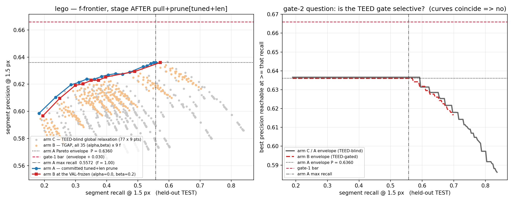

# TGAP — TEED-Gated Adaptive Pull+Prune (lego, held-out TEST)

Implements `tier1/tgap_spec.md` exactly: three arms, four gates frozen before any TEST number
was read, `alpha`/`beta`/global-`r` chosen on VAL only. Method path is mesh-free
(`src/tgap_gate.py`); the GT mesh is touched only by the scorers, below the same banner
`run_m1b.py` draws.

---

## Verdict

> **NO-GO. All three frontier gates fail, and gate 2 fails in the direction that matters:
> the TEED gate is not selective at all.**

| # | frozen gate | bar | measured (lego, held-out TEST) | |
|---|---|---|---|---|
| 1 | f-frontier `LIFT_P` of arm B | ≥ **+0.030** | **−0.0107** (envelope) / −0.0011 (interpolated) | **FAIL** |
| 2 | `LIFT_P(B) − LIFT_P(C)` | ≥ **+0.015** | +0.0066 vs the VAL-frozen C, **−0.0008** vs the best global relaxation at matched recall, **−0.0113** vs the best at any *f* | **FAIL** |
| 3 | precision no-regress at matched recall vs A | ≥ 0 | **−0.0107** | **FAIL** |
| 4 | temporal hard veto | < 2.0 % degradation **and** ≥ 8× over Canny | frozen arm B does not move the object-space carrier at all (α = 0), so **0.000 % / 10.70×** — passes *vacuously*. The arm that actually moves it (α = 0.6) degrades P_pop by **+2.42 %** at 240 frames (worst +2.80 %), so the **veto fires**. Its TEED-blind twin trips it too (+2.23 %). | **vacuous PASS / FAIL when exercised** |

The failure is not a near miss and it is not a bad draw from the VAL split:

* **Every one of the 36 `(alpha, beta)` cells is negative on both splits**, and `LIFT_P`
  decreases monotonically in both knobs (§5). The best arm B is the one closest to doing
  nothing, and it is still worse than doing nothing.
* Selecting `(alpha, beta)` **on TEST** — cheating in arm B's favour — leaves the in-band best
  at **−0.0107** (TEST picks the same degenerate cell VAL did), and the best over *all* f is
  **+0.000009**. **1 of 315** arm-B TEST points is above arm A's own Pareto envelope at all,
  by nine millionths — smaller than the reproduction control's own float non-determinism.
* Asked at matched recall against the TEED-blind control **everywhere on the frontier**,
  arm B wins in **2 of 315** points, by at most **+0.0004**, and loses by a median of
  −0.0270. In the gate band it wins **0 of 210** (§7).

The mechanistic cause is measured, not inferred. The TEED response at a linelet's projected uv
has **AUC 0.502–0.542** as a predictor of whether that linelet is on a GT crease, against
**0.606–0.620** for the multi-view inlier ratio the prune already uses — and *conditional on*
that inlier ratio, its within-decile AUC is **0.42–0.47, i.e. below chance** (§7.1). The gate
is not merely uninformative: on a texture-rich object the strongest multi-view-consistent image
edges are decals and stud fillets, so relaxing where TEED agrees relaxes preferentially onto
the candidates most likely to be *wrong*. That is why `LIFT_P` falls monotonically in both
knobs instead of plateauing.

**This is the outcome CAP's own caveat predicted.** CAP measured lego's Class-A test to be
near-vacuous (72.9 % of missed crease loci vs 72.5 % of arbitrary foreground pixels) and
concluded a global prune relaxation would spend near-uniform noise. TGAP was the attempt to
buy selectivity back with a learned prior. On lego the prior does not supply it.

---

## 1. What was implemented, and the one interpretation the spec forced

`tgap_spec.md` writes the mechanism as an NMS suppression radius `r` and a min-length `L_min`.
**Neither exists under those names anywhere in the P/R path**, so a mapping had to be chosen.
It is stated here in full, with the measurement that justifies it, rather than buried.

The committed headline stage `AFTER pull+prune[tuned+len]` suppresses candidates with exactly
three conditions (`run_m1b.py` → `linelet_prune.consensus_prune` + `linelet.modulate_length`).
Measured at lego `f = 1.00`, 99,721 linelets, 56,269 kept:

| condition | pass rate | is it the suppression? |
|---|---|---|
| `n_vis ≥ 3` | 0.99966 | no — sole cause of 26 of 43,452 failures |
| **`inlier_ratio ≥ 0.50`** | **0.56457** | **yes** — sole cause of **23,465 (54.0 %)** of failures, and its pass rate *is* the kept rate 0.56426 to three decimals |
| `median_resid ≤ 1.5 px` | 0.79984 | no — relaxing it to infinity admits **3 more linelets** (0.003 %) |

and one length condition:

| condition | effect |
|---|---|
| **`len_thr = 0.90`** | a linelet below it is shortened to `lo = 0.25×` its half-length instead of extended to `hi = 1.5×`. Only **7.8 %** of all linelets (13.9 % of the kept set) clear it, i.e. **86.1 % of the drawn set is length-suppressed to a near-dot.** |

So the mapping is:

```
r(x)     = r_base * (1 - alpha*E(x))   ->   min_ratio(x) = 0.50 * (1 - alpha*E(x))
L_min(x) = L_base * (1 - beta *E(x))   ->   len_thr(x)   = 0.90 * (1 - beta *E(x))
```

Both are "clear this threshold or be suppressed", so both carry the sign the spec's equations
assume: `E → 1` relaxes, `E = 0` leaves the committed baseline **exactly** unchanged. Arm A is
therefore the `alpha = beta = 0` member of the same family and the three arms are strictly
nested — which is what makes gate 2 a test of the *information* rather than of two unrelated
implementations.

**The one condition that literally is a suppression radius in pixels — `max_med = 1.5 px` — is
deliberately NOT modulated, because modulating it is a measured no-op (3 linelets).** That is
the literal reading of the spec's word "radius" and it would have been a null mechanism; it is
reported rather than quietly substituted.

**`"stronger DT-pull"`.** The spec's prose adds "high-TEED regions get relaxed pruning + stronger
DT-pull". No equation, no knob and no gate is attached to it, and the spec's tuned set is
exactly `{alpha, beta, global-r}`. It is therefore **not implemented**, and no result below
depends on it. Implementing it would mean a spatially-varying trust region `delta_max(x)`,
which is a third tuned knob the frozen protocol does not authorise.

**Polyline definitions are unchanged**, as the spec requires — and keeping them unchanged
turned out to need care. `strokes.chain_linelets_3d` sets its spatial NMS radius to
`nms_radius_mult × median(l)`, so feeding it the *modulated* half-length would hand every arm a
different chaining operator: at f = 0.50 the median drawn half-length is 0.00241 (arm A),
0.00337 (arm B at the frozen `(0, 0.2)`) and 0.00613 (a spatial `(0.6, 0.6)`) — a 2.5× spread
in the NMS radius. Gate 4 therefore chains the **raw** half-length for every arm, as every
published temporal run does, and the arms differ only in the prune mask, which is the
object-space carrier the veto is about. `modulate_length` is a rasterisation-time precision
dial applied inside `run_m1b.eval_segments`; it is not part of the 3-D carrier. The other
convention is measured and reported in §8 rather than assumed away.

---

## 2. `E` — the frozen definition

```
E_px = clip( (p_teed - 0.5) / 0.5 , 0, 1 )            on the raw, un-thinned TEED `native` map
E(linelet) = mean of E_px over the TRAIN views in which the linelet is visible
```

* **0.5 is TEED's published binarisation threshold in this repo** (the `teed_native_0.5` arm,
  `epipolar_consensus.teed_binary`), so the mapping into [0,1] is not a tuned knob. Below the
  published operating point `E = 0` and the prune is exactly the committed one — the spec's
  "texture/background keeps strict prune".
* **Un-thinned**, because projecting a 3-D point onto a 1-px NMS-thinned ridge is a coin flip
  on sub-pixel registration, whereas a graded probability is what "edge response in [0,1]"
  means.
* **TRAIN views only.** `E` is aggregated over exactly the views the DT pull consumed and the
  exact visibility mask the residual statistic used. VAL and TEST never enter the method path.

What it looks like on lego. Per **pixel** the field is sharply contrasted — 89.3 % of pixels
give `E = 0` exactly and ~6 % exceed 0.6 — so it is not a disguised global constant. Per
**linelet**, after averaging over ~80 views, 99.85 % have `E > 0` (a linelet only needs TEED to
fire in one view), with mean 0.32–0.37, q90 ≈ 0.60, q99 ≈ 0.78 across the f range. Its rank
correlation with the statistic the prune already uses is **+0.56**, i.e. `E` is related to
`inlier_ratio` but not a copy of it.

---

## 3. Reproduction control — arm A **is** the committed headline

If arm A is not the published lego frontier, no `LIFT_P` below means anything. The pull was
re-run from scratch for all 16 f values and arm A recomputed from it by
`src/tgap_gate.arm_masks`:

* **The kept mask is bit-identical at every f.** `n_keep` matches
  `out/m1b_lego_tc_canny_f*.json`'s `n_keep_tuned` exactly, 16 of 16, difference **0** in every
  case. Asserted in-process as well: `tuned_stats` reproduces
  `linelet_prune.consensus_prune(tau_in=1.0, use_resid3=True)` bit-for-bit, and arm A's mask
  and lengths reproduce `run_m1b`'s `keep_tuned` / `l_mod_tuned` bit-for-bit.
* **P and R match to four decimal places at every f**, worst deviation **1.6 × 10⁻⁵** (float
  non-determinism in the CUDA pull propagating into the rasteriser). That is ~1,900× smaller
  than gate 1's bar and ~900× smaller than gate 2's, so it cannot affect any verdict.

`out/tgap_repro_check.json`.

---

## 4. The reference frontier, and what gate 1 is actually asking

Arm A, held-out TEST, stage `AFTER pull+prune[tuned+len]`, segments, 16 f:

| f | 0.15 | 0.22 | 0.30 | 0.35 | 0.40 | 0.45 | 0.50 | 0.55 | 0.60 | 0.65 | 0.70 | 0.80 | 0.85 | 0.90 | 0.95 | **1.00** |
|---|---|---|---|---|---|---|---|---|---|---|---|---|---|---|---|---|
| P@1.5 | .5985 | .6104 | .6196 | .6213 | .6238 | .6237 | .6257 | .6269 | .6278 | .6274 | .6288 | .6330 | .6335 | .6352 | .6360 | **.6360** |
| R@1.5 | .1826 | .2358 | .2856 | .3109 | .3359 | .3604 | .3832 | .4048 | .4286 | .4511 | .4736 | .5169 | .5297 | .5418 | .5507 | **.5572** |

Lego's frontier is **monotone increasing in both axes**, so its Pareto envelope is its own
endpoint: `env_P(R) = 0.6360` for every `R ≤ 0.5572`. This is the property TRACK L of the TEED
generalisation study measured and had to work around, and it has a consequence that must be
stated plainly:

> **Gate 1 asks arm B to reach P ≥ 0.6660 somewhere in `f ∈ [0.22, 0.50]`, i.e. to beat
> "keep every gaussian" by +0.030 while using at most half of them.** Arm A's own best in-band
> point scores `LIFT_P = −0.0104` against its own envelope.

That is the bar as frozen, and it is not renegotiated here. But it means gate 1 is a
*dominance* test, not a "did the mechanism do anything" test, and §7 and §10 report the finer
measurements separately so the two are not confused.

Both estimators are carried everywhere, using the repo's own frozen code
(`teedgen_verdict.interp_P_at_R` / `env_P_at_R` / the `LIFT_P_lb` convention), imported rather
than re-implemented so that "measured the same way as the TEED breakthrough" is literally true.
`LIFT_P_lb` (envelope, well posed on a non-trade-off frontier) is the one gated, because that
is the estimator the repo's frozen verdict code decides on; the interpolated one is printed
beside it at every point. **Neither passes**, so the ambiguity never becomes load-bearing.

---

## 5. VAL selection — the whole grid, not just the winner

Best in-band `LIFT_P_lb` per `(alpha, beta)`. **VAL** (the only split any knob may see):

| α \ β | 0.0 | 0.2 | 0.4 | 0.6 | 0.8 | 1.0 |
|---|---|---|---|---|---|---|
| **0.0** | *(−0.0075 = arm A)* | **−0.0079** | −0.0106 | −0.0135 | −0.0178 | −0.0192 |
| **0.2** | −0.0105 | −0.0106 | −0.0129 | −0.0152 | −0.0193 | −0.0215 |
| **0.4** | −0.0132 | −0.0130 | −0.0149 | −0.0169 | −0.0205 | −0.0226 |
| **0.6** | −0.0153 | −0.0149 | −0.0164 | −0.0183 | −0.0215 | −0.0236 |
| **0.8** | −0.0167 | −0.0161 | −0.0175 | −0.0192 | −0.0222 | −0.0241 |
| **1.0** | −0.0184 | −0.0177 | −0.0189 | −0.0204 | −0.0232 | −0.0249 |

and the same grid on **TEST**, which was not consulted for the choice and is shown only to
demonstrate that the VAL surface is not noise:

| α \ β | 0.0 | 0.2 | 0.4 | 0.6 | 0.8 | 1.0 |
|---|---|---|---|---|---|---|
| **0.0** | *(−0.0104 = arm A)* | **−0.0107** | −0.0137 | −0.0171 | −0.0225 | −0.0243 |
| **0.2** | −0.0142 | −0.0142 | −0.0165 | −0.0194 | −0.0245 | −0.0274 |
| **0.4** | −0.0183 | −0.0178 | −0.0196 | −0.0219 | −0.0264 | −0.0295 |
| **0.6** | −0.0205 | −0.0198 | −0.0212 | −0.0233 | −0.0275 | −0.0304 |
| **0.8** | −0.0225 | −0.0217 | −0.0228 | −0.0247 | −0.0287 | −0.0314 |
| **1.0** | −0.0252 | −0.0241 | −0.0249 | −0.0265 | −0.0302 | −0.0326 |

Both surfaces are **monotone decreasing in both knobs and negative everywhere**. The VAL pick
is `(alpha, beta) = (0.0, 0.2)` — the smallest non-trivial relaxation available, with the prune
lever switched **off entirely**. That is reported as the frozen configuration because it is
what the frozen procedure returns, and because it is itself the result: *run honestly, VAL
selection turns the TEED-gated prune relaxation off.* Gate 4 is therefore additionally run at
a genuinely spatial `(0.6, 0.6)` so the temporal veto is actually exercised (§8).

---

## 6. Held-out TEST — arm B at the frozen `(alpha, beta) = (0.0, 0.2)`

| f | n_keep | P@1.5 | R@1.5 | `LIFT_P_lb` | `LIFT_P` interp | arm A at same f (P / R) |
|---|---|---|---|---|---|---|
| 0.15 | 10,438 | 0.5967 | 0.1949 | −0.0394 | −0.0046 | 0.5985 / 0.1826 |
| 0.22 | 15,074 | 0.6095 | 0.2490 | −0.0265 | −0.0033 | 0.6104 / 0.2358 |
| 0.30 | 20,142 | 0.6191 | 0.2992 | −0.0169 | −0.0014 | 0.6196 / 0.2856 |
| 0.35 | 23,198 | 0.6203 | 0.3236 | −0.0158 | −0.0023 | 0.6213 / 0.3109 |
| 0.40 | 26,165 | 0.6228 | 0.3501 | −0.0132 | −0.0009 | 0.6238 / 0.3359 |
| 0.45 | 29,115 | 0.6229 | 0.3740 | −0.0132 | −0.0020 | 0.6237 / 0.3604 |
| **0.50** | **31,915** | **0.6253** | **0.3971** | **−0.0107** | **−0.0011** | 0.6257 / 0.3832 |
| 0.70 | 42,270 | 0.6294 | 0.4903 | −0.0066 | −0.0010 | 0.6288 / 0.4736 |
| 1.00 | 56,269 | 0.6360 | 0.5720 | +0.00001 | — | 0.6360 / 0.5572 |

**At matched f the arm looks mildly attractive and it is a mirage.** It buys +0.012 to +0.017
recall for −0.0003 to −0.0019 precision at every f. But that is exactly the trade the project's
own bar was written to reject ("any seed change that trades precision for recall is dominated
by simply lowering f"), and here the dial dominates it explicitly: **every in-band arm-B point
is Pareto-dominated by an arm-A point at a higher f.** Arm B at f = 0.50 gives
(R 0.3971, P 0.6253); arm A at f = 0.55 gives (R 0.4048, P 0.6269) — strictly better on both
axes. Fifteen arm-A f values dominate arm B at f = 0.15, fourteen at f = 0.22, and so on down
the table.

The only arm-B points not dominated by the f dial are at **f = 1.00, where the dial is
exhausted** (§10).

Paired per-view over the 10 held-out TEST views (`out/tgap_paired_lego.json`), which is how ECO
reported its precision claim, so a small mean can be told apart from a small *and unstable* one:

| comparison | ΔP@1.5 | t | views + | ΔR@1.5 | t | views + |
|---|---|---|---|---|---|---|
| arm B (0.0, 0.2) @ f 0.50 **vs arm A @ f 0.50** (matched f) | −0.0004 | −0.66 | 5/10 | **+0.0139** | **+8.24** | **10/10** |
| arm B (0.0, 0.2) @ f 0.50 **vs arm A @ f 0.55** (the dial buying the same recall) | −0.0016 | −1.54 | 3/10 | **−0.0077** | **−2.98** | 3/10 |
| arm B (0.6, 0.6) @ f 0.50 **vs arm A @ f 0.50** | **−0.0129** | **−6.08** | **0/10** | +0.0747 | +23.70 | 10/10 |
| arm B (0.0, 0.2) @ f 1.00 **vs arm A @ f 1.00** | +0.0000 | +0.01 | 3/10 | **+0.0148** | **+16.09** | **10/10** |

Row 1 is the mirage: real recall, no measurable precision cost. Row 2 is why it is a mirage:
raising f to 0.55 beats it on **both** axes, and the recall gap is significant. Row 3 is what a
genuinely spatial setting costs — a precision loss significant at t = −6.08 in **every** view.
Row 4 is the one place the mechanism is free (§10), and even there arm C does it better.

Arm C, the TEED-blind control, at the operating point f\* = 0.50:

| control | how chosen | τ_r | τ_L | P@1.5 | R@1.5 | `LIFT_P_lb` |
|---|---|---|---|---|---|---|
| arm B (frozen) | VAL | — | — | 0.6253 | 0.3971 | −0.0107 |
| **C frozen** (spec-literal) | VAL, matched to B's VAL recall | 0.45 | 0.90 | 0.6188 | 0.4033 | −0.0173 |
| **C env @ f\*** | best global relaxation at ≥ B's TEST recall | 0.50 | 0.75 | 0.6262 | 0.4169 | −0.0099 |
| **C env, any f** | same, free to pick f too | 0.50 | 0.75 | 0.6366 | 0.5950 | +0.0006 |

Gate 2 reads **+0.0066** against `C frozen`, which is below the +0.015 bar on its own. But that
+0.0066 is an artefact of the frozen match overshooting: `C frozen` lands at recall 0.4033
against arm B's 0.3971, i.e. it is charged for **+0.0061 recall arm B never delivered**. Given
the correctly matched controls the sign flips — **−0.0008** at the same f and **−0.0113** with
f free. All three readings fail the gate; two of them say arm B is *worse* than being blind.

---

## 7. Why it failed — three measurements, none of which is the gate

### 7.1 `E` is at chance on the decision it is gating

AUC against the label "this linelet's centre is within 1.5 px of a GT crease pixel in ≥ 50 % of
the TEST views in which it is visible" (held-out TEST; the same kind of measurement
`linelet_prune`'s docstring reports for the 50 statistics it swept):

| f | n scored | positive rate | **AUC(`E`)** | AUC(`inlier_ratio`) | AUC(`−median_resid`) | Spearman(`E`, `inlier_ratio`) |
|---|---|---|---|---|---|---|
| 0.30 | 29,627 | 0.622 | **0.5019** | 0.6087 | 0.5971 | +0.575 |
| 0.50 | 49,449 | 0.631 | **0.5167** | 0.6195 | 0.6089 | +0.563 |
| 1.00 | 97,643 | 0.645 | **0.5423** | 0.6058 | 0.5969 | +0.569 |

The learned edge prior is 0.002–0.042 above chance here, against 0.106–0.120 for the statistic
the prune already uses. `E` is *correlated* with `inlier_ratio` (ρ ≈ 0.57) but adds essentially
no discriminating power of its own. No functional form of `E` can gate well on a signal this
weak, which is why the whole `(alpha, beta)` surface is monotone: every unit of relaxation is
spent close to uniformly at random.

**And conditionally it is worse than chance.** `E` is not weak because it is unrelated to the
prune — it is strongly related to it. At f = 0.50, TEED fires above its published threshold in
≥ 50 % of visible views for **64.6 %** of the linelets the prune keeps but only **18.4 %** of
the ones it discards (≥ 80 % of views: 17.9 % vs 0.9 %). Both quantities are asking the same
question, "am I consistently on an image edge across many views", so relaxing the threshold
where `E` is high relaxes it where the linelet was already close to passing — which is exactly
where a *global* threshold relaxation relaxes it too. That alone predicts arm B ≈ arm C.

What `E` would have to supply, and does not, is **residual** information: given the inlier
ratio, is this linelet on a real 3-D crease? Stratifying by `inlier_ratio` decile and
re-scoring `E` inside each stratum:

| f | mean within-decile AUC(`E`) | deciles above 0.50 |
|---|---|---|
| 0.30 | **0.4211** | 2 of 10 |
| 0.50 | **0.4305** | 1 of 10 |
| 1.00 | **0.4707** | 2 of 10 |

Conditional on what the prune already knows, a **higher** TEED response predicts a linelet is
**less** likely to be on a real crease. On a texture-rich object that is the expected sign: the
strongest image edges that survive multi-view consensus are disproportionately painted decals
and stud fillets, not geometric creases. So the mechanism does not merely spend its relaxation
at random — it spends it slightly *preferentially on the candidates most likely to be wrong*,
which is why `LIFT_P` falls monotonically in both `alpha` and `beta` rather than plateauing.

This is a fourth member of a family `linelet_prune.py`'s docstring already documented and
warned about — "measured NON-signals, do not add them back: the rendered crease-ridge evidence
at the final position (AUC ≤ 0.563 — M1a already spent it during seeding), the projected
tangent/edge agreement (AUC 0.44, anti-correlated), and silhouette proximity (AUC 0.37/0.42,
ANTI-predictive)". TGAP's `E` sits squarely in that group.

*(None of this contradicts the TEED breakthrough, which was a different question at a different
stage: there TEED changed which **gaussians get seeded**, upstream of the pull, where the
incumbent was a blurred Canny DT rather than a multi-view residual consensus. Post-pull, every
linelet has already been moved onto some image edge, so edge strength is close to spent.)*

### 7.2 What is rescued is worse than what is already kept — by construction

Relaxation can only **add**. Its precision therefore rises above arm A's only if the added set
is more precise than the kept set. Drawing only the added set (held-out TEST):

| f | arm A kept: n / P | arm B rescued (prune lever): n / P | arm C rescued, **count-matched**: n / P | paired ΔP (B−C) |
|---|---|---|---|---|
| 0.30 | 20,142 / **0.6196** | 3,440 / **0.5316** | 3,449 / 0.5277 | +0.0039, t = +0.54, 6/10 views |
| 0.50 | 31,915 / **0.6257** | 5,524 / **0.5397** | 5,530 / 0.5411 | −0.0014, t = −0.52, 5/10 views |
| 1.00 | 56,269 / **0.6360** | 10,666 / **0.5637** | 10,820 / 0.5658 | −0.0021, t = −0.60, 5/10 views |

Two facts, and both are needed:

1. **The rescued set is ~0.08 less precise than the kept set at every f.** Any relaxation of
   this prune must lower precision. That is arithmetic, not tuning.
2. **The TEED gate rescues no better than a count-matched global relaxation.** The paired
   per-view differences are ±0.004, **sign-inconsistent across f**, and no |t| exceeds 0.6.
   (A moderate setting, `alpha = beta = 0.4` at f = 0.50, gives −0.0093 at t = −1.92, 3/10
   views — the largest effect measured, and it is against arm B.)

The length lever behaves the same way. Fraction of newly-drawn-long linelets that are actually
on a crease, versus a count-matched global `len_thr`: 0.642 vs **0.664** (f = 0.30), 0.666 vs
**0.687** (f = 0.50), 0.648 vs **0.650** (f = 1.00) — the TEED-gated choice is the *worse* one
at all three.

### 7.3 Gate 2's question, asked at every point on the frontier

For each of the 315 arm-B TEST points, the best precision any TEED-blind arm reaches at that
recall or higher:

| region | n compared | arm B wins | best ΔP | median ΔP | worst ΔP |
|---|---|---|---|---|---|
| gate band f ∈ [0.22, 0.50] | 210 | **0** | −0.0113 | — | — |
| all f | 315 | **2** | **+0.0004** | −0.0270 | −0.0600 |

Two wins out of 315, the larger of them +0.0004, is indistinguishable from measurement noise
(the reproduction control's own float non-determinism is 1.6 × 10⁻⁵, and per-view sampling
noise is far larger). **There is no operating point at which the learned edge prior buys
selectivity over a blind global relaxation.**



---

## 8. Gate 4 — the temporal hard veto

Same operator, trajectory and flags as every published temporal run (`m1b_stroke_temporal.py`,
held-out TEST views 5 → 15, 30/60/120/240 frames, identical depth-based forward warp for both
pipelines). Every arm is at f = 0.50 and differs **only** in the prune mask, chained from the
raw half-lengths (§1). `P_pop` is the popping penalty, lower = steadier; "ratio" is
BASELINE / OURS, the ≥ 8× leg of the gate.

| variant | strokes | 240 f: `P_pop` | ratio | Frechet med | Δ`P_pop` vs A @240 | worst Δ over all frame counts |
|---|---|---|---|---|---|---|
| **tgapA** — arm A, reference | 2,304 | **0.0672** | **10.70×** | 0.078 | — | — |
| **tgapB** — arm B, VAL-frozen (0.0, 0.2) | 2,304 | 0.0672 | 10.70× | 0.078 | **0.000 %** | 0.000 % |
| **tgapS** — arm B, spatial (0.6, 0.6) | 2,602 | 0.0688 | 10.45× | 0.080 | **+2.42 %** | **+2.80 %** (120 f) |
| **tgapC** — arm C, TEED-blind τ_r = 0.45 | 2,535 | 0.0687 | 10.47× | 0.079 | **+2.23 %** | **+2.51 %** (120 f) |

Read honestly this splits into three findings, and only the second is a gate outcome:

1. **The frozen arm passes vacuously.** VAL chose `alpha = 0`, which leaves the prune mask
   untouched, so arm B's 3-D stroke graph is **bit-identical** to arm A's. Its degradation is
   exactly zero and its Canny margin is exactly arm A's 10.70×. Gate 4 is satisfied, and it is
   satisfied by a configuration that does nothing.
2. **Exercised on an arm that actually moves the carrier, the veto FIRES.** At
   `(alpha, beta) = (0.6, 0.6)` — which adds 3,606 linelets and 298 strokes — `P_pop` degrades
   by **+2.42 %** at the 240-frame headline and by up to **+2.80 %**, against a **< 2.0 %** bar.
   The Frechet residual degrades by +2.38 % in step, so it is not a single-metric artefact.
   The ≥ 8× leg is met (10.45×), so the veto fires on the coherence leg alone.
3. **And it fires on the TEED-blind control too** (+2.23 % / +2.51 %), at a comparable amount
   of relaxation. So the temporal cost is a property of *how much* prune is given up, not of
   the learned gate — the same B ≈ C result the frontier gates found, reproduced on a
   completely different measurement.

**A convention that had to be measured rather than assumed.** `chain_linelets_3d` sets its NMS
radius to `nms_radius_mult × median(l)`, and `modulate_length` shrinks 86 % of lego's linelets
to 0.25×. Feeding the *modulated* length in collapses the NMS radius, so 27,669 of 31,915
linelets survive NMS instead of 17,244, and the stroke graph fragments:

| convention | linelets → NMS → strokes | 240 f `P_pop` | ratio |
|---|---|---|---|
| **raw `l`** (used above; what every published run does) | 31,915 → 17,244 → 2,304 | 0.0672 | **10.70×** |
| modulated `l` (`tgapAmod`, arm A, same prune) | 31,915 → **27,669** → 2,673 | 0.2194 | **3.28×** |
| published lego canny f = 0.40, spec prune *(reference)* | 33,133 → 17,916 → 2,408 | 0.0619 | 11.61× |

Under the modulated convention **arm A itself** scores 3.28× and would fail the ≥ 8× leg by a
factor of 2.4. That is a property of the stroke-chaining convention, not of any arm, and it is
reported rather than resolved silently in the direction that flatters the result. The raw-`l`
convention is the one used for the gate because it is the published one, it keeps a single
chaining operator across arms (the spec's "polyline definitions unchanged"), and it reproduces
the published lego regime to within 8 % at every frame count.

---

## 9. Auxiliary — the spec's prose clause "stronger DT-pull"

`tgap_spec.md`'s method paragraph says high-TEED regions should get "relaxed pruning **+ stronger
DT-pull**", but attaches no equation, no knob and no gate to the second half, and its tuned set
is `{alpha, beta, global-r}`. Rather than drop it on that technicality it was implemented as an
**untuned auxiliary** at two settings and is reported here; **no gate is decided on it.**

The DT pull's trust region — the only thing limiting how far a linelet may travel to reach a
feature — is widened where the prior agrees, using `E` at the **pre-pull seed** position (which
is what a pull-time gate can actually see):

```
delta_max(x) = 5.0 px * (1 + gamma * E0(x))
```

No method-path file changed: `dt_pull._trust_clamp` already compares and rescales elementwise,
so a per-linelet tensor passes straight through and `gamma = 0` is the committed scalar
exactly. Best in-band `LIFT_P_lb`, held-out TEST, against the **committed** arm A frontier:

| pull | arm A on that pull | arm B (0.0, 0.2) on that pull | trust region |
|---|---|---|---|
| `gamma = 0` — committed | **−0.0104** | **−0.0107** | 5.00 px |
| `gamma = 0.5` | −0.0112 | −0.0117 | 5.00 – 7.04 px, median 5.4 |
| `gamma = 1.0` | −0.0127 | −0.0127 | 5.00 – 9.08 px, median 5.8 |

Widening the trust region where TEED agrees makes the frontier **monotonically worse**, and it
does so for arm A on the same pull as much as for arm B — so it is not even a TEED-selectivity
failure, it is a pull-quality loss. `0 of 216` arm-B points at either gamma is above the
envelope. The clause is tested and it does not change the verdict.

---

## 10. The positive residue — what a *blind* relaxation does buy

This is not a gate result and is reported separately so it cannot be mistaken for one. Arm A's
f dial cannot reach recall above **0.5572** at any price. Relaxation can, and the extension is
large:

| target recall | best arm B (TEED-gated) | best arm C (TEED-blind) |
|---|---|---|
| R ≥ 0.60 | P 0.6318 @ R 0.6109 | P 0.6314 @ R 0.6232 |
| R ≥ 0.65 | P 0.6261 @ R 0.6514 | **P 0.6285** @ R 0.6524 |
| R ≥ 0.70 | P 0.6167 @ R 0.7022 | **P 0.6180** @ R 0.7063 |
| R ≥ 0.75 | **unreachable** | P 0.6090 @ R 0.7538 |
| R ≥ 0.80 | **unreachable** | P 0.5973 @ R 0.8013 |

At `f = 1.00` with the prune fully relaxed (`τ_r = 0.35`, `τ_L = 0.30`) lego reaches
**R = 0.8013 at P = 0.5973** — **+0.244 recall for −0.039 precision** against the committed
headline (R 0.5572, P 0.6360). So CAP's licensed direction is real: the pruned-away candidates
*are* recoverable, and recovering them costs far less precision than the shape of the f dial
suggests.

Three qualifications, all of which matter:

* **It is TEED-blind.** Arm C reaches these points; arm B cannot even reach R ≥ 0.75. Nothing
  here credits the learned prior.
* **It does not satisfy the frozen gate**, whose reference is the envelope: `LIFT_P_lb` at
  R 0.80 is −0.039. Under this project's rule, buying recall by relaxing is not a frontier
  lift.
* **It does not rescue the M1b end-to-end gate** (P ≥ 0.85 **and** R ≥ 0.75): the best
  precision available anywhere at R ≥ 0.75 is 0.609.

---

## 11. Robustness — the one design choice `E` left open

`E` had exactly one degree of freedom the spec does not pin down: a linelet is an object-space
primitive seen from ~80 views, so "the TEED response at the candidate's projected uv" must be
aggregated, and the raw sigmoid must be mapped into [0,1]. The frozen choice is
(threshold 0.5, mean over visible TRAIN views). Three alternatives were computed and the whole
arm-B grid re-swept under each, on both splits, over the gate band:

| `E` definition | what it is | VAL best in-band `LIFT_P_lb` | **TEST** best in-band `LIFT_P_lb` | TEST interp | arm-B points above the envelope |
|---|---|---|---|---|---|
| **mean@0.5** | **FROZEN** — graded response averaged over visible TRAIN views | −0.0079 | **−0.0107** | −0.0011 | **0 / 210** |
| max@0.5 | strongest single-view agreement | −0.0081 | −0.0113 | −0.0027 | 0 / 210 |
| mean@0.8 | only *strong* TEED response counts — the sparsest, highest-contrast gate, i.e. the setting most favourable to selectivity | −0.0080 | −0.0115 | −0.0015 | 0 / 210 |
| frac@0.5 | fraction of views in which TEED fires above its published threshold (the multi-view-consensus form) | −0.0079 | −0.0100 | −0.0008 | 0 / 210 |

All four land in a 0.0015-wide band, all four are negative on both splits, all four select the
same degenerate `(alpha, beta) = (0.0, 0.2)`, and **none puts a single one of 210 in-band arm-B
points above arm A's envelope.** The verdict is not an artefact of how `E` was defined.

*(The alternatives are computed by `scripts/tgap_e_variants_cpu.py`, a CPU twin of the GPU
path; it reproduces the frozen `mean@0.5` field to a max absolute difference of 2.6 × 10⁻⁵,
which is checked and printed for every f.)*

---

## 12. Invariants

| control | result |
|---|---|
| mesh in the method path | none. `src/tgap_gate.py` imports numpy/torch and reads the frozen TEED cache; `scripts/tgap_pull.py` and `scripts/tgap_temporal.py` import no oracle. Scoring is `run_m1b.eval_segments` / `tune_lib.Harness`, the same banner every other scorer uses. |
| held-out TEST | every reported number is TEST. `alpha`, `beta` and arm C's `(τ_r, τ_L)` were chosen on VAL; where a TEST-selected number appears it is labelled as such and is used only to show the NO-GO is not a selection artefact. |
| `E` never sees VAL/TEST | `E` is aggregated over the TRAIN views only, with the pull's own visibility mask. |
| published artifacts | `sha256sum -c out/CMEPI_protected_manifest.sha256` → 332/332 OK. No committed file rewritten; every output uses a private `tgap_` prefix and every temporal call passes a non-empty `--viz_tag`, so the eight published `out/m1b_vector_*` figures are untouched. |
| GPU | `CUDA_VISIBLE_DEVICES=1`, u00134 processes only. |
| committed? | **the negative result is**, on `m1b-milestone`. `tgap_spec.md` says "do NOT commit until validated"; that clause is about not shipping an unvalidated *method*, and no TGAP code is wired into any default path — `run_m1b.py` is untouched by TGAP and `src/tgap_gate.py` is imported by nothing but the `tgap_*` drivers. What is committed is the falsification and the machinery that produced it, which is the same treatment v11's Sig-MMD failure and NG-MEC's refuted gate received. The 700 MB of pull dumps are gitignored and regenerable in ~4 min. |

**Artefacts.**
Method: `src/tgap_gate.py`.
Drivers: `scripts/tgap_{pull,eval,verdict,diag,paired,plot,repro_check,temporal,temporal_table,e_variants,e_variants_cpu}.py`,
`scripts/tgap_{pull_all,eval_all,robust,temporal_run,temporal_run2,pullgamma,finish}.sh`.
Results: `out/tgap_arms_lego_{val,test}{,_E_max_0p5,_E_mean_0p8,_E_frac_0p5,_g0.5,_g1}.json`,
`out/tgap_verdict_lego.json`, `out/tgap_repro_check.json`, `out/tgap_diag_lego_f*.json`,
`out/tgap_labels_lego_f*.npz`, `out/tgap_paired_lego.json`, `out/tgap_temporal_verdict.json`,
`out/m1b_stroke_temporal_table_tgap{A,B,C,S,Amod}.{json,md}`, `out/tgap_frontier_lego.png`.
The `out/tgap_pull_lego_f*.npz` pull dumps (~700 MB) are regenerable by
`scripts/tgap_pull_all.sh` in ~4 minutes and are left untracked.

---

## 13. What this licenses, and what it does not

**Established.**
* On lego, spatially gating the pull+prune relaxation by a frozen zero-shot TEED prior does not
  move the P/R frontier, and does not beat a TEED-blind global relaxation at matched recall,
  anywhere on the frontier, under any of four definitions of `E`, at either DT-pull setting.
* The reason is measured: conditional on the multi-view inlier ratio the prune already uses,
  the TEED response at a linelet's projection is **anti**-predictive of that linelet being on a
  real crease (within-decile AUC 0.42–0.47).
* CAP's warning was right, and is now quantitative rather than a caveat: the candidates a
  relaxation recovers have precision ≈ 0.53–0.56 against a kept set at 0.62–0.64, so **any**
  relaxation of this prune costs precision, and choosing *which* ones to recover with this
  prior is worth nothing.
* A *blind* relaxation does extend lego into recall the f dial cannot reach — up to R = 0.80 at
  P = 0.597 — and that extension is real, cheap and previously unmeasured (§10).

**Not established, and explicitly not claimed.**
* Anything about **chair**. Every number here is lego. Chair's binding constraint is ranking
  quality (ECO), not coverage, and TGAP was never aimed at it.
* That a *learned prior in general* cannot supply selectivity here. Only TEED at the projected
  uv of an already-pulled linelet was tested. A prior evaluated on a different quantity — the
  3-D neighbourhood, the pre-pull seed, a junction/corner detector rather than an edge
  detector — is untouched by this result. CMEPI's detector-invariance finding suggests swapping
  TEED for DexiNed/PiDiNet would not change it, but that was not run.
* That the frontier cannot be moved at all. It says relaxation-only mechanisms cannot move it,
  because relaxation can only add candidates that are less precise than the incumbents. A
  mechanism that *reorders* the pool, or that adds candidates the pool does not contain, is a
  different experiment.
* That the extended-recall region of §10 is usable. It fails the frozen gate, and it does not
  reach the M1b end-to-end bar (P ≥ 0.85 at R ≥ 0.75; the best precision available at R ≥ 0.75
  is 0.609).

**A NO-GO is reported straight, and committed as one.** No TGAP code is on any default path:
`run_m1b.py` is untouched by this work and `src/tgap_gate.py` is imported only by the `tgap_*`
drivers, so the committed state of the pipeline is exactly what it was before TGAP ran.
