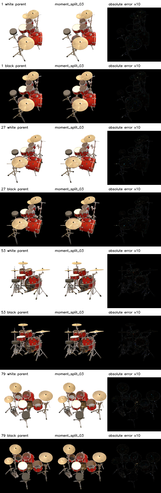
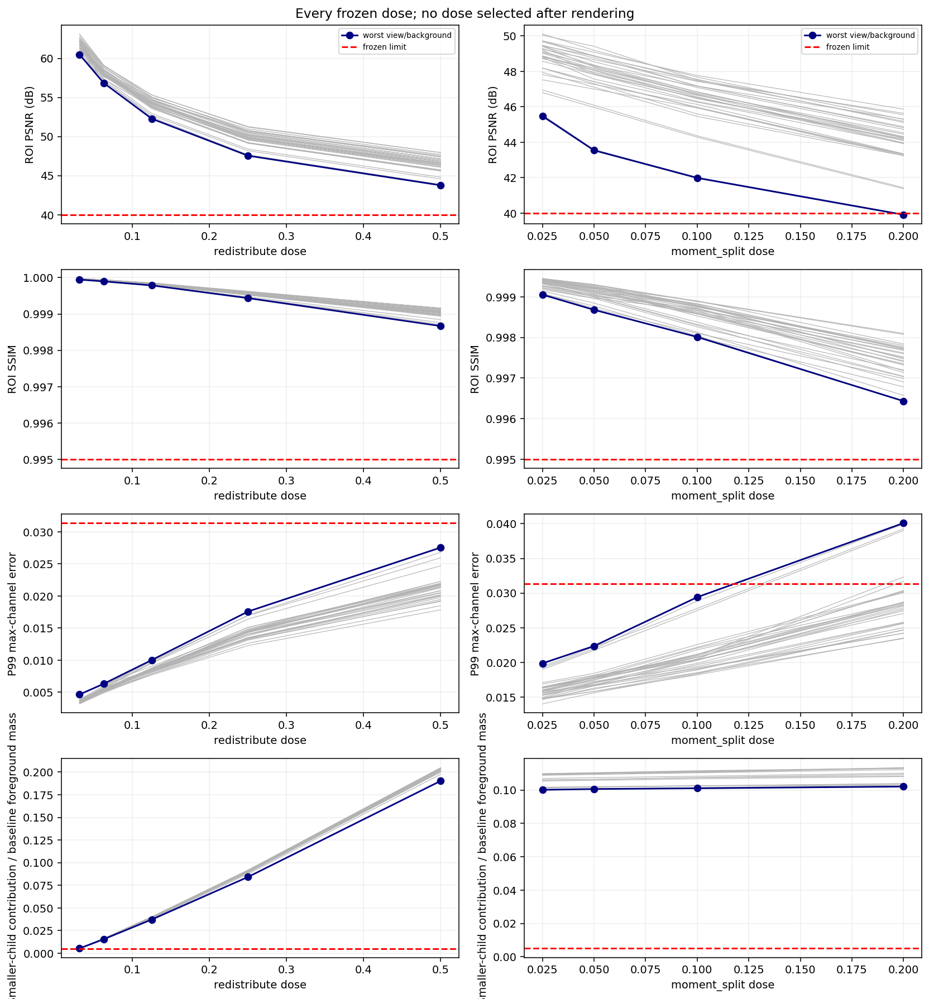
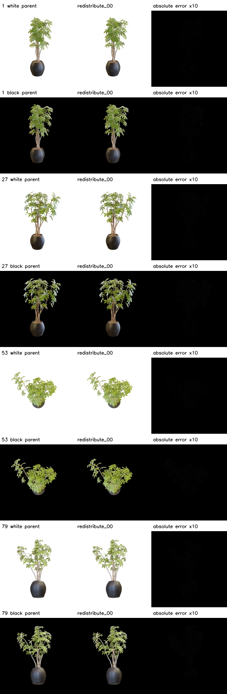

# Actual outputs and limited implementing-author review

Reviewer: Codex, the implementing assistant. This is a nonblind diagnostic review,
not an independent annotation or certification. G2 manual and G5 are UNCERTIFIED.
No glyph or video was reached because posterior eligibility failed before local
science. There is no schematic or substitute movie.

Before local outputs, the assistant inspected the four fixed TRAIN contacts and
recorded 16 coarse target candidates and 48 challenge rectangles. Annotation JSON
contains author, timing, contact hashes and the explicit lack of certified
cross-view spans. No DEV photograph or annotation was inspected/created.

The reached outputs are real stock-rendered comparisons. Their cameras and doses
were fixed before rendering; error amplification is printed on each panel. Small
contact sheets can conceal pixel-scale misregistration and reconstruction error.
They do not override the all-view foreground-ROI gates.

| Scene | Independent seeds, GT and difference | Every dose, all views/backgrounds | Native-resolution diagnosis, seed 1729 | Native-resolution diagnosis, seed 2718 |
|---|---|---|---|---|
| Lego | [Fixed comparisons](scenes/lego/fixed_seeds.png) | [Dose plot](scenes/lego/qualification.png) | [Contact](diagnostics/resolution/lego/seed_1729/measurements/comparison.png) | [Contact](diagnostics/resolution/lego/seed_2718/measurements/comparison.png) |
| Chair | [Fixed comparisons](scenes/chair/fixed_seeds.png) | [Dose plot](scenes/chair/qualification.png) | [Contact](diagnostics/resolution/chair/seed_1729/measurements/comparison.png) | [Contact](diagnostics/resolution/chair/seed_2718/measurements/comparison.png) |
| Drums | [Fixed comparisons](scenes/drums/fixed_seeds.png) | [Dose plot](scenes/drums/qualification.png) | [Contact](diagnostics/resolution/drums/seed_1729/measurements/comparison.png) | [Contact](diagnostics/resolution/drums/seed_2718/measurements/comparison.png) |
| Ficus | [Fixed comparisons](scenes/ficus/fixed_seeds.png) | [Dose plot](scenes/ficus/qualification.png) | [Contact](diagnostics/resolution/ficus/seed_1729/measurements/comparison.png) | [Contact](diagnostics/resolution/ficus/seed_2718/measurements/comparison.png) |

The assistant directly inspected all four scenes' fixed-seed comparisons and
dose plots; the four seed-1729 diagnostic contacts; Lego and Ficus TRAIN1
full-resolution quality panels; Lego's smallest redistribution contact; Chair's
largest spatial-split contact; the failed Drums largest spatial-split contact;
and Ficus' smallest redistribution and largest spatial-split contacts.
This is a stated subset of the retained images, not an assertion of manual review
of every pixel or every dose. All output PNGs also receive automated full decoding.

At this scale, the independent reconstructions preserve the broad object layouts.
Amplified seed differences concentrate on edges, texture/material detail, thin
structures and occlusions. The diagnostic improves apparent Lego/Chair agreement;
Drums retains substantial highlight/material errors, while Ficus retains leaf and
occlusion errors, particularly on black. These observations are descriptive and
do not measure local 3D edge-band stability, axial tangents or GS benefit.

The failed Drums dose is retained below. The numerical failure occurs across the
full frozen view set, so a small fixed-view contact can look close while the gate
fails. All nine dose contacts are retained under each scene's controlled directory.

The all-dose plot shows the actual measured degradation and frozen limits; it is
not a schematic or a fitted monotone curve.

Ficus' smallest redistribution has very small RGB error but fails the frozen
smaller-child contribution requirement (minimum 0.004090430 versus 0.005).
It is retained and excluded from qualification regardless of appearance.

Full-resolution images remain server-side at
`training/<scene>/seed_<seed>/quality/measurements/full_resolution/`,
`controlled/<scene>/measurements/full_resolution/`, and
`diagnostics/resolution/<scene>/seed_<seed>/measurements/full_resolution/`.
Every path, byte count and SHA256 is recorded in MANIFEST. The machine-readable
row tables retain every view and both backgrounds, including failures.
